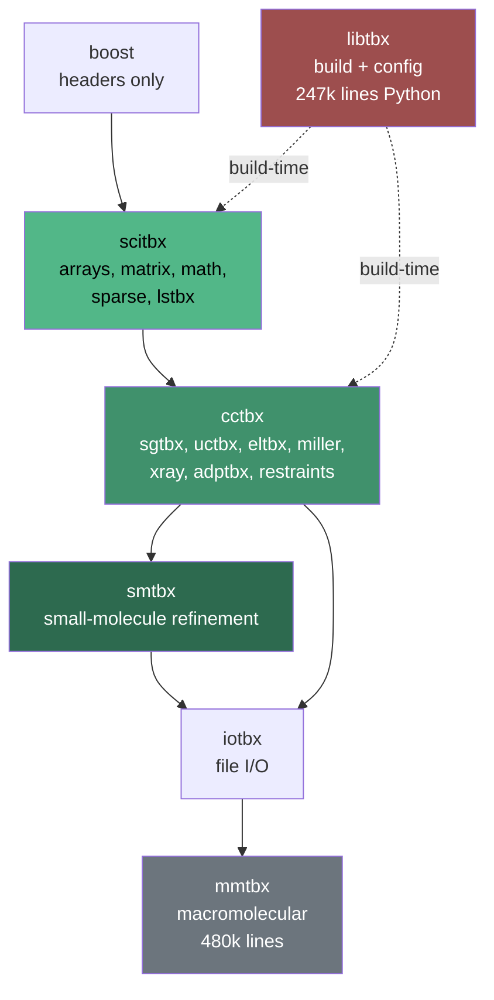
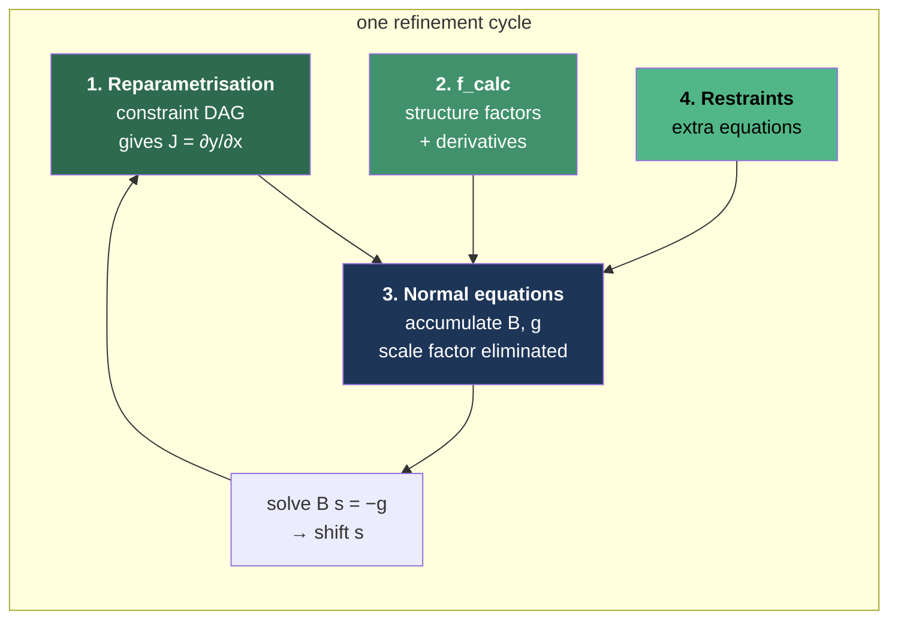
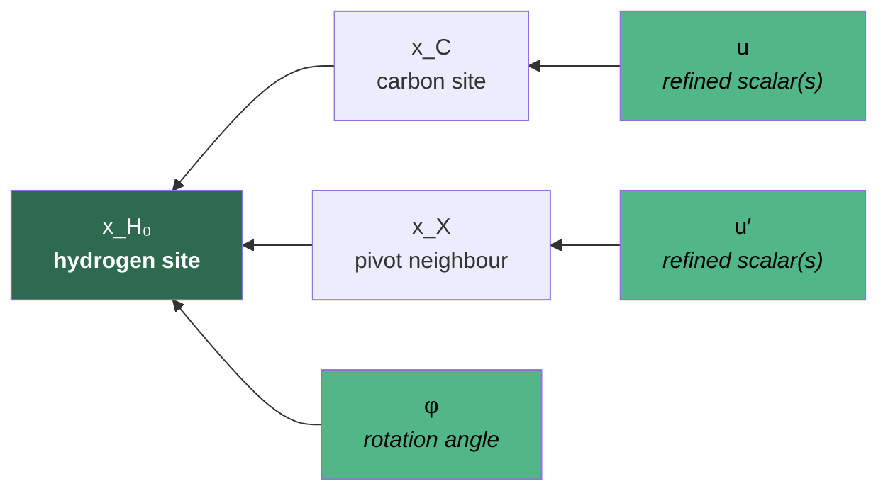
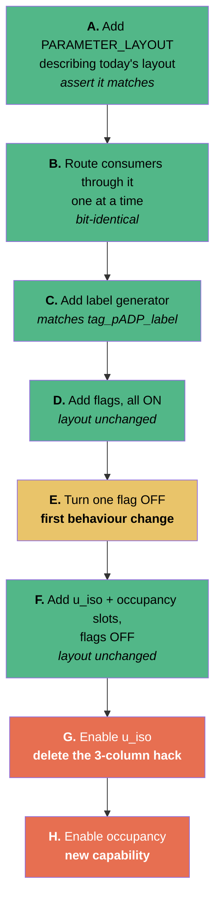

# Bringing cctbx's small-molecule refinement into Tonto

**Status:** analysis and plan. No code written, and **not yet scheduled to start.**
**Scope:** port the refinement capabilities Tonto lacks, natively in Foo.
**Date of analysis:** August 2026.

> ### Before acting on this
>
> **This document is a snapshot of Tonto as it stood in August 2026, and Tonto is moving.**
> Every file-and-line reference, every "absent" in §4, and every defect recorded in §10 was
> true of `develop` at that date. Some will have been fixed, moved or renamed since —
> including, by design, several items in §12, which were handed to the cleanup effort
> precisely so that they would be. **Re-verify against the current tree before acting on any
> specific claim here.** The analysis, the architecture and the staging are durable; the line
> numbers are not.
>
> Two rechecks are required rather than optional:
>
> 1. **Redo the §4 gap analysis against the union of live and recovered code.** It was made
>    against `develop` alone. Archived work — see [Repository branches](REPOSITORY_BRANCHES.md)
>    and the `archive/*` tags — may already contain some of what §4 lists as absent, in which
>    case the scope shrinks and the port becomes partly a recovery job. Anything found there
>    is cheaper to revive than to re-port.
> 2. **Re-check §10 against whatever s.u. work has landed.** The ADP-ESD defect described
>    there was handed over for fixing independently of this plan, so that section is the most
>    likely to be out of date.
>
> Two further sequencing constraints, from §8: land or park the nearest-neighbour fragHAR
> work first, and prefer to run Steps 0–5 before the CRYSTAL/MOLECULE hoist so that the
> restructure inherits a regression net.
>
> The cctbx checkout at `/home/dylan/github/cctbx_project` is a permanent read-only
> reference and is not going away. It is inert — no build, no dependency, nothing to
> maintain — and §9's cross-reference table is the index into it.

---

## 0. Where things are

| What | Where |
|---|---|
| cctbx source (read-only reference) | `/home/dylan/github/cctbx_project`, branch `nix-packaging` |
| The specification paper | `~/Dropbox/manuscripts/Bourhis_2015_Acta_Cryst_A_71_p59-75.pdf` |
| Tonto | this repository |

**cctbx is here as a source to read, not a program to run.** The checkout is not executable
(its prebuilt tree points at a vanished `.nix-profile` python; the source tree cannot import
for want of `six`). This is deliberate and should stay that way: making cctbx runnable would
turn it into a permanent build dependency of Tonto's test suite, which is precisely the
coupling this port exists to avoid. Everything below is designed to be verifiable without it.

### The primary source is the paper, not the code

> L. J. Bourhis, O. V. Dolomanov, R. J. Gildea, J. A. K. Howard & H. Puschmann (2015).
> *The anatomy of a comprehensive constrained, restrained refinement program for the modern
> computing environment — Olex2 dissected.* **Acta Cryst. A71, 59–75.**
> doi:10.1107/S2053273314022207

This paper is the complete mathematical specification of exactly the engine being ported —
its stated purpose is that "precise and clear equations are provided for every computation
performed by this engine". **Write the port from the paper; use the code to resolve what the
equations leave out.** Three reasons:

1. The equations are language-neutral. The C++ is template-heavy and shaped by Boost idioms
   that Foo cannot express at all.
2. The paper states its approximations explicitly where the code leaves them implicit — the
   riding approximation, eqs (5)–(6), is the clearest example.
3. A Foo implementation derived from published equations is defensible and citable in a way
   that a transliteration of someone else's C++ is not.

All equation numbers in this document refer to that paper.

---

## 1. Is cctbx a mess?

Partly. The distinction matters because it determines what is safe to copy.



**What is good, and it is the part we depend on.** The scientific core is cleanly layered and
acyclic: `scitbx → cctbx → smtbx`. Nothing in that chain reaches sideways or upward. The
algorithms are header-only C++ templates; only data tables and the space-group machinery
compile to objects. For cherry-picking, this layering is exactly what you want — you can read
`smtbx/refinement/constraints/rigid.h` and follow its dependencies downward without ever
meeting the rest of the project.

**What is genuinely messy.**

- **43 top-level modules**, most irrelevant to refinement: `xfel`, `simtbx`, `iota`, `prime`,
  `spotfinder`, `crys3d`, `gltbx`, `wxtbx`, `qttbx`, `cootbx`, `kokkostbx`, `cudatbx`… The
  signal-to-noise on first contact is poor.
- **`libtbx` is 247k lines of Python** doing build orchestration and configuration. This is
  the actual bloat. We take none of it.
- **`chiltbx` is declared a build dependency of `cctbx` and is entirely unused** — no cctbx,
  scitbx or smtbx source includes anything from it. Dead weight that nobody removed.
- **Surprising placements, historical rather than logical:**
  - The least-squares engine is in **`scitbx/lstbx/`**, not smtbx.
  - The restraint functional forms are in **`cctbx/geometry_restraints/` and
    `cctbx/adp_restraints/`**, not smtbx. smtbx contributes only the ~50-line manager that
    counts rows and dispatches.
  - **`iotbx` depends on `smtbx`** — file I/O depending on refinement, an inversion caused by
    the SHELX reader needing to build constraint objects.
- **The C++ is designed to be *driven* from Python.** Space groups, unit cells, scatterer
  arrays and scattering-type registries are all assembled Python-side and handed down. A
  C++-only consumer must reimplement that assembly. This is why the C++ looks more independent
  than it is.

**Verdict for our purposes:** the layering is sound, so targeted extraction is safe; the
infrastructure is heavy, so we take none of it; the placements are surprising, so the
cross-reference table in §9 is worth keeping.

---

## 2. The architecture worth taking

The reason to model on smtbx is not its formulae — Tonto already has many of them — but its
separation of concerns. Four pieces meet in one place and can each be replaced independently:



Concretely, in `smtbx/refinement/least_squares.py:133 build_up()`, all four arrive as
arguments to one call. That is the whole design.

**Why this matters for Tonto specifically:** the same four seams are what would later admit
macromolecular machinery without redesign. An FFT-plus-bulk-solvent calculator is another
piece 2. A maximum-likelihood target is another piece 3. A monomer-library restraint source is
another piece 4. Tonto's HAR densities are *already* another piece 2 — which is the point.

---

## 3. Concepts, explained

These four ideas carry the rest of the document.

### 3.1 Accumulator form

The normal matrix is **B = JᵀWJ**, where J has one row per reflection and one column per
parameter. There are two ways to compute it.

**Store-then-multiply** — build all of J (the *design matrix*), then multiply:

```
        n_p params
      ┌───────────┐
      │           │  n_refl rows        B = JᵀWJ        14206 × 200 doubles
   J  │           │  (14206)         ────────────►      = 23 MB held at once
      │           │
      └───────────┘
```

**Accumulate** — for each reflection compute its *one row* `j_h`, immediately fold it in, then
discard it:

```
   for each reflection h:
       j_h  ←  one row, length n_p          B  ┌─────┐   200 × 200 doubles
       B   +=  w_h · j_h j_hᵀ                  │     │   = 0.3 MB, total
       g   +=  w_h · r_h · j_h                 └─────┘
       discard j_h
```

Same arithmetic, same answer. Like summing a long list without first building the list.

The paper is explicit (App. B): *"we never construct and store the whole of the so-called
design matrix… we compute the vector of derivatives for a few reflections h and then we
immediately accumulate them"*. Its figures: for ~1000 atoms the design matrix needs 40–120 MB
against ~2 MB for the normal matrix — a factor of 40 to 120.

**Tonto currently uses store-then-multiply** (`diffraction_data.set.foo:2384` builds
`dF(n_refl, n_p)` then forms `A(i,j) = Σ sig·dF(:,i)·dF(:,j)`).

### 3.2 Composability

This is the *real* reason to switch, more than the memory.

Once "add one equation to the normal matrix" is a single operation, then:

| a reflection | is an equation |
| a restraint | is an equation |
| an origin-fixing condition | is an equation |
| a twin component's contribution | is an equation |

— and all four go through the same door. **The reflection loop never needs to know that
restraints exist.**

With store-then-multiply, restraints must be appended as extra rows to a matrix already
allocated and filled, so the reflection loop has to know in advance how many restraints there
will be. That coupling is why restraints, twinning and origin-fixing all depend on this change.
It is not that the arithmetic improves — it is that those features become *addable at all*
without touching the reflection code.

In smtbx this is `least_squares.py:194`:

```python
self.reduced_problem().add_equations(
    linearised_eqns.deltas,
    linearised_eqns.design_matrix * jacobian,
    linearised_eqns.weights * self.restraints_normalisation_factor)
```

### 3.3 Constraint nodes

A **node** is one entry in a dependency graph: it holds a value, knows which other nodes are
its *arguments*, and knows how to differentiate itself with respect to them.

Take a methyl group, X–C–H₃ (the paper's Fig. 2, redrawn):



Read the arrows as "is an argument of". The hydrogen's position is not refined; it is
*computed* from the carbon site, the pivot neighbour and one rotation angle. Only φ and the
two carbon positions are refined. Three refined numbers replace nine.

The hydrogen node knows its own value — eq (15), and note this is pure **Cartesian** vector
algebra:

$$x_{H_n} = x_C + d\left\{\sin\alpha\left[\cos\left(\varphi + \tfrac{2\pi n}{3}\right)e_1 + \sin\left(\varphi + \tfrac{2\pi n}{3}\right)e_2\right] - \cos\alpha\, e_0\right\}$$

with $\alpha \simeq 109.5°$ and $(e_0, e_1, e_2)$ an orthonormal basis with $e_0$ along
$X \to C$. And it knows its own derivative with respect to the new refined parameter, eq (16):

$$\frac{\partial \tilde{Y_c}}{\partial \varphi} = \frac{\partial Y_c}{\partial x_{H_n}} d\sin\alpha\left[-\sin\left(\varphi + \tfrac{2\pi n}{3}\right)e_1 + \cos\left(\varphi + \tfrac{2\pi n}{3}\right)e_2\right]$$

**"Linearise"** means: walk the graph in dependency order; each node computes its value and
writes its own derivative rows into the Jacobian **J = ∂y/∂x**, mapping *p* crystallographic
parameters to *n < p* refined ones. Then everything downstream needs only the chain rule,
eq (19):

$$\frac{\partial \tilde{Y_c}}{\partial x} = \frac{\partial Y_c}{\partial y}\frac{\partial y}{\partial x}$$

**Why a graph rather than special-case code.** Constraints compose. A hydrogen riding on a
carbon that sits on a special position and belongs to a rigid group is three constraints
chained. A graph handles that by construction; per-case code does not, which is why SHELX
needs bespoke handling for each combination. The paper (§3.1) notes this is what let them add
constraints incrementally, and enables third parties to add their own.

Every constraint is a node kind: riding hydrogens, rigid groups, shared ADPs, special
positions, occupancy relations, SHELX free variables, twin fractions, extinction.

**Two safeguards the paper insists on** (§3.1), both of which we must port:

1. **At most one reparametrisation per parameter.** A second is an error, not a merge.
2. **Cycles are rejected.** A parameter that transitively depends on itself is a bug.

The paper notes these guard "against incorrect user inputs, and also against bugs in our own
code that automatically builds constraints". Given Tonto's history of silent failures, both
belong in the first version.

### 3.4 How the unknowns are labelled and laid out

**This is where cctbx is clearly better than Tonto, and it is a prerequisite for everything
else.** Two layers, and the separation is the whole trick.

**Layer 1 — which parameters exist, and which are refined.** `cctbx/xray/scatterer_flags.h`
gives each atom independent booleans, distinguishing *"the model has this"* from *"we are
refining it"*:

| model has it | we refine it |
|---|---|
| `use_u_iso`, `use_u_aniso`, `use_fp_fdp` | `grad_site`, `grad_u_iso`, `grad_u_aniso`, `grad_occupancy`, `grad_fp`, `grad_fdp` |

`cctbx/xray/parameter_map.h` then walks the atom list **once** and assigns slots:

```cpp
struct parameter_indices {
  static int const invariable = -1;
  int site, u_iso, u_aniso, occupancy, fp, fdp;   // an index, or -1 if not refined
};
```

`site` claims 3 slots, `u_iso` 1, `u_aniso` 6 (+10 more for 3rd-order Gram–Charlier, +25 for
4th), `occupancy`/`fp`/`fdp` 1 each — **but only if the corresponding flag is set.** A fixed
U_iso consumes no index at all. Globals (twin fractions, extinction, SWAT) are appended
afterwards by `add_independent_scalar()`.

So the layout is **variable-stride, flag-driven, with a sentinel for absent.** That is what
makes "refine positions only", "refine this atom's occupancy but not that one's", and
partial-occupancy disorder expressible at all.

**Layer 2 — labels.** Every component carries a human-readable annotation (`"N13.x"`,
`"C4.u11"`), emitted per node type by `write_component_annotations_for`
(`smtbx/refinement/constraints/reparametrisation.h:535` onward). This is what lets you ask the
covariance matrix for the s.u. of one *named* thing —
`covariance_matrix_and_annotations.variance_of("N13.x")` — and what lets the ESD table and the
CIF say what they are reporting.

**Tonto today is the opposite on both counts.** `ATOM.pADP_vector` is a fixed-stride record:
`no_of_pADPs` (`atom.foo:6698`) returns 9, 19 or 34 — `x,y,z` + 6 second-order U + 10
Gram–Charlier 3rd + 15 4th. Everything present is always refined; nothing absent can be. There
is **no occupancy slot and no U_iso slot**. Labelling is `tag_pADP_label(par_index)` with a
hardcoded `par_index.is_in_range([1,34])`.

Consequences, all of them live today:

- **Occupancy cannot be refined at all** — so disorder modelling and SHELX free variables are
  out of reach, not merely unconstrained.
- **U_iso is faked inside the structure-factor kernel.** `molecule.har.foo:1300-1310` writes
  the identical value `-sf2` into derivative columns 4, 5 and 6 (U₁₁, U₂₂, U₃₃) and zero into
  7, 8, 9. Three identical columns make the normal matrix singular *by construction*; the
  near-zero-eigenvalue pseudo-inverse absorbs it downstream. It works, but the ESDs are the
  pseudo-inverse's rather than a properly constrained problem's, and the constraint is
  expressed in the wrong file.
- **No parameter can be selectively fixed** without editing the kernel.

§6 gives a staged migration.

---

## 4. What Tonto has, lacks, and has differently

Verified by reading and grepping `foofiles/`.

### Absent outright — zero occurrences anywhere in Tonto

| Capability | Paper | Cherry-pick from |
|---|---|---|
| Constraints framework of any kind | §3, App. C | `smtbx/refinement/constraints/reparametrisation.h` |
| Riding / geometrical hydrogens (SHELX AFIX set) | C3, eqs 82–84; 15–16 | `constraints/geometrical_hydrogens.{h,cpp}` |
| Rigid-body constraints (AFIX 6/7/8/9) | C5–C6, eqs 89–95 | `constraints/rigid.h`, `direction.h` |
| Occupancy refinement | C1, eqs 77–81 | `constraints/occupancy.h` |
| Restraints (bond, angle, planarity, chirality, similarity) | §4, App. D, eqs 97–108 | `cctbx/geometry_restraints/` |
| ADP restraints (SIMU/DELU/RIGU/ISOR, U_eq, volume) | D4, eqs 109–134 | `cctbx/adp_restraints/` |
| Floating-origin restraints (polar space groups) | — | `smtbx/refinement/restraints/origin_fixing.h` |
| Twinning (twin laws, BASF, HKLF-5) | §5, eqs 27–31 | `least_squares_twinning.h`, `cctbx/xray/observations.h` |
| Absolute structure / Flack / Hooft / Parsons | — | `smtbx/absolute_structure/__init__.py` |
| Solvent masking | — | `smtbx/masks/__init__.py` |

Restraints are not merely missing, they are *vestigially* missing:
`diffraction_data.put.foo:109` writes `_refine_ls_number_restraints 0` as a hardcoded literal
into the CIF, and the only other mentions in `vec{atom}.foo` are commented out.

### Present at the bottom, disconnected at the top: refinement against F²

Olex2 and SHELXL both refine on F² (App. A2), so the whole port assumes it. Tonto's F² support
is most of the way there and then broken by one missing routine.

`diffraction_data.set.foo:2247` dispatches correctly, and `d_I_pred_dX`,
`optimize_I_scale_factor(s)`, `optimize_I_extinction_factor`, `I_r_factor` and `F2_r_factor`
all exist. But `crystal.foo:4621`:

```
get_parameter_shifts(ff)
   ...
   if (.xray_data.refine_F) then;  .get_parameter_shifts_F(ff)
!  else;                           .get_parameter_shifts_I(ff)
   end
```

The F² branch is **commented out, and `get_parameter_shifts_I` does not exist** — only the
`_F` variants are defined. Both overloads (`:4621`, `:4634`) have the same shape.

**So `refine_F= FALSE` today computes no shifts at all: no diagnostic, no error, the
refinement simply does not refine.** Zero shift also reads as convergence. Presumably no test
sets it. This is reported separately from the port; it is a precondition for it.

### Present but differently shaped

**Scale factor — Tonto already does variable projection.** An earlier reading of mine said
otherwise; that was wrong. `diffraction_data.inq.foo:748 d_F_pred_dX` forms
`top = Σ w F̃ F_o` and `bot = Σ w F̃²`, so `K* = top/bot` — eq (67) exactly — then computes
`d_scale(p) = ∂K*/∂x_p` by the quotient rule and chains it:

```
res(n,p) = d_scale(p)·F̃(n) + K·ext·(∂F̃/∂F)·dF(n,p)
```

which is eq (76)'s structure. `optimize_F_scale_factor` exists but merely *seeds* the same K,
exactly as smtbx's `objective_only` pre-pass does. **What is missing is the accumulator form,
not the mathematics.** One documented approximation: the routine's own comment says extinction
is treated as constant and "should be OFF for exact results".

**Special positions — right projection, wrong end.** `crystal.foo:5192
stabilize_asym_atom_shifts` computes `dX ← (1/n) Σ_s R_s dX`, averaging the shift over the site
stabiliser. For a finite group that is the Reynolds operator, the orthogonal projector onto the
invariant subspace — mathematically correct. But it is applied *after* the solve, so the normal
matrix still carries the redundant parameters and is singular; the parameter count is patched
by counting near-zero eigenvalues, and the reported ESDs come from a pseudo-inverse of a
rank-deficient matrix.

The code's own comment says so, at `molecule.har.foo:1497`:

```
! Stop symmetry breaking
! NOTE: we should apply this to the gradient *not*
! the shift to make sure the shift maintains symmetry
```

**The reparametrisation DAG is the fix that comment is asking for.** And the paper is directly
critical of the current alternative (App. B):

> *"for singular or nearly singular problems, one could solve the LS problem by using
> singular-value filtering on the design matrix, which is the most robust technique. On the
> other hand, if one computes the normal matrix, therefore squaring the singularities, solving
> the LS problem with eigenvalue filtering is of little practical interest."*

That describes `mat{real}.foo:solve_ill_linear_equations_v1` exactly.

Two things to fix when that routine goes: it leaks (its own comment says so, at the
`X_atom.pADP_vector.create(n)` / `Y_atom.pADP_vector.create(n)` pair) and it carries an
`if (n_stab<=1) ... cycle` guard annotated `! Kang debug on 2025.Mar.27`.

**Weighting.** Tonto uses `w = 1/σ²` only (`diffraction_data.inq.foo:800`). The SHELX scheme
`w = 1/(σ² + (aP)² + bP)` with `P = (max(F_o²,0) + 2F_c²)/3` is absent.

**Extinction.** Tonto uses a Larson-type model; olex2.refine uses the SHELXL empirical
correction, eq (62):

$$F_c' = F_c\left(1 + 0.001\,x\,\frac{F_c^2\lambda^3}{\sin 2\theta}\right)^{-1/4}$$

**These are different functions.** Any external comparison must disable extinction on both
sides or port eq (62) first, or every number is contaminated.

### Present — reuse, do not rebuild

`CRYSTAL`/`UNIT_CELL`/`SPACEGROUP` (Hall symbols, 593-entry table), site stabilisers
(`CRYSTAL.asym_atom_stabilizer`, `.xyz_seitz_matrices`), `REFLECTION`/`VEC{REFLECTION}` and its
R-factor/χ²/GoF statistics, CIF read+write (smCIF/mmCIF/CIF2), SHELX `.hkl` reading, `.fcf`
writing, structure factors with analytic derivatives, IAM form factors for 98 elements,
Slater/Coppens bases, anomalous dispersion, ADPs to 4th-order Gram–Charlier, connectivity
(`VEC{ATOM}:make_connection_table`), the LAPACK wrappers in `mat{real}.foo`, ESD machinery,
shift limiting, convergence testing, and the whole `fit_table` reporting shell.

**Do not port `standard_xray.h`** (1837 lines of CRTP over scatterer type, form-factor source
and direct/table dispatch). Tonto's structure-factor kernel is already *richer* — Hirshfeld,
IAM-ITC, Slater, Coppens, Gram–Charlier to 4th order, anomalous dispersion, extinction. Port
only the *contract*. This is the single largest available scope reduction.

---

## 5. Design decisions

### 5.1 All-Cartesian, with symmetry derived in fractional

**Decision: refined parameters are Cartesian throughout**, matching Tonto's existing convention
(`crystal.foo:1256` "the pADPs (which must be in cartesians)"; `:1267`
`set_axis_system_to("cartesian")`). Fractional appears only where symmetry is expressed.
Rationale: fractional coordinates only pay for themselves on symmetry operations, and the
coupling to the quantum-chemistry side — the whole point of Tonto — is Cartesian.

**This is cheaper than it looks, because smtbx's geometric constraints are already Cartesian
internally.** Counting `cart_t` against `frac_t` in the constraint headers:

| header | `cart_t` | `frac_t` |
|---|---|---|
| `direction.h` | 17 | 0 |
| `geometrical_hydrogens.h` | 3 | 0 |
| `rigid.h` | 2 | 0 |
| `reparametrisation.h` | 1 | 1 |

smtbx *stores* sites fractionally but *computes* in Cartesian, paying a round trip every call.
`geometrical_hydrogens.cpp:58` orthogonalises the pivot and its neighbour, builds an orthonormal
basis, places the hydrogens by eq (15), then fractionalises each gradient back (`:103`, `:109`).
**In an all-Cartesian Tonto those conversions simply delete — the node bodies get shorter.**

**What must still be derived in fractional, and how it crosses over.** Symmetry operators are
integer matrices *only* in the fractional basis, and the exactness of the row-echelon reduction
depends on that.

- **Special-position sites.** Solve `(R−I)x = −t` in fractional by exact integer row echelon
  (eq 9), giving `x_frac = Zu + z`. Then transform once, with `A = UNIT_CELL.direct_mx`:

  ```
  x_cart = A x_frac = (A Z) u + A z
  ```

  **The independent parameters `u` are abstract scalars — they do not transform.** So the
  constraint arrives in Cartesian with no approximation and no loss of exactness, and
  `Z_cart = A Z` is a constant computed once.
- **Special-position ADPs.** Derive the constraint basis on `u_star` in fractional (eqs 11–14),
  then map the basis vectors through the congruence `U_cart = A U_star Aᵀ`, as a constant 6×6
  acting on the packed 6-vector.
- **Symmetry-equivalent sites.** Canonically fractional; `R_cart = A R_frac A⁻¹`.
- **The structure factor** needs fractional `x` and `u_star` for `exp(2πi h·x)` — but that is
  the existing kernel's business and it already converts.

One consequence to decide rather than discover: cctbx picks a special position's free
parameters as a *subset of the fractional coordinates*, which is why its annotations read
`"N3.x"`. After transformation they are general linear combinations, so special-position atoms
need generic labels (`"N3.sp1"`, `"N3.sp2"`).

### 5.2 Node dispatch: kind tag plus `select case`

**Foo has no runtime polymorphism.** Measured, not assumed: across all generated `.F90` files
there are **zero** occurrences of `class(`, `select type`, or `procedure(...), pointer`. The
`Foo.g4` `typeDef` rule admits data members only — no `contains`, no type-bound procedures, no
`abstract`. Foo *does* have dummy procedure arguments with explicit interfaces (that is how
`minimize_BFGS` takes a function), but a procedure cannot be stored in a derived type.

So smtbx's design — a `boost::ptr_vector` of `parameter*` with a virtual `linearise()` — cannot
be transliterated. Instead: **one concrete node type carrying a kind tag, arguments held as
integer indices, dispatched by `select case`.**

```
PARAMETER_NODE ::
   kind        :: INT          ! RIDING, RIGID_PIVOTED, SHARED_U, SPECIAL_POSITION, ...
   arg         :: VEC{INT}@    ! indices into the node array -- the DAG edges
   value       :: VEC{REAL}@
   ipar        :: VEC{INT}@    ! integer payload: atom, symop, pivot
   rpar        :: VEC{REAL}@   ! real payload: bond length, angle, 1.2/1.5
   index, n_comp :: INT        ! its slice of the parameter vector
   label       :: STR
end
```

`linearise` becomes one loop in topological order with `select case (node.kind)` dispatching to
one routine per constraint type.

This is **not** merely a workaround. Integer-indexed nodes in a flat array are
`ARCHIVE`-serialisable and MPI-broadcastable for free, and copying a reparametrisation is an
array assignment — none of which is true of a pointer graph. The cost is closed extension:
adding a node kind edits the dispatch site as well as adding a routine. Acceptable; smtbx adds
node kinds roughly once a year. Tonto already uses this idiom (`select case (.generation_method)`,
`crystal.foo:389`).

If Foo ever grows `class(...)`, only `PARAMETER_NODE` and the one `select case` change; the
container, topological sort, Jacobian, normal equations and every gate are unaffected. The enum
design is not a stopgap to unwind later.

### 5.3 Sparse or dense Jacobian

J is very sparse — "any given crystallographic parameter `y_i` depends on very few refined
parameters `x_j`" (§3.2) — and smtbx exploits this so cost scales with non-zeros rather than
O(n²). **Tonto has no sparse matrix type.**

Start dense: for a few hundred atoms this is a sub-10 MB array, and a dense implementation is
the natural *reference* against which a later CSR version is tested. Build CSR when a structure
needs it, gated on agreeing with the dense version to 1e-14 on random input.

---

## 6. Migrating the parameter vector, in checkable stages

This is the hardest sequencing problem in the plan, because `pADP_vector`'s layout is assumed
by `crystal.foo`, `molecule.har.foo` and `diffraction_data.*` simultaneously. A big-bang
reindex would change every consumer at once, silently — the exact failure mode this project has
spent months eliminating.

**Two insights make it tractable.**

**(a) Introduce the descriptor as a *second opinion* first.** The first stage adds a
`PARAMETER_LAYOUT` that describes the *existing* layout and asserts it matches. Zero behaviour
change, and it proves the descriptor is right before anything depends on it.

**(b) Do not reorder.** Adopting smtbx's ordering looks necessary for ported node bodies to
index correctly — but smtbx's nodes write into the Jacobian at `jt(param->index(), ...)`, using
indices obtained from parameter objects, never hardcoded offsets. **So once the descriptor
mediates all access, the physical order is an internal detail.** New slots go on the end. This
removes an entire risky step.



Green stages must change nothing. Amber and red change results, deliberately and one at a time.

| Stage | What | Gate |
|---|---|---|
| **A** | `PARAMETER_LAYOUT` type: per-atom index record with `invariable` sentinel, built in one pass from the current structure. No consumer uses it. | For every atom, `layout.site_index(a)` equals the current offset; `layout.n_params` equals `Σ no_of_pADPs`. Pure assertion, no behaviour. |
| **B** | Replace hardcoded offsets in consumers with `layout.*_index(a)`, **one consumer per commit**. | Bit-identical refinement results after each. Guaranteed by A, so a failure means A was wrong. |
| **C** | Label generator `layout.label(i)`. | Agrees with `tag_pADP_label` on all existing indices. Then dump the parameter vector with names and read it — the first time that has been possible. |
| **D** | Per-atom flags (`use_*` separate from `refine_*`), all defaulting to today's implicit values. Layout now *computed* from flags. | Layout identical, results identical. |
| **E** | Turn one flag off — fix one atom's position. **First behaviour change.** | Layout shrinks by exactly 3. Other atoms' refined values match a run in which that atom happened not to move. First real exercise of the machinery. |
| **F** | Extend the record with `u_iso`, `occupancy`, `fp`, `fdp` slots — flags off, so they consume no indices. | Layout unchanged from E; results identical. |
| **G** | Enable `u_iso` as a real parameter; **delete the three-identical-columns hack** at `molecule.har.foo:1300`. | `near_0` drops by 2 per affected atom. The U_iso *value* agrees with the old path; its *ESD* differs — and the new one is right, because it no longer comes from a pseudo-inverse of a singular matrix. **State that prediction in the commit message before running it.** |
| **H** | Enable `occupancy`. | New capability: refine a published disordered structure and land on its deposited occupancies. |

Five of eight stages are "must be identical", which is the strongest kind of test available and
needs no external reference. The three that change numbers do so one at a time, with the
expected direction of change stated in advance.

---

## 7. The port, staged

Steps 0–5 are self-contained and individually valuable. Step 6 is more than a third of the
total work.

### Step 0 — Measurement scaffolding, before any port code

**cctbx cannot be run** (§0), so measurement rests on four sources, in descending order of
strength:

1. **Finite differences.** Every node's and every restraint's analytic Jacobian against
   numerical differentiation of its own value function. Needs nothing external, runs in
   seconds, catches the entire derivative-sign error class, lives in `ctest` permanently.
   *This is the workhorse.*
2. **Internal invariants** — two implementations of one quantity that must agree. The
   accumulator against the existing design-matrix path (Step 4). The identity-Jacobian
   reparametrisation against pre-DAG numbers (Step 6). CSR against dense. **These cannot be
   blessed away on a broken build**, which is the property that matters here.
3. **Published refined values.** `smtbx/regression/test_data/thpp.{ins,hkl}` and
   `sucrose_p1.res` are real structures whose `.ins`/`.res` carry refined parameters and the
   `WGHT`/`FVAR` cards. Note `thpp.cif` in that directory has no deposited `_refine_ls_*` block,
   so the reference is parameter values, not the R-factor summary; prefer a deposited CIF with
   full statistics if a stronger reference is wanted.
4. **Transcribed assertions from smtbx's tests** — `tst_least_squares.py` (22 `approx_equal`),
   `tst_constrained_structure.py` (4). Mostly self-consistency checks rather than gold numbers,
   so treat these as a source of *test ideas* more than reference values.

Extinction disabled for any external comparison until eq (62) is ported.

`thpp.ins` is **not** a valid first target — it carries `EXYZ N3 C3` and an occupancy tied to
`FVAR 3`, so it is the acceptance test for Step 6. Start with `sucrose_p1.res`: P1, no special
positions, no constraints.

Also in this step, because it costs nothing while the file set is empty: **a CI lint that no
new refinement `.foo` file mentions `MOLECULE`** (see §8).

### Step 1 — Make F² refinement work

Write `get_parameter_shifts_I` in `crystal.foo` as the F²-analogue of `get_parameter_shifts_F`
(`:4648`); uncomment the dispatch at `:4628` and `:4640`. Everything below already exists.

*Gate:* refining on F and on F² gives consistent positions and different ESDs. If the F² path
reproduces the F answer, it is still not connected.

### Step 2 — The parameter-vector migration

All of §6. This is the prerequisite for constraints, occupancy and selective refinement.

### Step 3 — Weighting schemes

SHELX `w = 1/(σ² + (aP)² + bP)`, `P = (max(F_o²,0) + 2F_c²)/3`, alongside the existing `1/σ²`.
New `foofiles/weighting_scheme.foo`; the weight currently computed inline at
`diffraction_data.set.foo:2211` becomes a call. The a/b optimisation comes later, separately.

*Gate:* wR2 and GoF against published values for a structure refined with the same `WGHT` card.

### Step 4 — Normal equations in accumulator form

Not new mathematics (§4) — a restructuring for composability (§3.2) and memory (§3.1). The six
accumulators are `‖Y_o‖²`, `Y_o·Y_c`, `‖Y_c‖²`, `∇Y_c·∇Y_c`, `Y_o·∇Y_c`, `Y_c·∇Y_c`, with
scalar product eq (63):

$$Y \cdot Y' = \sum_h w(h) Y(h) Y'(h)$$

The scale factor is eliminated by eq (67), and the key simplification is eq (69):

$$\tilde{K} = \frac{Y_c \cdot Y_o}{\|Y_c\|^2}, \qquad \frac{\partial L(x,\tilde{K})}{\partial x_j} = \frac{\partial L}{\partial x_j}(x,\tilde{K})$$

— the chain-rule second term vanishes by the definition of `K̃`, so the first derivative is
exactly what it would be with K an independent parameter. Full `B_ij` and `g_i` at eq (76).

Add `separable_scale` and `target_kind` switches **now**, even though only one value of each is
implemented: maximum likelihood breaks the separable-scale trick, and retrofitting the branch
means unpicking the densest 40 lines in the port.

*Gate — an invariant needing no reference:* the accumulator's `B` and `g` must equal what
today's `d_F_pred_dX` + `solve_normal_equations` produce, to ~1e-10. Same algebra, two
implementations. **If they disagree, one of them is wrong and it ships today.** Keep permanently.

### Step 5 — Restraints

**Ahead of constraints, deliberately.** Eq (21) shows restraints are built *without knowledge
of the constraint matrix* and composed afterwards:

$$\tilde{D}_{\text{restraints}} = \frac{\partial T_c}{\partial x} = D_{\text{restraints}}\frac{\partial y}{\partial x}$$

With no constraints `∂y/∂x = 1`. The paper is explicit that this organisation "simplifies their
use in a refinement program that does not use constraints" — which describes Tonto exactly. So
this delivers real capability without waiting on the largest step.

Each restraint supplies one row of `∂T_c/∂y`, a delta `ΔT_i = T_{o,i} − T_{c,i}` (eq 24) and a
weight; the manager forms eqs (22)–(23):

$$B_{\text{restraints}} = \tilde{D}^T W \tilde{D}, \qquad g_{\text{restraints}} = \tilde{D}^T W \Delta T$$

Normalisation, eq (25) — the Rollett (1970) factor, which is χ², the square of the goodness of
fit, so restraints weigh more when the fit is poor and less as it improves:

$$w_{\text{restraints}} = \frac{1}{m-n}\sum_h w_h (Y_{o,h} - KY_{c,h})^2$$

Order within the step: bond and angle (with symmetry via eq 96 — note cctbx's macromolecular
restraints originally could *not* accept symmetry-equivalent atoms and had to be extended for
small-molecule use; Tonto needs it from the start); bond similarity (eqs 97–103); planarity as
a sum of squared tetrahedron volumes (eqs 104–108, equivalent to SHELX `FLAT`); chirality; then
ADP restraints — rigid-bond/Hirshfeld `DELU` (109–116), similarity `SIMU` (117–120), isotropic
`ISOR` (121–125), U_eq similarity (126–128), fixed U_eq (129–130), volume similarity (131–134);
then floating-origin restraints.

Also: `diffraction_data.put.foo:109` stops writing `_refine_ls_number_restraints 0` as a literal.

*Gate:* per-restraint finite differences first; then a restrained refinement of a structure with
deliberately poor geometry.

### Step 6 — The constraint framework

New files: `parameter_node.foo` (+ `.symm`, `.geom_h`, `.rigid`, `.adp`, `.occ` submodules),
`reparametrisation.foo`, `reparametrisation.build.foo`.

Node kinds, in order, each with a finite-difference gate **written before the node**:

1. **Trivial nodes** — independent site, U_iso, U_star, occupancy. Eq (18): any `y_k` not
   reparametrised is itself a component of x. J is the identity, so results must reproduce
   Step 4's **exactly**. This is the test that the DAG machinery is right before anything
   depends on it.
2. **Special positions** — eq (9) for sites, eqs (11)–(14) for ADPs, via §5.1's crossover.
   Replaces `stabilize_asym_atom_shifts`. *Gate:* constrained values satisfy `Rx = x` to
   ~1e-12; `near_0` falls to zero; shifts agree with the old path, ESDs do not — **state that
   prediction before running it.**
3. **Shared site / shared U** (C2) — SHELX `EXYZ`/`EADP`. What `thpp.ins` needs.
4. **Occupancy constraints** (C1) — affine `v = Σ aᵢuᵢ + b`, eq (77), covering two-site
   complementarity (`s=1, a=−1, b=1`) and `SUMP`-style multi-species sites (eqs 78–81). SHELX
   free variables are this node.
5. **U_iso tied to a pivot**, scaled ADP.
6. **Riding atoms** (C3) — `r' = s(r − r_p) + r_p`, eq (82), derivatives eqs (83)–(84); then the
   geometrical hydrogen family, eqs (15)–(16). **Port the riding approximation exactly as
   stated** — eqs (5)–(6): `∂x_H/∂x_X = 0`, `∂x_H/∂x_C = 1`, and for CH₃ the derivatives of the
   orthonormal basis are neglected. Every refinement program makes this approximation;
   reproducing published numbers requires making the same one. The code supplies what the paper
   does not tabulate: the nine site *classifications*.
7. **Rotated U** (C4) — `U_B = R U_A Rᵀ`, eqs (85)–(88).
8. **Rigid bodies** — pivoted rotation (C5, AFIX 7/8), eqs (89)–(91), reducing to simple riding
   if neither angle nor distance is refined; free rotation (C6, AFIX 6), eqs (92)–(95).
9. **Non-crystallographic symmetry** (C7). Rarely used in small-molecule work, but it is the
   natural bridge to macromolecular NCS — worth doing for that reason alone.

### Step 7 — Twinning

`I_{c,r} = Σ_l α_{i,l}|F_c(h_{r,i,l})|²` (eq 27), target eq (28), weights eq (29), constraint
`Σ αᵢ = 1` (eq 30) — which is an affine occupancy-style node, hence after Step 6. Merohedral
first, where one 3×3 twin law generates `h_{r,i} = h_{r,i−1}R` (eq 31); then HKLF-5. Note the
caution in App. A1: for pseudo-merohedral twins, Miller indices transformed by the twin law may
violate the centring conditions, so the centring factorisation of eq (55) must not assume
`hτ = 0 mod 1`.

### Step 8 — Absolute structure

Hooft and Parsons-quotient analysis and the Flack parameter. Post-refinement statistics over
Bijvoet pairs; `VEC{REFLECTION}:get_all_Friedel_pairs` already exists. Cheapest remaining gap.

### Deferred

Solvent masking (needs FFT and map machinery Tonto lacks — a separate project of comparable
size). SHELX `.res`/`.ins` *writing*. Charge flipping (structure *solution*, out of scope).
`smtbx/ED/` electron diffraction (4.4k lines, out of scope).

---

## 8. Sequencing against the CRYSTAL/MOLECULE hoist

The planned restructure (~October 2026) hoists `CRYSTAL` out of `MOLECULE` so a CRYSTAL contains
several MOLECULEs.

**Steps 0–5 before it; Step 6 onward after it.** Steps 0–5 touch `crystal.foo`,
`diffraction_data.*` and new self-contained modules; they touch neither `CRYSTAL`'s relationship
to `MOLECULE` nor the fragment machinery. Doing them first means **the restructure gains a
regression net on the refinement path that does not exist today** — which, given fragHAR was
broken from January 2020 to June 2026 unnoticed, is worth more than sequencing purity.

Step 6 introduces types that must decide *where* refinable parameters live — exactly the
question the hoist re-answers.

**One rule makes most of the constraint work hoist-invisible anyway.** The nodes need only
`CRYSTAL.asymmetric_unit_atom`, `CRYSTAL.asym_atom_stabilizer` and `CRYSTAL.spacegroup`, all of
which survive the hoist unchanged — it moves MOLECULEs *under* CRYSTAL, it does not move the
asymmetric unit out of it. So:

> **The reparametrisation and restraint types are components of `CRYSTAL`, never of `MOLECULE`,
> and no routine in any new refinement `.foo` file takes a `MOLECULE` argument.**

Lint it in CI in Step 0, while the file set is still empty and it costs nothing. Corollary: new
refinement drivers go on `CRYSTAL` (a new `crystal.fit.foo`), and `MOLECULE.HAR` keeps only the
Hirshfeld form-factor *supply*. That is the right factorisation independently of the hoist, and
it is what makes the structure-factor extension point work — "supply form factors" and "assemble
normal equations" become separate responsibilities with a named interface between them.

**Land or park the uncommitted nearest-neighbour fragHAR work first.** It touches `crystal.foo`,
`cluster.foo`, `diffraction_data.{read,set}.foo` and `types.foo` — three of the four files this
port also touches. Do not interleave.

---

## 9. Cross-reference

Equation → cctbx source → what the code adds that the equation does not say.

| Algorithm | Paper | cctbx source | Code adds |
|---|---|---|---|
| Special position, sites | eq (9) | `cctbx/sgtbx/site_constraints.h:30` | Exact **integer** row-echelon on `(R−I)x = −t`, no float tolerance; `independent_indices` picks which of x,y,z stay free |
| Special position, ADPs | eqs (11)–(14) | `cctbx/sgtbx/tensor_rank_2.h:38` | Same treatment of the packed 6-vector |
| Parameter layout | §3.4 above | `cctbx/xray/parameter_map.h`, `cctbx/xray/scatterer_flags.h` | The `invariable` sentinel; `use_*` vs `grad_*` split |
| Separable scale | eqs (63)–(76) | `scitbx/lstbx/normal_equations.h:627` | The six accumulators and the reset/finalise state machine |
| DAG bookkeeping | §3.1–3.2, eqs (18)–(19) | `smtbx/refinement/constraints/reparametrisation.h` | Topological sort, cycle rejection, one-reparametrisation-per-parameter check, variability propagation |
| Parameter labels | §6.1 | `reparametrisation.h:535` `write_component_annotations_for` | Per-node-type annotation emission |
| Riding H | eqs (5)–(6), (15)–(16), (82)–(84) | `constraints/geometrical_hydrogens.{h,cpp}` | The nine site classifications; `smtbx/development.py:85` generates them from connectivity |
| Rigid bodies | eqs (89)–(95) | `constraints/rigid.h`, `direction.h` | Three direction kinds: static, vector, normal-to-best-plane |
| Rotated / scaled U | eqs (85)–(88) | `constraints/scaled_adp.h`, `shared.h` | |
| Occupancy, free variables | eqs (77)–(81) | `constraints/occupancy.h` | |
| Restraints, geometric | eqs (96)–(108) | `cctbx/geometry_restraints/{bond,angle,dihedral,chirality,planarity,bond_similarity}.h` | Per-proxy symmetry operators (`rt_mx_ji`) |
| Restraints, ADP | eqs (109)–(134) | `cctbx/adp_restraints/{rigid_bond,adp_similarity,isotropic_adp,fixed_u_eq_adp,rigu,npd_adp}.h` | |
| Restraint assembly | eqs (20)–(25) | `smtbx/refinement/restraints/__init__.py:151` | Row counting and dispatch only — thin |
| Weighting | §2 | `smtbx/refinement/weighting_schemes.h` | `mainstream_shelx_weighting` vs `new_shelx_weighting` |
| Twinning | eqs (27)–(31) | `cctbx/xray/observations.h`, `smtbx/refinement/least_squares_twinning.h` | HKLF-5 iteration, batch-scale bookkeeping |
| Extinction | eq (62) | `cctbx/xray/extinction.h` | |
| s.u. propagation | eqs (32)–(51) | `smtbx/refinement/least_squares.py:293` | `jacobian_transpose.self_transpose_times_symmetric_times_self` |
| The whole cycle | §2, eq (2) | `smtbx/refinement/least_squares.py:133` | How the four pieces meet |

### Tonto sites that change

| Tonto | Why |
|---|---|
| `atom.foo:6698 no_of_pADPs`, `tag_pADP_label` | §6 — fixed stride → descriptor |
| `crystal.foo:4621 get_parameter_shifts` | Step 1 — F² branch missing |
| `crystal.foo:5192 stabilize_asym_atom_shifts` | Step 6.2 — replaced; leaks; debug guard |
| `molecule.har.foo:1300` | §3.4 — three-identical-columns U_iso hack |
| `molecule.har.foo:1497` | The comment asking for this port |
| `diffraction_data.inq.foo:748 d_F_pred_dX` | Step 4 — already does variable projection |
| `diffraction_data.inq.foo:800` | Step 3 — `1/σ²` hardcoded |
| `diffraction_data.set.foo:2211, 2384` | Step 4 — design matrix → accumulator |
| `diffraction_data.put.foo:109` | Step 5 — `_refine_ls_number_restraints 0` literal |
| `mat{real}.foo:3131 solve_ill_linear_equations_v1` | Step 6 — stops being the mechanism for special positions; stays as a backstop |

---

## 10. Standard uncertainties — a consequence to plan for

§6.1: `Var(x) = B⁻¹` for the refined parameters (eq 32), and for the crystallographic ones
(eq 35):

$$\text{Var}(y) = J\,\text{Var}(x)\,J^T$$

**Constrained parameters therefore do not have zero s.u.'s.** Riding hydrogen coordinates carry
the s.u. of the atom they ride on; for a rotating CH₃ they differ because the azimuthal angle
contributes. So any bond, angle or torsion involving a riding H has a non-zero s.u.

This causes real friction and it is better anticipated than discovered: most structures refined
with olex2.refine **fail PLATON `checkCIF` test PLAT732**, because PLATON has no access to the
covariance or constraint matrices and estimates those s.u.'s as if the coordinates were
independent — differing by up to a factor of two. olex2.refine writes an explanation into the
CIF automatically. If Tonto reports s.u.'s the same (correct) way, it inherits both the
correctness and the alert, and should inherit the explanation too.

### Cell uncertainties are read and then never used — verified

§6.2.1, eq (37): the s.u. of a derived quantity has two independent sources,

$$\sigma^2(f) = \sigma^2_{\text{cell}}(f) + \sigma^2_{xyz}(f)$$

**Tonto computes the second term and omits the first.** `vec{atom}.foo:9434
bond_distance(a,b,covariance,angstrom)` does

```
.bond_distance_deriv(a,b,der)          ! ∂d/∂(Cartesian positions), 6 components
res(2) = sqrt(cov.dot(der,der))        ! = eq (36), over the 6×6 block for the two atoms
```

which is exactly eq (36) — `σ²(f) = Σᵢⱼ (∂f/∂pᵢ)(∂f/∂pⱼ) cov(pᵢ,pⱼ)` — restricted to the
positional parameters. Working in Cartesian makes this *simpler* than the paper's treatment:
eqs (40)–(46) compute derivatives with respect to the metric tensor only because they work in
fractional coordinates, and `bond_distance_deriv` needs none of that.

But the cell contribution is absent, and provably so. `length_error`, `angle_error` and
`volume_error` are:

- **declared** — `types.foo:4068, 4074, 4080`
- **read from CIF** — `unit_cell.foo:754-762`, and from input at `:669, 700`
- **scaled with units** — `unit_cell.foo:105-126`
- **consumed nowhere.** `grep -l "length_error\|angle_error\|volume_error" *.foo` returns only
  `types.foo` and `unit_cell.foo`. They are read and stored and never used again.

### Should they be propagated at all? — a scientific question, not a bug

There is a real argument that they should not, and it deserves stating properly rather than
being waved past.

**The objection.** Tonto refines *Cartesian* coordinates. A bond length is
`d = |x_cart,b − x_cart,a|` — an expression containing no cell parameter whatsoever, which is
why `bond_distance_deriv` needs none. The cell defines the reciprocal lattice and hence the
diffraction geometry, but on this reading it has no direct bearing on the coordinates. Why
propagate an uncertainty through a dependence that does not appear?

**Where the cell actually enters.** `vec{reflection}.foo:1346 make_unique_SF_k_pts` builds

```
rcm = TWO*PI*unit_cell.reciprocal_mx
k   = rcm · symopᵀ · h
```

and the structure-factor phase is `k · x_cart`. So the cell enters through **k**, not through
the coordinates — a genuine structural difference from conventional programs. But
`reciprocal_mx = direct_mx⁻ᵀ`, so

$$\mathbf{k}\cdot x_{\text{cart}} = 2\pi(B^*h)\cdot(A\,x_{\text{frac}}) = 2\pi\,h\cdot x_{\text{frac}}$$

**identically.** It is the same model as SHELX's, factored differently: Tonto puts the cell in
`k`, conventional codes put it in `x`.

**Why propagation is nonetheless warranted.** What the intensities constrain is the *phase*,
`k·x_cart`. If `k` carries an uncertainty because the cell does, the `x_cart` that reproduces
the same observed structure factors shifts correspondingly: a relative cell error produces a
relative position error, hence `σ_cell(d)/d ≈ σ_a/a`.

The bond-length *formula* contains no cell parameter — that much of the objection is simply
correct. But `x_cart` was not handed down; it was *determined* by fitting against
cell-dependent `k`. **Refining in Cartesian does not remove the cell dependence, it moves it
out of the bond-length formula and hides it from the normal matrix.** A parameterisation is a
choice of coordinates on one manifold; it cannot change the physical uncertainty of a physical
quantity.

The sharpest test case: an atom fixed by symmetry at fractional (¼, 0, 0). Its fractional
coordinate has *zero* uncertainty — symmetry fixes it exactly. Its Cartesian position is
`a/4`, with uncertainty `σ_a/4`, entirely from the cell. A purely Cartesian treatment reports
only the fitting uncertainty and misses this completely.

**What is genuinely right in the objection.**

1. **Eq (37) is an assumption, not a theorem.** §6.2.1 states it conditionally — *"If the
   s.u.'s in atomic parameters are considered to be totally uncorrelated with the s.u.'s in the
   cell parameters, i.e. their covariance is zero…"*. Cell and intensities come from the same
   frames; independence is a working convention, not a fact.
2. **It is a systematic, not a random error.** A cell scale error stretches every distance
   proportionally. For charge-density and Hirshfeld-atom work — where experimental geometry is
   being compared against quantum-chemical geometry — that may be more useful reported
   *separately* than folded into each s.u., where it masquerades as independent noise and
   partially cancels in the quadrature sum.
3. Therefore **Tonto's current behaviour is a defensible choice, not a defect.**

**Magnitude, for calibration.** For a well-determined cell this is small: thpp's `6.9196(1) Å`
is a relative s.u. of 1.4×10⁻⁵, so on a 1.5 Å bond the cell term is ~2×10⁻⁵ Å against a
positional s.u. typically 10⁻³–10⁻² Å — two to three orders down, and lost in the rounding of
a published value. It grows to significance when the cell is poorly determined (powder-derived
cells, high pressure, non-ambient temperature) or when s.u.'s are being used to judge whether a
small geometric difference is real.

**Recommendation.** Include it, for two reasons that do not depend on settling the argument
above: the IUCr convention is that `_geom_bond_distance_esu` carries the cell contribution, and
*checkCIF* assumes it; and a reader comparing Tonto's s.u.'s against those from SHELX or
olex2.refine is comparing unlike quantities otherwise. Report the two contributions separately
in Tonto's own output if that is scientifically more informative — but make the CIF value the
conventional one.

### How the propagation is actually done — no re-refinement needed

The natural objection to the above is procedural: a cell error perturbs `k`, which perturbs the
calculated structure factors, which perturbs the refined positions — but how does one get the
last step without redoing the least squares with perturbed data?

One does not. **The sensitivity of a least-squares solution to a fixed nuisance parameter is
available in closed form**, by implicit differentiation of the normal equations.

**Setup.** Let `x` be the refined parameters and `c = (a,b,c,α,β,γ)` the cell, held fixed at its
measured value with covariance `V_c`. The objective is that of eq (1),

$$L(x,c) = \sum_h w_h\left(Y_{o,h} - K\,Y_{c,h}(x,c)\right)^2$$

**The estimator is defined by an identity.** `x̂(c)` satisfies stationarity, and does so
identically in `c`:

$$\left.\frac{\partial L}{\partial x_i}\right|_{x=\hat{x}(c)} = 0 \qquad \forall i,\ \forall c$$

That is the step that makes this work. Differentiating the identity totally with respect to
`c_j`,

$$\sum_k \frac{\partial^2 L}{\partial x_i \partial x_k}\frac{d\hat{x}_k}{dc_j} + \frac{\partial^2 L}{\partial x_i \partial c_j} = 0$$

i.e. `B S + M = 0`, giving the **sensitivity matrix**

$$S \equiv \frac{d\hat{x}}{dc} = -B^{-1}M$$

**B is the normal matrix the refinement already forms.** `M` is an n×6 cross-term. In the
Gauss–Newton approximation — dropping terms proportional to the residual, exactly the
approximation made at eq (71):

$$B_{ik} \approx 2K^2\left(\frac{\partial Y_c}{\partial x_i}\cdot\frac{\partial Y_c}{\partial x_k}\right), \qquad M_{ij} \approx 2K^2\left(\frac{\partial Y_c}{\partial x_i}\cdot\frac{\partial Y_c}{\partial c_j}\right)$$

with the scalar product of eq (63). The `2K²` cancels in `B⁻¹M`. **M is built from the same
per-reflection derivative rows as B** — one additional n×6 accumulation alongside the normal
matrix, which fits the accumulator form of §3.1 naturally and costs almost nothing. Use the
*reduced* separable-scale `B` of eq (76), since `K` re-optimises with `c`; by the envelope
theorem the structure is unchanged.

**The covariance contribution** then follows, and for a derived quantity `f(x)` which — in a
Cartesian parameterisation — has no explicit cell dependence:

$$\operatorname{Var}_{\text{cell}}(\hat{x}) = S\,V_c\,S^{T}, \qquad \sigma^2(f) = \left(\frac{\partial f}{\partial x}\right)^{T}\left[\operatorname{Var}_{\text{fit}}(\hat{x}) + S V_c S^{T}\right]\frac{\partial f}{\partial x}$$

**Obtaining `∂Y_c/∂c`.** By the chain rule through `k`. Since the phase is `k·x`, for
`F = Σ_j f_j exp(i k·x_j)`:

$$\frac{\partial F}{\partial k_\alpha} = i\sum_j x_{j\alpha} f_j e^{i k\cdot x_j} \qquad\text{against}\qquad \frac{\partial F}{\partial x_{j\alpha}} = i k_\alpha f_j e^{i k\cdot x_j}$$

— the same inner loop with `x_α` in place of `k_α`. Then `∂k/∂c` from
`k = 2π B*(c) Rᵀ h` (`vec{reflection}.foo:1346`), plus a weaker second channel through the form
factors `f(h²)`, since `h² = h M* hᵀ` is cell-dependent.

### The closed form, and why it reconciles the two pictures

There is a shortcut, and it doubles as the consistency check that settles the argument above.

The phase `k·x_cart = 2π h·x_frac` is **cell-independent** written fractionally — `h` integers,
`x_frac` dimensionless. So to the extent that phases carry the positional information, what the
data pins is `x_frac`, and

$$\hat{x}_{\text{cart}}(c) = A(c)\,\hat{x}_{\text{frac}} \quad\Longrightarrow\quad S_{\text{atom}} = \frac{\partial A}{\partial c_j}A^{-1}\hat{x}_{\text{cart}}$$

block-diagonal per atom, closed form, **no accumulation required**. For a bond
`Δx = x_b − x_a`:

$$\frac{\partial d}{\partial c_j} = \frac{\Delta x}{d}\cdot\frac{\partial A}{\partial c_j}A^{-1}\Delta x$$

Sanity check: a uniform dilation `A → (1+ε)A` gives `∂d/∂ε = d`, hence
`σ_cell(d)/d = σ_a/a`, matching the magnitude estimate above.

**This reconciles the Cartesian and fractional pictures.** In the fractional parameterisation
`S ≈ 0` — the data determines `x_frac` almost independently of the cell — and the contribution
comes from the *explicit* `∂f/∂c` in `d = |A Δx_frac|`. In the Cartesian parameterisation
`∂f/∂c = 0` and the entire contribution arrives through `S`. Same physics, bookkept in
different places, which is what a mere change of coordinates must give.

### Caveats

- **Gauss–Newton** drops a term in `r_h ∂²Y_c/∂x∂c`. Fine for a good fit, and the same
  assumption the refinement already makes throughout.
- **`V_c` is usually not available off-diagonal.** CIFs report `σ(a)`, `σ(b)`, `σ(α)`… but not
  their correlations, which are real — they come from one least-squares fit of the orientation
  matrix. A diagonal `V_c` is a further approximation, and for low-symmetry cells it can be a
  poor one. Worth stating in any output that uses it.
- The **explicit-`∂f/∂c`** route (eqs 39, 48, via `x_frac = direct_mx⁻¹ x_cart`) is the simpler
  implementation and gives the same number. Prefer it; the derivation above is what justifies
  it in a Cartesian code, and what to fall back on if the two ever disagree.

Independent of everything else in this document; could be done at any time.

### The same question for ADPs — and a larger issue found while checking

**What the data pins.** In Tonto's Cartesian form the Debye–Waller factor is
`T = exp(−½ kᵀ U_cart k)`, and with `k = 2πB*h`,

$$\mathbf{k}^{T}U_{\text{cart}}\mathbf{k} = 4\pi^2\,h^{T}\!\left(B^{*T}U_{\text{cart}}B^{*}\right)h$$

so what the intensities constrain is the dimensionless
`U* ≡ B*ᵀ U_cart B* = A⁻¹ U_cart A⁻ᵀ`, and therefore

$$U_{\text{cart}} = A\,U^{*}A^{T}$$

Contrast the positional case, `x_cart = A x_frac`: **positions carry one power of A, ADPs
carry two.** With `G_j ≡ (∂A/∂c_j)A⁻¹` the sensitivity is a congruence-derivative,

$$\frac{\partial U_{\text{cart}}}{\partial c_j} = G_j U_{\text{cart}} + U_{\text{cart}}G_j^{T}$$

For a uniform dilation `A → (1+ε)A`, `G = εI`, so `∂U/∂ε = 2U`:

$$\frac{\sigma_{\text{cell}}(U)}{U} = 2\,\frac{\sigma_a}{a}$$

**Twice** the relative effect it has on a bond length — because `U` is quadratic in length
(Ų) where `d` is linear. The same holds for `U_iso` and `U_eq`.

**Magnitude.** For thpp's `σ_a/a = 1.4×10⁻⁵` this is `2.8×10⁻⁵` relative; on `U ≈ 0.02 Ų`
that is `≈ 6×10⁻⁷ Ų`, against refined `σ(U)` typically `10⁻⁴–10⁻³ Ų`. Two to three orders
down — the same verdict as for positions. And for ADPs specifically the error budget is
dominated by systematics that are not in the covariance matrix at all: absorption, extinction,
thermal diffuse scattering, scan truncation. The cell term is nowhere near the largest missing
piece.

### The larger issue: ADP ESDs are transformed element-wise, not by covariance

`atom.foo:3733 change_ADP2_axis_system_to` converts ADPs between Cartesian and crystal axes —
which is required for CIF output, since `_atom_site_aniso_U_ij` is defined in the crystal-axis
convention while Tonto refines Cartesian tensors. Its own docstring says:

> *"the errors are transformed too, linearly, unless forbidden with change_ESDs (**this is
> wrong, but in the absence of any covariance we do it**)."*

The conversion is a congruence, `U' = M U Mᵀ`, so **each `U'_ij` is a linear combination of
all six `U_kl`**. Its variance therefore needs the full 6×6 covariance:

$$\sigma^2(U'_{ij}) = \sum_{kl}\sum_{mn}\frac{\partial U'_{ij}}{\partial U_{kl}}\frac{\partial U'_{ij}}{\partial U_{mn}}\operatorname{cov}(U_{kl},U_{mn})$$

Transforming the σ's element-wise discards every off-diagonal term. That can be wrong in
either direction and by a substantial factor — and it affects **every anisotropic ADP ESD
Tonto writes to a CIF.** This is a much bigger effect than the cell contribution above.

The docstring's justification — "in the absence of any covariance" — no longer holds:
`DIFFRACTION_DATA.covariance_mx` exists and `set_pADP_errors_to` already consumes it. The fix
is to build the 6×6 congruence matrix `T` representing `U → M U Mᵀ` on the packed vector and
form `T V Tᵀ`, exactly as eq (35) does for the constraint Jacobian.

**Precedent in the same file for doing it right:** `vec{atom}.foo:14564
Hirshfeld_test(a,b,covariance,angstrom)` takes an 18×18 covariance block for the two atoms and
forms `sqrt(derᵀ cov der)` — the correct quadratic form. So the machinery and the idiom both
already exist; the axis-system conversion simply predates them.

**Axis-system consistency there: checked, and it is correct.** `crystal.foo:7317` builds the
covariance from `.xray_data.fragment_covariance_mx` via `make_pADP2_covariance_mx`, i.e. the
refinement's own covariance in the Cartesian pADP basis; and
`vec{atom}.foo:14826 put_bonds_and_Hirshfeld_test` guards the other side loudly —

```
DIE_IF(self(1).pos_axis_system/="cartesian","axis system must be cartesian")
DIE_IF(any(self(:).ADP_axis_system/="cartesian"),"ADP axis system must be cartesian")
```

Both sides Cartesian, and the mismatch that would have been silent is in fact a `DIE_IF`.
No action needed.

### What to do when the covariance is not available

Correcting the conversion raises the question of what to do when there is no covariance to
convert with — which is the normal situation for a CIF, since the covariance matrix is not
part of the standard.

**Three cases, and only the third is difficult.**

1. **Tonto's own refinement.** `covariance_mx` / `fragment_covariance_mx` are in hand. Build
   the 6×6 congruence `T` for `U → M U Mᵀ` on the packed vector and form `T V Tᵀ`. Exact, no
   approximation, and it is the same operation as eq (35). This is the main fix and it removes
   the problem for everything Tonto produces itself.
2. **Tonto's own CIF, round-tripped.** Also solved, and already implemented:
   `diffraction_data.put.foo:189 put_CIF_covariance_mx` writes `_asym_unit_covariance_mx`, and
   `molecule.xtal.foo:125 read_CIF_covariances` reads it back. The covariance survives the
   round trip.
3. **A foreign CIF** — ADP values and their esds, no covariance. Nothing can reconstruct the
   correlations, so no correct Cartesian ADP esd can be formed.

**In case 3 the conversion must not be performed.** A number transformed element-wise is wrong
by an unknown factor in an unknown direction, and manufacturing it is exactly the silent-wrong-
number failure this project exists to eliminate.

**But it must be recorded as *absent*, not as zero.** These are different claims:

| encoding | what a crystallographer reads it as |
|---|---|
| esd omitted / unallocated | "not available" — correct |
| esd = 0 | "**exactly** known, fixed, constrained" — a different false claim |

A zero esd is also actively dangerous downstream: any shift-over-esd test, significance ratio
or esd-weighted comparison divides by it. An allocated array of zeros silently claims infinite
precision and passes every existing guard.

**Tonto already has the right encoding.** `pADP_errors` is `VEC{REAL}@`
(`types.foo:2614`) — allocatable — and consumers guard with
`ENSURE(.pADP_errors.allocated,"no pADP_errors")` (`atom.foo:1825, 1853, 1880, 2071, 2092`, …).
So:

> **When converting ADPs to an axis system without a covariance, `destroy` the errors rather
> than transforming or zeroing them.**

Unallocated is the established "not available" signal. Note that `zero_pADP_errors`
(`vec{atom}.foo:750`) does *not* achieve this — an allocated array of zeros passes every
`.allocated` guard.

> **CORRECTION (2026-08-16, measured).** This section previously said Tonto *"already enforces
> it"*, and that the existing `ENSURE`s would *"catch any consumer that needs them, loudly and
> at the point of use"*. **That is wrong, and it was tried.** `ENSURE` is gated on
> `USE_PRECONDITIONS`, which is **off in every optimised build** (`include/macros.in`), so those
> guards compile to nothing in release. Destroying `pADP_errors` therefore turns a wrong-number
> bug into a **SIGSEGV**: `tests/short/urea_lamaGOET_grown_CIF` died in
> `VEC{ATOM}:put_CIF_ADP2_cryst`, which requires the array unconditionally. A check that must
> fire in production has to be a `DIE`, not an `ENSURE` — see `CLAUDE.md` §8.
>
> The encoding is still right and the recommendation stands. What it additionally requires is
> that the **consumers be made absence-aware first**: five CIF writers, 44 `_esu` column
> headers, five value/error table pairs. And because `pADP_errors` holds positions, `U_iso` and
> ADPs in one vector, destroying it removes the coordinate esds too — which argues for splitting
> it, or giving it a validity flag, as part of §6's parameter-descriptor migration rather than
> as a standalone change.
>
> Also corrected: this section's claim that the element-wise conversion *"affects every
> anisotropic ADP ESD Tonto writes to a CIF"*. It does not. There are two CIF ADP writers, and
> the one that matters most — `crystal.foo:8207`, via `CRYSTAL:make_CIF_esds` — **already builds
> the induced 6×6 map with `GAUSSIAN_DATA:symmetric_tensor_2_product_mx` and applies it as a
> proper quadratic form to the covariance.** Only the no-covariance writer at `crystal.foo:8135`
> is affected. Full record, including a retracted numerical claim about the size of the error,
> in `DEFERRED.md`.

**If a number is genuinely required**, the honest one is the conservative upper bound. Since
`|cov(U_kl,U_mn)| ≤ σ_kl σ_mn`,

$$\sigma(U'_{ij}) \le \sum_{kl}\left|T_{ij,kl}\right|\sigma_{kl}$$

the fully-correlated worst case, computable from the diagonal alone and never an
understatement. The corresponding lower bound is zero (perfect anticorrelation), so the
interval is wide — but a bound that cannot lie beats a point estimate that might. Label it as
a bound wherever it is reported.

*(Minor, spotted alongside: `vec{atom}.foo:9434 bond_distance(a,b,covariance,angstrom)` carries
a copy-pasted docstring reading "Return the Hirshfeld test (and error)". It computes the bond
distance. Harmless, but misleading to a reader.)*

---

## 11. Scale, and what "done" means

Excluding `standard_xray.h` (not ported), the source is ~2.3k lines of C++ across the constraint
node bodies plus the restraint forms, twinning, the DAG bookkeeping and the normal-equations
core. Rewritten in Foo without templates or polymorphism, expect **9,000–12,000 new lines** —
roughly a 3% increase on `foofiles/`. Step 6 alone is more than a third.

Add to that **~15 new `tests/short/` cases and the per-node and per-restraint finite-difference
invariants.** The test count is a deliverable, not overhead: on this project's own history, a
port that doubles the refinement code without doubling its tests has made the codebase worse.

This is a programme of months. Steps 0–5 are individually small, individually valuable, and
deliver a regression net whether or not the rest proceeds.

---

## 12. Open items

Carried forward deliberately. None blocks the others.

### Must happen before Step 0

| Item | Note |
|---|---|
| **Re-do the §4 gap analysis against recovered branch material** | The scope may shrink. See the banner at the top. |
| **Review the §6 staging against the real consumers** | `crystal.foo` and `molecule.har.foo` assume `pADP_vector`'s layout in ways worth a second opinion from whoever knows that code best. The staging is designed so five of eight stages must be bit-identical, but that only holds if Stage A's descriptor genuinely reproduces the current offsets everywhere. |
| **Land or park the nearest-neighbour fragHAR work** | Overlaps three of the four files this port touches. See [NN HAR report](NN_HAR_REPORT.md). |

### Independent, doable at any time

| Item | Where | Size |
|---|---|---|
| **`refine_F= FALSE` computes no shifts, silently** | `crystal.foo:4621`, `:4634` — write `get_parameter_shifts_I`; everything below it exists | Small. Precondition for the port, but worth fixing on its own. |
| **ADP ESDs transformed element-wise on axis change** | `atom.foo:3733 change_ADP2_axis_system_to` — its own docstring says *"this is wrong"*. The congruence `U' = MUMᵀ` mixes all six components, so the ESDs need the full 6×6 covariance, not element-wise σ's. **Affects every anisotropic ADP ESD written to CIF.** Fix: `T V Tᵀ` where a covariance exists (own refinement, and Tonto's own round-tripped CIF); **`destroy` the errors, not zero them, where none exists** (foreign CIF) — see §10 for why zero is a different false claim. `vec{atom}.foo:14564 Hirshfeld_test` shows the correct idiom in the same file | Small-to-moderate. **The largest of the s.u. items** |
| **Cell uncertainties read but never propagated** | §10 — `_geom_bond_distance_esu` omits `σ_cell`. A scientific judgement call, argued in §10, not a defect. The derivation is in §10 *How the propagation is actually done* (implicit differentiation of the normal equations, `S = −B⁻¹M`, with the closed form `S = (∂A/∂c)A⁻¹x̂`) and *The same question for ADPs* (`U_cart = A U* Aᵀ`, so `σ_cell(U)/U = 2σ_a/a` — twice the positional effect) | Small, self-contained. Prefer the closed form over accumulating `M` |
| **`stabilize_asym_atom_shifts` leaks** | `crystal.foo:5192`, at the `create(n)` pair — per atom per cycle | Small |
| **`if (n_stab<=1) cycle` guard** | `crystal.foo:5192`, annotated `! Kang debug on 2025.Mar.27` — intended as temporary? | Needs a decision, not code |
| **U_iso as three identical derivative columns** | `molecule.har.foo:1300` — singular by construction; ESDs come from the pseudo-inverse | Resolved by §6 Stage G, not before |

### Material that exists only in cctbx, not in the paper

This is the reason to keep the checkout. The paper gives the mathematics; these are the parts
that were never written down and must be read from the source when the corresponding step is
taken.

| What | Where | Why the paper doesn't cover it |
|---|---|---|
| **The nine H-atom site classifications** | `constraints/geometrical_hydrogens.cpp`, `smtbx/development.py:85 generate_hydrogen_constraints` | The paper gives eq (15) for one geometry; deciding *which* geometry applies to a given X–Hₙ from connectivity is code only. **The single biggest such gap.** |
| **Exact integer row-echelon reduction** | `cctbx/sgtbx/site_constraints.h:30`, `tensor_rank_2.h:38` | Eq (9) asserts a Z matrix exists; obtaining it exactly is an algorithm |
| **Restraint derivative implementations** | `cctbx/geometry_restraints/`, `cctbx/adp_restraints/` | Eqs (97)–(134) give the residuals and principal derivatives; the edge cases and symmetry handling are code |
| **HKLF-5 iteration and batch-scale bookkeeping** | `cctbx/xray/observations.h` | Eqs (27)–(31) give the model, not the file format traversal |
| **The three rigid-body direction kinds** | `constraints/direction.h` (static, vector, normal-to-best-plane) | Not mentioned in the paper |

## 13. Attribution and licensing

cctbx is **BSD-3-clause** (`/home/dylan/github/cctbx_project/LICENSE.txt`); Tonto is **GPL-2**.
BSD-3 code may be incorporated into a GPL-2 work provided the copyright notice, conditions list
and disclaimer are retained. **Ported files must carry the cctbx copyright notice.** The
licence's no-endorsement clause means ported modules must not be named or described so as to
imply LBNL endorsement.

Where the port follows the paper's equations rather than the code, cite:

> Bourhis, L. J., Dolomanov, O. V., Gildea, R. J., Howard, J. A. K. & Puschmann, H. (2015).
> *Acta Cryst.* **A71**, 59–75.

`smtbx` carries no per-file copyright headers of its own. The refinement engine is substantially
the work of **Luc Bourhis, Oleg Dolomanov, Richard Gildea, Florian Kleemiß, Ralf Grosse-Kunstleve
and Pascal Parois** — it is the Olex2 refinement engine developed inside cctbx_project. There is
no legal requirement to contact them, but this is a small field and Tonto and Olex2 already share
users; a courtesy note is worth sending.
