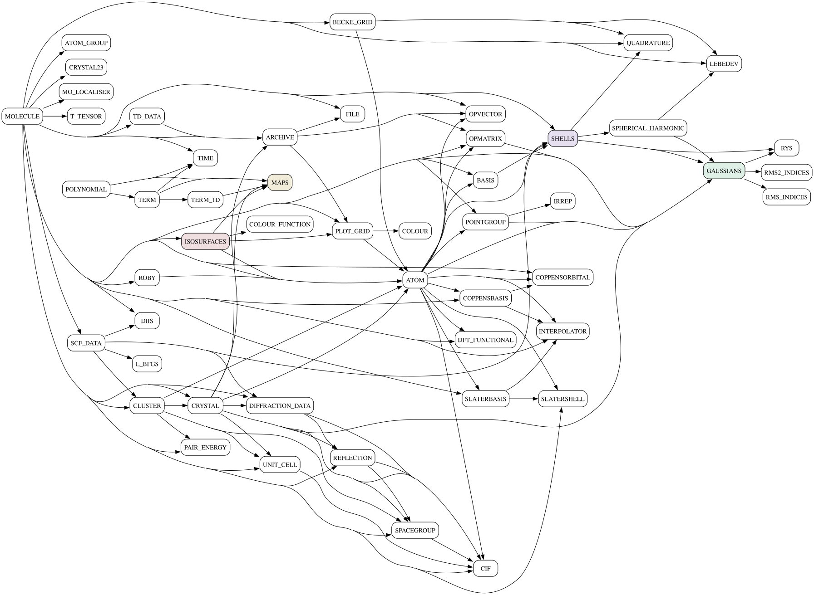

# Source and executable layout

Migrated from the project wiki (2026-08-05).

## Executables

Built into whichever build directory you configured (`build/` by convention):

| Path | Program |
|------|---------|
| `build/tonto` | the main program |
| `build/hart` | standalone Hirshfeld atom refinement (`hart --help`) |

Other small test/run programs are built alongside.

## Source layout

| Folder | Contents |
|--------|----------|
| `foofiles/` | the source modules, written in **Foo** (`*.foo`) — maintained by hand |
| `runfiles/` | the run programs (`run_molecule.foo` = `tonto`, `run_har.foo` = `hart`, …) |
| `foogrammar/` | the ANTLR4 grammar (`Foo.g4`) and translator (`FooToFortran.java`) |
| `<build dir>/` | translator output (`*.F90` / `*.int` / `*.use`), objects, executables |
| `tests/` | test jobs, one folder per job, grouped into suites: `short`, `hart`, `rgbi`, `long`, `cx` |
| `basis_sets/` | basis-set data |
| `scripts/` | test harness, invariant checks, developer tools |
| `docs/` | these documents |

The `.foo` modules translate fairly directly to the `.F90` files of the same name
in the build directory. **Never edit the generated Fortran** — edit the `.foo`
source and rebuild.

For each `module.foo` the translator emits three files: `module.F90` (the Fortran),
`module.int` (generic interfaces) and `module.use` (procedures pulled in from
dependent modules). The latter two are `#include`d into the `.F90` by the C
preprocessor at compile time, so the translator's output is *pre-CPP*.

## Module structure

The module dependency picture omits utility modules such as `TEXTFILE` and
`TABLES`; aggregates `ARRAYS`, `NUMBERS`, `MAPS`, gaussian basis functions and
`SHELLS`; and note that use of a type such as `ATOM` often implies use of the
corresponding array type `VEC{ATOM}`.

*(`docs/images/module_structure.svg` — committed here rather than linked to a
GitHub attachment URL, so it is versioned with the code and survives if that
URL ever stops resolving.)*

For generated, always-current versions of this information see
[`MAKING_CALL_GRAPHS.md`](MAKING_CALL_GRAPHS.md) — `make callgraphs` writes `call_graph.dot`,
`module_use.dot` and `submodule_use.dot`, and `scripts/simplify_callgraph.py`
makes them readable.
