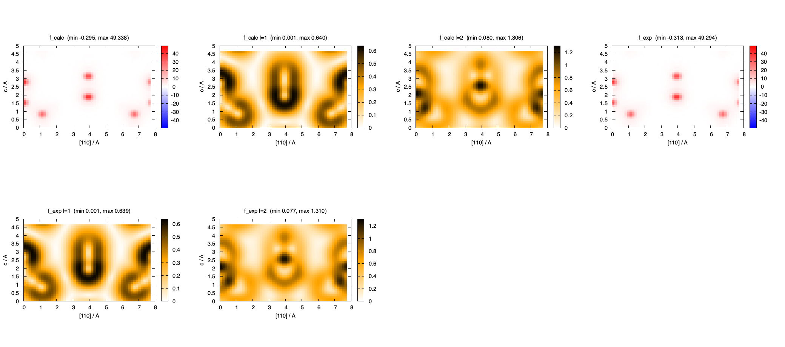
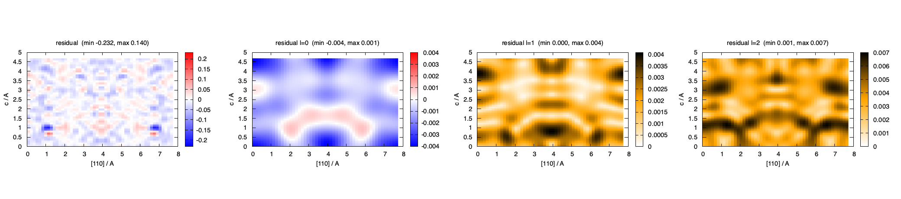

# Angular decomposition of electron density maps

A density map shows where the electrons are. It does not say, at any point, whether the
density there is spherical about the nearest atom, leans to one side, or is elongated — the
features that bonding adds to the atoms. Tonto makes three kinds of map that separate the
density by angular character, $`l = 0, 1, 2, \ldots`$, about every point of the cell or about
each atom:

- **local moments**: at every point, the moments of the density seen through a small window
  centred there — $`l = 0`$ the local average, $`l = 1`$ the local gradient, $`l = 2`$ the
  local curvature — made from the structure factors, measured or calculated;
- **the one-centre expansion**: the exact radial functions of the cell density about a chosen
  point, the reference the atom decomposition is tested against;
- **Hirshfeld atoms**: the density shared among the atoms by Hirshfeld's weights, each atom
  expanded about its own nucleus, so that the sum over atoms and $`l`$ gives the density back
  exactly, and the sum truncated at $`l \le L`$ is the density filtered to those $`l`$; and the
  same for the square root of each atom, whose expansion gives the number of electrons of each
  angular character, $`n_l`$.

This page gives the equations, the keywords, where the code is, the checks the code passed,
and what the maps show on urea and glycyl-L-alanine.

Units: Tonto works in atomic units and prints the maps in electrons per ų, lengths in Å.
Vectors are columns; a hat marks a unit vector, $`\hat{\mathbf v} = \mathbf v/v`$.

## 1. The density and the harmonics

**The density of the cell** is the Fourier series of its structure factors,

```math
\rho(\mathbf r) = \frac{1}{V} \sum_{n} F_n e^{i\alpha_n}\, e^{-i\mathbf q_n\cdot\mathbf r},
\qquad \mathbf q_n = 2\pi\,\mathbf B\,\mathbf h_n , \qquad (1)
```

with $`V`$ the cell volume, $`\mathbf h_n`$ the Miller indices of reflection $`n`$, $`\mathbf B`$
the reciprocal cell matrix (columns the reciprocal cell vectors), $`F_n`$ and $`\alpha_n`$ the
structure factor's magnitude and phase. The sum runs over the whole sphere of reflections, both
members of every Friedel pair, and includes $`F_{000}`$, the number of electrons in the cell; a
series without it is not a density. The structure factors may be the model's, $`F_{\rm calc}`$,
or the observed magnitudes with the model's phases, $`F_{\rm exp}`$, or their difference, the
residual.

**Real spherical harmonics** $`Y_{lm}(\hat{\mathbf r})`$ are used throughout, normalised to one
over the unit sphere,

```math
\oint Y_{lm}(\hat{\mathbf r})\, Y_{l'm'}(\hat{\mathbf r})\, d\hat{\mathbf r} = \delta_{ll'}\delta_{mm'} ,
\qquad (2)
```

so that $`Y_{00} = 1/\sqrt{4\pi}`$ and, for $`m = -1, 0, 1`$, $`Y_{1m}`$ is $`\sqrt{3/4\pi}`$ times
$`y/r`$, $`z/r`$, $`x/r`$. Any function of direction is a sum of them,

```math
f(\hat{\mathbf r}) = \sum_{l=0}^{\infty}\sum_{m=-l}^{l} f_{lm}\, Y_{lm}(\hat{\mathbf r}),
\qquad f_{lm} = \oint Y_{lm}(\hat{\mathbf r})\, f(\hat{\mathbf r})\, d\hat{\mathbf r} . \qquad (3)
```

**A plane wave about a point** is a sum of harmonics in both the wave's direction and the
displacement's (Rayleigh's formula),

```math
e^{-i\mathbf q\cdot\mathbf s} = 4\pi \sum_{l=0}^{\infty}\sum_{m=-l}^{l} (-i)^l\, j_l(qs)\,
Y_{lm}(\hat{\mathbf q})\, Y_{lm}(\hat{\mathbf s}) , \qquad (4)
```

with $`j_l`$ the spherical Bessel function, $`j_0(x) = \sin x / x`$. Equations (1) to (4) are
everything the three maps need.

## 2. The three maps

### 2.1 Local moments

Stand at a point $`\mathbf r`$ and look at the density within a distance $`\sigma`$ of it,
through a window $`w(s)`$, a positive function of the distance $`s`$ alone, largest at
$`s = 0`$ and falling to zero beyond $`\sigma`$, normalised to $`\int w\, d\mathbf s = 1`$. The
local moment of order $`l`$ of the density at $`\mathbf r`$ is

```math
M_{lm}(\mathbf r) = \int w(s)\; s^l\, Y_{lm}(\hat{\mathbf s})\; \rho(\mathbf r + \mathbf s)\; d\mathbf s . \qquad (5)
```

$`M_{00}`$ is the average density near the point; the three $`M_{1m}`$ say in which direction,
and how strongly, the density near the point rises; the five $`M_{2m}`$ say how it is elongated
or flattened. Put equation (1) into (5), expand the plane wave by (4) and use (2): the integral
over directions picks out one harmonic, and the radial integral is a number for each
reflection. With a Gaussian window, $`w(s) = (2\pi\sigma^2)^{-3/2} e^{-s^2/2\sigma^2}`$, that
number is elementary and

```math
M_{lm}(\mathbf r) = \frac{1}{V} \sum_{n} (-i\sigma^2)^l\; q_n^l\, Y_{lm}(\hat{\mathbf q}_n)\;
e^{-\sigma^2 q_n^2/2}\; F_n e^{i\alpha_n}\; e^{-i\mathbf q_n\cdot\mathbf r} . \qquad (6)
```

This is the density series (1) with each structure factor multiplied by a number: the same
routine makes it. The factor $`e^{-\sigma^2 q^2/2}`$ blurs the map, an added isotropic
displacement $`U = \sigma^2`$; call the blurred density $`\rho_\sigma`$. The factor
$`q^l Y_{lm}(\hat{\mathbf q})`$ is a polynomial of degree $`l`$ in the components of $`\mathbf q`$,
and $`-i\mathbf q`$ under the series is a gradient, so the moments are derivatives of the
blurred density: $`M_{00} = \rho_\sigma/\sqrt{4\pi}`$; the three $`M_{1m}`$ are
$`\sqrt{3/4\pi}\,\sigma^2`$ times $`\partial\rho_\sigma/\partial y, \partial z, \partial x`$; the
five $`M_{2m}`$ are $`\sigma^4`$ times the traceless second derivatives. Tonto prints the
scaled moments $`M_{lm}/\sigma^l`$, which have the units of a density for every $`l`$.

The $`m`$ components depend on the axes. The norm over $`m`$ for each $`l`$,
$`\big(\sum_m M_{lm}^2\big)^{1/2}`$, does not: for $`l = 1`$ it is the magnitude of the blurred
gradient, for $`l = 2`$ the magnitude of its traceless curvature. That is the map made by
default; one component is made on request.

**The window width.** The window merges features within about $`2\sigma`$, so $`\sigma`$ should
be below the size of the atoms looked at: a first-row covalent radius is 0.6 to 0.8 Å, a
second-row one 1.0 to 1.1 Å, hydrogen's 0.3 Å. The window also damps the series termination,
by $`e^{-\sigma^2 q_{\max}^2/2}`$ with $`q_{\max} = 4\pi (\sin\theta/\lambda)_{\max}`$: at a
resolution of 1.0 Å⁻¹ the damping is $`7\times10^{-3}`$ at $`\sigma = 0.25`$ Å and 0.2 at 0.15 Å.
So $`\sigma \ge 2/q_{\max}`$ keeps the map free of ripple; 0.25 Å, the default, is the narrowest
window that is safe on ordinary good data and resolves first-row atoms; 0.5 Å suits second-row
atoms and noisy data. For the residual map the same rule applies, and its features are small
enough that a wide window removes them.

### 2.2 The expansion about one centre

Choose a point $`\mathbf c`$, an atom or the middle of a bond, and write a general point as
$`\mathbf c + \mathbf s`$. On each sphere about the centre the density is a sum of harmonics,
equation (3), with radial functions

```math
\rho_{lm}(s;\mathbf c) = \oint Y_{lm}(\hat{\mathbf s})\, \rho(\mathbf c + s\hat{\mathbf s})\, d\hat{\mathbf s}
= \frac{4\pi\,(-i)^l}{V} \sum_{n} F_n e^{i\alpha_n}\, e^{-i\mathbf q_n\cdot\mathbf c}\;
Y_{lm}(\hat{\mathbf q}_n)\; j_l(q_n s) , \qquad (7)
```

the second form by (1), (4) and (2) again. It is exact for the Fourier series, with no grid and
no interpolation, and costs one sum over the reflections for each $`l`$, $`m`$ and radius. It
does not depend on where the cell's origin is drawn, and the power of each $`l`$,
$`P_l(s) = \sum_m \rho_{lm}(s)^2`$, does not depend on the axes. Its use is as the reference the
atom decomposition is tested against (section 5), and as a direct look at the density about one
point.

### 2.3 Hirshfeld atoms

The expansion (7) about one atom describes the whole density, neighbours included, so the
expansions about different atoms overlap and cannot be added. To decompose the density it is
first shared among the atoms by Hirshfeld's weights,

```math
w_A(\mathbf r) = \frac{\rho^0_A(|\mathbf r - \mathbf c_A|)}{\sum_B \rho^0_B(|\mathbf r - \mathbf c_B|)},
\qquad \sum_A w_A(\mathbf r) = 1 , \qquad (8)
```

with $`\rho^0_A`$ the spherical density of the free atom $`A`$ at $`\mathbf c_A`$, the sums over
every atom. The atom in the crystal is $`\rho_A = w_A\,\rho`$, and it is expanded about its own
nucleus,

```math
\rho^A_{lm}(s) = \oint Y_{lm}(\hat{\mathbf s})\; w_A(\mathbf c_A + s\hat{\mathbf s})\;
\rho(\mathbf c_A + s\hat{\mathbf s})\; d\hat{\mathbf s} . \qquad (9)
```

Because the weights add to one, the pieces add back to the density exactly:

```math
\rho(\mathbf r) = \sum_A \sum_{l=0}^{\infty}\sum_{m=-l}^{l}
\rho^A_{lm}(|\mathbf r - \mathbf c_A|)\; Y_{lm}\big(\widehat{\mathbf r - \mathbf c_A}\big) . \qquad (10)
```

Truncating at $`l \le L`$ is the filter: $`L = 0`$ is a crystal of spherical atoms, each with
the charge and radial shape it has in the crystal; $`L = 1`$ adds their dipolar deformations,
and so on. The weight falls off quickly, so the series in $`l`$ converges much faster than the
unweighted expansion (7). The product $`w_A\rho`$ is not periodic and has no structure factors,
so (9) is done by quadrature: for each atom and each radius, the integrand at the points of a
Lebedev grid on the sphere, with the density from the wavefunction, or from the series (1) when
the density is the measured one.

### 2.4 The square root of the atom, and populations

The components $`\rho^A_{lm}`$ with $`l > 0`$ integrate to zero over the sphere: they hold no
electrons, and one cannot say from them how much of an atom is of $`l = 1`$ character. The
square root of the atom, its *amplitude* $`\varphi_A = \sqrt{w_A\rho}`$, expanded in the same
way,

```math
\varphi^A_{lm}(s) = \oint Y_{lm}(\hat{\mathbf s})\; \sqrt{w_A\rho}\,\big|_{\mathbf c_A + s\hat{\mathbf s}}\; d\hat{\mathbf s} ,
\qquad (11)
```

gives numbers of that kind. Squaring the expansion and integrating over the sphere, the cross
terms between different harmonics vanish by (2) and the squares integrate to one; integrating
over the radius then gives

```math
N_A = \sum_{l=0}^{\infty} n^A_l , \qquad
n^A_l = \sum_{m=-l}^{l} \int_0^\infty \varphi^A_{lm}(s)^2\, s^2\, ds \;\ge\; 0 , \qquad (12)
```

with $`N_A`$ the atom's electron count. So $`n^A_l`$ is the number of the atom's electrons of
angular character $`l`$ about its nucleus: never negative, adding up to the atom, independent
of the axes. Three things it is not. The squares of the components do not add up to the density
at each point: (12) is a statement about populations, the cross terms being lobes on one side of
the atom, the shape of a lone pair. The populations are not orbital occupations: $`\varphi_A`$
is one function with no nodes standing for all the atom's electrons, so a free nitrogen atom,
whose three $`p`$ electrons give a spherical density, has $`n_1 = 0`$, and $`n^A_1`$ measures
only how far bonding has pushed the atom off a sphere. And it needs a true density: the square
root exists only where the density is not negative, so a measured map must be on the absolute
scale with $`F_{000}`$, and free of ripple; the wavefunction's density is the natural choice.

## 3. Keywords

All the settings live in one block, `cell_map= { ... }`, read at the top level of the molecule;
the maps are made by `plot_grid= { ... }` and `plot` as other maps are, and the tables by their
own keywords. The block keeps its settings between uses, so a sequence of maps changes one
keyword at a time.

| in `cell_map= { }` | default | meaning |
|---|---|---|
| `kind=` | `residual` | which structure factors the Fourier maps use: `residual` ($`F_{\rm exp} - F_{\rm calc}`$ with the model's phases), `f_exp` (observed magnitudes, model phases, $`F_{000}`$ added), `f_calc` |
| `l_value=` | $`-1`$ | for the Fourier maps: the plain density when negative, else the local moment of this $`l`$ (and this resets `m_value=`); for the rebuilt atoms: one $`l`$ alone |
| `m_value=` | none | one component $`m`$ of the local moment, signed, in the frame of the Cartesian axes; without it the norm over $`m`$ |
| `window_width=` | 0.25 Å | $`\sigma`$ of equation (6), a length with units |
| `l_max=` | 2 | the highest $`l`$ of the radial functions and the rebuilt atoms |
| `centre=` | the origin | the centre of the radial functions (7), Cartesian, with units; `center=` is accepted |
| `centre_fractional=` | | the same in fractional coordinates (`crystal=` must come first) |
| `n_radii=`, `radius_max=` | 40, 2 Å | the radii of the radial functions, equally spaced |
| `density_source=` | `wavefunction` | the density the atoms are expanded from: the wavefunction's, or `cell_map`, the series (1) of the `kind` above |
| `atom_weight=` | `hirshfeld` | `none` leaves the weight out of (9), for testing against (7) |
| `atoms= { ... }` | all | the atoms of a rebuilt map, by index or by tag, in braces |

| keyword | what it makes |
|---|---|
| `plot_grid= { kind= cell_map ... }` then `plot` | the Fourier map the block describes: the density of `kind=`, or with `l_value=` its local moment, equation (6) |
| `plot_grid= { kind= angular_hirshfeld ... }` then `plot` | the density rebuilt from the Hirshfeld atoms, equation (10), up to `l_max=` or for `l_value=` alone, over the atoms of `atoms=` |
| `plot_grid= { kind= hirshfeld_amplitude ... }` then `plot` | the same for the amplitudes, the sum over atoms of the expansion (11) |
| `put_cell_map` | the block's settings, the number of reflections and the electron count of the map |
| `put_cell_map_radial_functions` | the radial functions (7) about `centre=`, and the power of each $`l`$ |
| `put_angular_hirshfeld_atoms` | for each unique atom, $`\rho^A_{lm}(s)`$ of (9) on its radial shells, the power $`\sum_m \int (\rho^A_{lm})^2 s^2 ds`$ for each $`l`$, and its electron count |
| `put_ha_populations` | the same for the amplitude (11): $`\varphi^A_{lm}(s)`$ and the populations $`n^A_l`$ of (12) |

The Fourier maps need structure factors, so a HAR or `make_structure_factors` comes first; the
atom tables and rebuilt maps need the wavefunction's density matrix. A job that makes a model
density map and its $`l = 1`$ moment, then the rebuilt density up to $`l = 4`$ for two atoms:

```
plot_grid= {
   kind= cell_map
   use_unit_cell_as_bbox
   desired_separation= 0.2 bohr
   plot_format= gaussian.cube
}
cell_map= { kind= f_calc }
plot
cell_map= { l_value= 1 }
plot
plot_grid= { kind= angular_hirshfeld }
cell_map= { l_value= -1  l_max= 4  atoms= { O1 C1 } }
plot
```

Each `plot` writes a Gaussian cube file named after the job, the plot's label and the kind, for
VESTA or any cube viewer; `plot_grid= { plot_label= ... }` between plots keeps the files apart.

## 4. Where it is implemented

| piece | procedure |
|---|---|
| the coefficients of a cell density, expanded over the whole sphere, divided by $`V`$ | the type `CELL_MAP` (`cell_map.foo`), filled by `CRYSTAL:make_cell_map` |
| the coefficient of each reflection for `residual`, `f_exp`, `f_calc` | `DIFFRACTION_DATA.SET:make_Fourier_coefficients` |
| the expansion over the symmetry-generated reflections, with the Friedel and site-symmetry factors | `DIFFRACTION_DATA.SET:make_symop_generated_coefficients`, `CRYSTAL:set_Fourier_multiplicities` |
| the series (1) at any points, reflections outside and points inside so that the sines and cosines vectorise | `FOURIER_SUMS:fourier_series_at`, called by `CELL_MAP:make_values_at` |
| the series on a grid over the cell, by one-dimensional phase tables | `CELL_MAP:make_values_on_cell` |
| the local moments (6), one component or the norm over $`m`$ | `CELL_MAP:make_moment_at`, through `make_map_at` |
| the solid harmonics $`q^l Y_{lm}(\hat{\mathbf q})`$ for all $`l \le l_{\max}`$ | `FOURIER_SUMS:make_solid_harmonics`, with `FOURIER_SUMS:harmonic_column` for the order of $`m`$ |
| the radial functions (7); the spherical Bessel functions | `CELL_MAP:make_radial_functions`, `FOURIER_SUMS:spherical_bessel` |
| the angular quadrature (9) and (11) about a nucleus | `MOLECULE.RHO:make_atom_lm_radial_functions` |
| the atom tables and populations | `MOLECULE.MAIN:put_angular_Hirshfeld_atoms` |
| the rebuilt density (10) on a grid; the atoms of `atoms=` | `MOLECULE.RHO:make_rebuilt_atoms_grid`, `atoms_for_cell_map` |
| the plot kinds and their set-up | the dispatch tables of `MOLECULE.GRID`, `MOLECULE.PLOT:set_up_for_plot` |
| the keywords | `CELL_MAP:process_keyword`, `MOLECULE.MAIN:read_cell_map` and the `put_` keywords |

`CELL_MAP` holds no crystal, atoms or plot grid; it is given what it needs. The residual
density map, which existed before, now goes through it unchanged.

Two conventions to know when reading the code. The columns of `make_solid_harmonics` are in
Molden order within each $`l`$, $`m = 0, +1, -1, +2, -2, \ldots`$ with $`m > 0`$ cosine-like and
$`m < 0`$ sine-like, so for $`l = 1`$ the columns are $`z, x, y`$; `harmonic_column(l,m)` maps the
usual $`m`$ onto them, and every table and keyword uses the usual $`m`$, with $`-1, 0, 1`$ as
$`y, z, x`$. And the series is summed as the real part of each doubled term for the reflections
whose Friedel mate is not in the data, which is right for odd $`l`$ too because the factor of
(6) at $`-\mathbf q`$ is the conjugate of the factor at $`\mathbf q`$.

## 5. The checks the code passed

Each piece was tested against something it does not share code with. The reference for the
Fourier pieces is an independent Python sum over the whole sphere of reflections, built from the
structure factors Tonto writes to its `.fcf` file and the symmetry operations in its `.fco`,
and itself tested against an angular quadrature of the series.

| # | what was compared with what | on | measure | result |
|---|---|---|---|---|
| 1 | the `f_exp` map minus the `f_calc` map, against the residual map | L-alanine, urea | largest point difference | within the cubes' four printed decimals |
| 2 | the integral of the `f_calc` and `f_exp` maps, against the electron count | L-alanine (192), urea (64), gly-L-ala (312) | integral over the cell | 192.000, 64.000, 312.000 |
| 3 | each $`l = 1`$ component, against $`\sqrt{3/4\pi}\,\sigma\,\partial\rho_\sigma/\partial x_m`$ by finite differences of the $`l = 0`$ map | L-alanine, `f_calc`, 0.25-bohr grid | correlation over the cell | +0.99996, each along its own axis |
| 4 | the $`l = 1`$ norm, against the root sum of squares of its three components | L-alanine | largest difference | 1e-5 |
| 5 | the radial functions (7) about O and C, against the Python sum | urea, $`l \le 2`$, $`s`$ = 0.1 to 2 Å | relative difference | 1e-4, the four figures the `.fcf` prints |
| 6 | the quadrature (9) of the Fourier density with the weight left out, against the exact (7) at the same radii | urea, every atom, $`s \le 1.5`$ Å | relative difference | 5e-5 |
| 7 | $`\sum_{l\le 2} n^A_l`$ of the amplitude, against the atom's electron count | urea, gly-L-ala, every atom | difference as a fraction of $`N_A`$ | 0.05 to 0.3 %, the remainder being $`l > 2`$ |
| 8 | the rebuilt density (10) over all atoms, against the electron density on the same grid | urea, $`L = 0, 1, 2, 4, 6`$ | rms remainder as a fraction of the density's rms | see section 6 |

Beyond 1.5 Å from a nucleus check 6 fails, as it must: without the weight the sphere runs
through neighbouring nuclei, and a 302-point Lebedev grid cannot integrate a 50 e/ų spike.
With the weight on, the atom has gone to zero there.

## 6. Results

### Urea

Hirshfeld atom refinement at B3LYP/def2-TZVP on the data of `tests/long/urea_rhf_STO-3G_HAR`
(GoF 2.55), then maps of the cell at 0.2 bohr. The window is 0.5 Å here.



*The molecular plane $`y = x + \tfrac12`$ of urea; C and O on the cell diagonal's midpoint, N at
the sides, H at the edges. Top: from $`F_{\rm calc}`$; bottom: from $`F_{\rm exp}`$ with the
model's phases. The $`l = 1`$ norm, the gradient of the blurred density, is zero on each nucleus
and rings it; the $`l = 2`$ norm peaks on the nuclei and along C=O.*

The maps from $`F_{\rm exp}`$ and from $`F_{\rm calc}`$ agree closely after the refinement: the
$`l = 1`$ norms have maxima 0.641 and 0.642 e/ų and an rms difference of 0.0013 over the cell
(correlation 0.99998); the $`l = 2`$ norms 1.310 and 1.306, rms difference 0.0015. The same
measure for the density itself is 0.022 against maxima of 49, the residual's rms.



*The residual, $`-0.23`$ to $`+0.14`$ e/ų, and through the 0.5 Šwindow its $`l = 0, 1, 2`$ parts,
of rms 0.0013, 0.0023 and 0.0035: a smooth, mostly negative background with a positive band
across the N-H region. The window is wide for residual features; 0.25 Å, the default, keeps
more of them.*

The populations of the Hirshfeld amplitudes, $`l \le 2`$, with each atom's electron count:

| atom | $`n_0`$ | $`n_1`$ | $`n_2`$ | sum | $`N_A`$ |
|---|---|---|---|---|---|
| O | 8.363 | 0.0064 | 0.0023 | 8.372 | 8.376 |
| N | 7.125 | 0.0015 | 0.0044 | 7.131 | 7.143 |
| C | 5.817 | 0.0010 | 0.0079 | 5.826 | 5.842 |
| H (N-H, two kinds) | 0.848, 0.866 | 0.0155, 0.0135 | 0.0012, 0.0014 | 0.865, 0.881 | 0.866, 0.882 |

The amplitude of a Hirshfeld atom is spherical to better than 0.2 % of its electrons. The lone
pairs of O and the planar skeleton do not show in $`n_1`$ or $`n_2`$ at any size; the only
visible non-sphericity is the hydrogens' $`n_1`$ of 0.014 to 0.016 e, the polarisation of the
N-H bond.

**The density rebuilt from the atoms** (equation 10, all eight atoms of the molecule, on the
cell at 0.3 bohr) against the electron density of the same wavefunction, as the truncation
$`L`$ rises:

| $`L`$ | rms remainder / rms of the density | largest point remainder, e/bohr³ |
|---|---|---|
| 0 | 0.49 % | 0.14 |
| 1 | 0.43 % | 0.18 |
| 2 | 0.33 % | 0.18 |
| 4 | 0.12 % | 0.18 |
| 6 | 0.12 % | 0.18 |

So the spherical atoms alone are within half a percent of the density in the rms sense,
$`L = 2`$ brings that to a third of a percent, and $`L = 4`$ reaches the floor of the method,
0.12 %, set by the interpolation of the radial functions: the largest point remainder, 0.18 on
183 e/bohr³, sits on a nucleus and does not fall with $`L`$. The amplitude being spherical to
0.2 % by electron count (the table above) and the density needing $`L = 4`$ for 0.1 % are the
same fact seen two ways: the density is the amplitude squared, so its angular content runs to
twice the amplitude's.

### Glycyl-L-alanine

The 150 K data of the X-ray and neutron test set (`~/Dropbox/tonto_data/xray_neutron_set`),
HAR at B3LYP/def2-TZVP, 20 atoms, 2532 reflections (GoF 1.34), maps at 0.2 bohr with the
default 0.25 Å window. Both total maps integrate to 312.000 electrons. From $`F_{\rm exp}`$
against $`F_{\rm calc}`$: $`l = 1`$ norm maxima 1.980 and 1.989 e/ų, rms difference 0.0060,
correlation 0.99987; $`l = 2`$ norm 3.191 and 3.193, rms difference 0.0043; the residual's
$`l = 1`$ and $`l = 2`$ parts reach 0.020 and 0.024 e/ų (rms 0.009), five times urea's through
the narrower window. The populations say what urea's do: $`n_0`$ carries all but 0.1 to 0.3 % of
every atom (O 8.43, 8.41, 8.28; N 7.04, 6.91; C 5.85 to 6.07; the ammonium H 0.80, the amide H
0.88, C-H 0.93 to 0.99), and the only $`n_1`$ above 0.01 e are the N-H hydrogens' (0.011 to
0.018), with C-H at 0.005 to 0.009 and the carbonyl O at 0.008 to 0.009.

## 7. The same idea in other fields

Windowed moments of a field at every point are, by equation (6), derivatives of the blurred
field, and that has been found wherever a scalar field on a grid is analysed. The atom-centred
expansion with its invariants summed over $`m`$ has twins too. Each relative, and what it is
here:

| field | name | what it is | here |
|---|---|---|---|
| image analysis, vision | the *local jet* of scale-space theory (Koenderink; Florack, ter Haar Romeny, Viergever) | the image convolved with Gaussian derivatives of order 0, 1, 2, … at a scale $`\sigma`$, at every point, with the scale a free parameter | the local moments of section 2.1, one to one: $`M_{00}`$, $`M_{1m}`$, $`M_{2m}`$ are the derivatives of order 0, 1, 2 at scale $`\sigma`$ |
| image analysis; seismic interpretation | the *structure tensor* (second-moment matrix; Förstner, Harris) | the outer product of the gradient, smoothed over a window; its eigenvectors give the local orientation of layering, its eigenvalues the anisotropy; used to pick reflector normals and channels in seismic volumes | a window over products of the $`l = 1`$ moments |
| rock mechanics, granular materials, bone | the *fabric tensor* | the second-moment tensor of the orientations of grains, pores or interfaces in a window, linking the anisotropy of a microstructure to its elastic anisotropy | $`l = 2`$ moments of an orientation distribution rather than of a density |
| medical imaging | *vesselness* (Sato, Lorenz, Frangi) | the eigenvalues of the Hessian of the Gaussian-smoothed image at several scales, combined into a score for "tubular here", the best scale kept | the $`l = 2`$ norm used as a detector, with the window width swept |
| condensed matter, simulation | Steinhardt's *bond-orientational order parameters* $`Q_l`$ | about each atom, $`q_{lm} = \frac{1}{N}\sum_j Y_{lm}(\hat{\mathbf r}_{ij})`$ over its neighbours, then the rotational invariant $`Q_l = \big(\frac{4\pi}{2l+1}\sum_m q_{lm}^2\big)^{1/2}`$; $`Q_4`$ and $`Q_6`$ tell fcc from bcc from liquid | the norm over $`m`$, applied to neighbour directions instead of a density |
| materials, machine-learning potentials | *SOAP*, smooth overlap of atomic positions (Bartók) | the neighbour density about an atom as a sum of Gaussians, expanded in radial functions times $`Y_{lm}`$ and reduced to the rotationally invariant power spectrum $`\sum_m c_{nlm} c_{n'lm}`$ | the Hirshfeld-atom expansion of section 2.3 and its power $`P_l(s)`$, built on atoms placed as Gaussians instead of the electron density |

So the field maps are the local jet and the structure tensor, and the atom-centred expansion
with its $`m`$-summed invariants is $`Q_l`$ and SOAP's power spectrum. The decomposition (10),
whose pieces add back to the density, and the populations (12) of the square root appear to
have no twin. Two habits of the neighbours are worth borrowing: the vision literature answers
"which $`\sigma`$" by sweeping it and reading the structure across scales, and the experience
with SOAP is that the power spectrum, $`P_l`$ here, carries the chemistry better than any single
component.

References: [the Gaussian scale-space paradigm and the multiscale local jet](https://link.springer.com/article/10.1007/BF00126140);
[an introduction to scale-space theory](https://www.cs.jhu.edu/~misha/Fall07/Papers/intro-to-scalespace.pdf);
[the structure tensor](https://en.wikipedia.org/wiki/Structure_tensor) and
[its use on seismic data](https://academic.oup.com/gji/article/210/1/534/3805465);
[the fabric tensor](https://arxiv.org/pdf/2604.08105);
[multiscale vesselness filters](https://www.researchgate.net/publication/283558933_Beyond_Frangi_An_improved_multiscale_vesselness_filter);
[Steinhardt parameters for structure identification](https://arxiv.org/pdf/1202.5005);
[atom-density representations, SOAP](https://arxiv.org/pdf/1807.00408) and
[DScribe](https://arxiv.org/pdf/1904.08875), which computes it.

## 8. Pitfalls

- A map from measured structure factors is a density only on the absolute scale with
  $`F_{000}`$ and the model's phases; Tonto adds $`F_{000}`$ as the electrons of the unit cell,
  the cell taken as neutral.
- The Fourier density is smeared by the ADPs; the wavefunction's is not. Their $`l`$
  components differ for that reason alone.
- The window must be at least $`2/q_{\max}`$ or the map carries termination ripple; the default
  0.25 Å is safe at a resolution of 1.0 Å⁻¹ and above.
- The $`m`$ components depend on the axes; compare the norms, or the populations, between
  atoms and between structures.
- The atom quadrature uses a Lebedev grid of order $`\max(2 l_{\max} + 2, 29)`$ on every shell;
  with the weight left out (`atom_weight= none`) it is only valid within the atom's own region.
- The rebuilt maps tabulate each atom's radial functions to 10 bohr and add nothing beyond.
