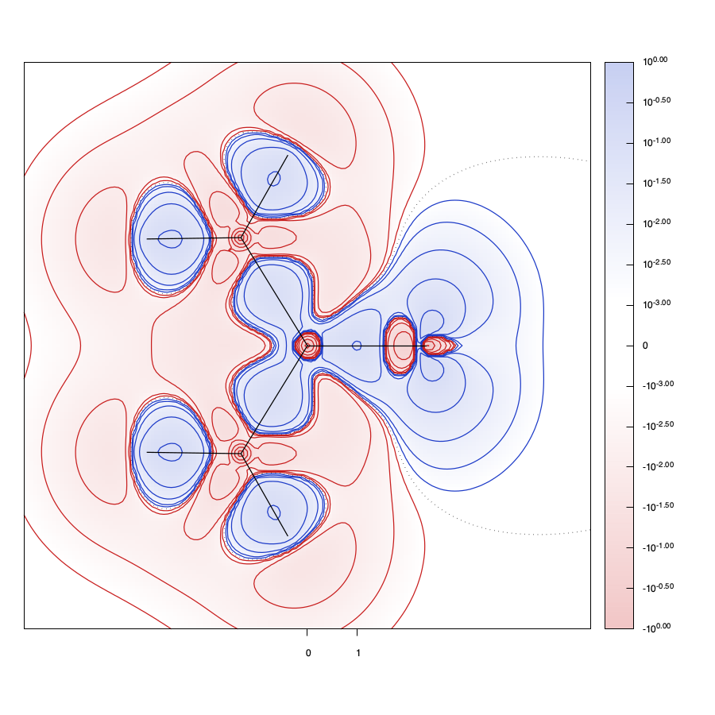
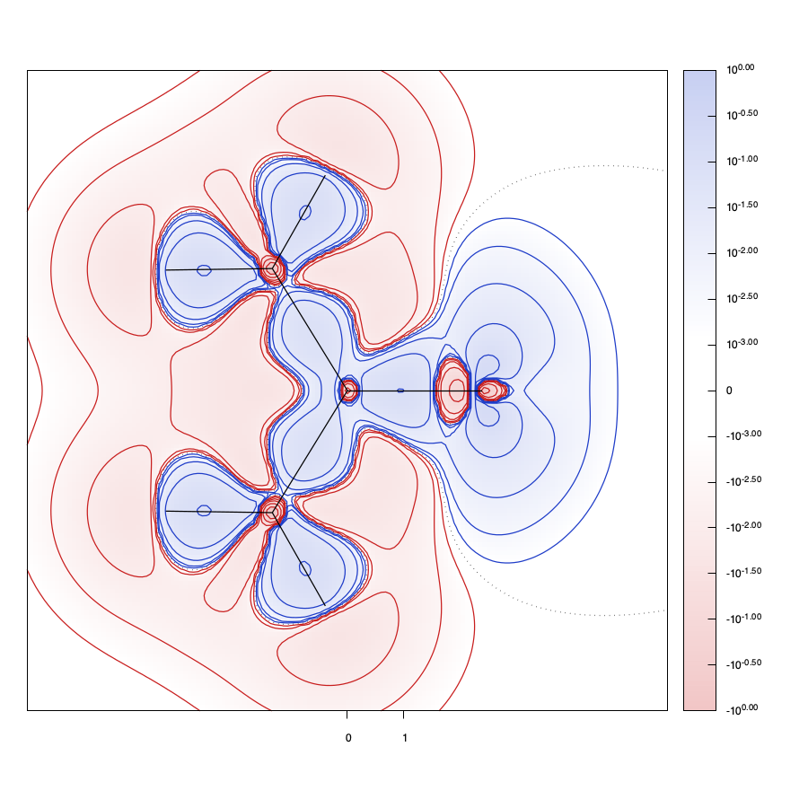
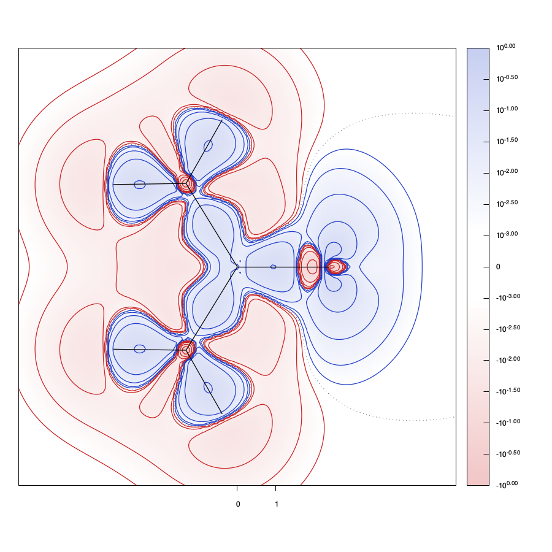
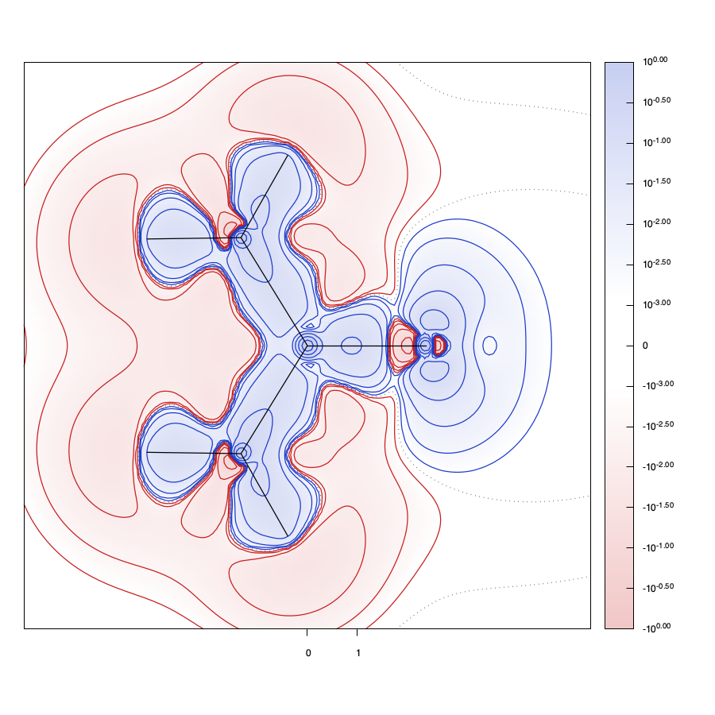
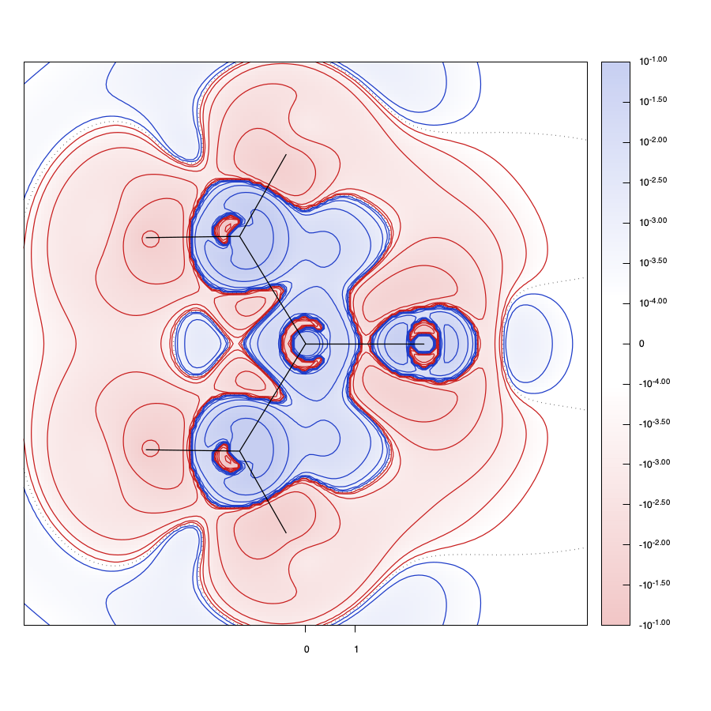
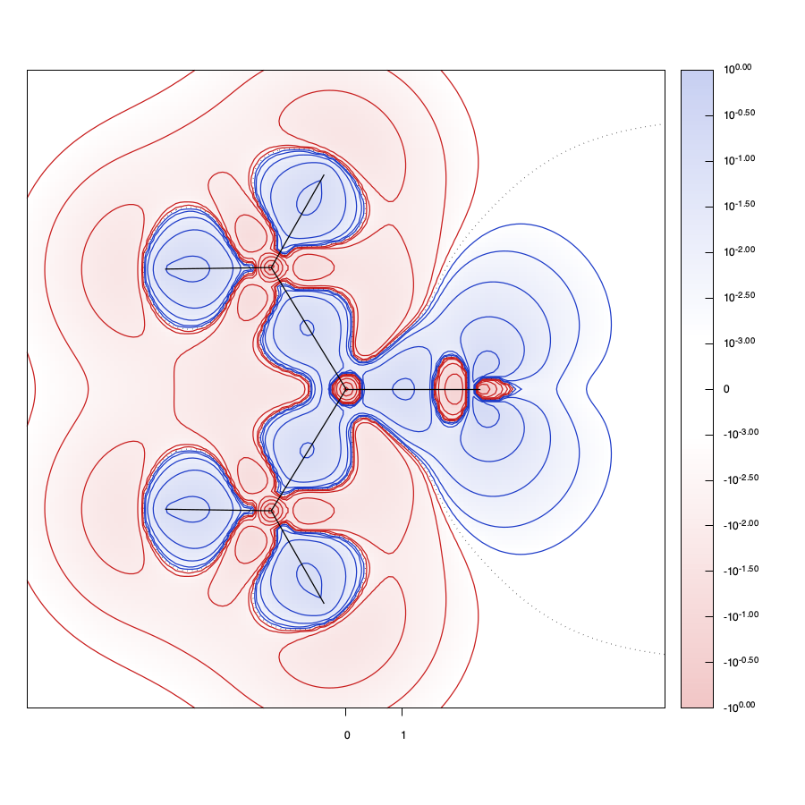
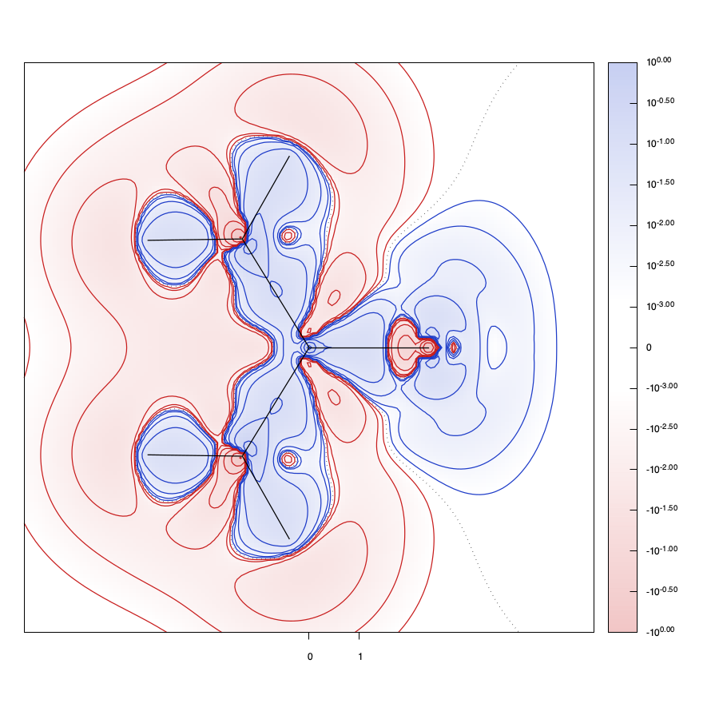
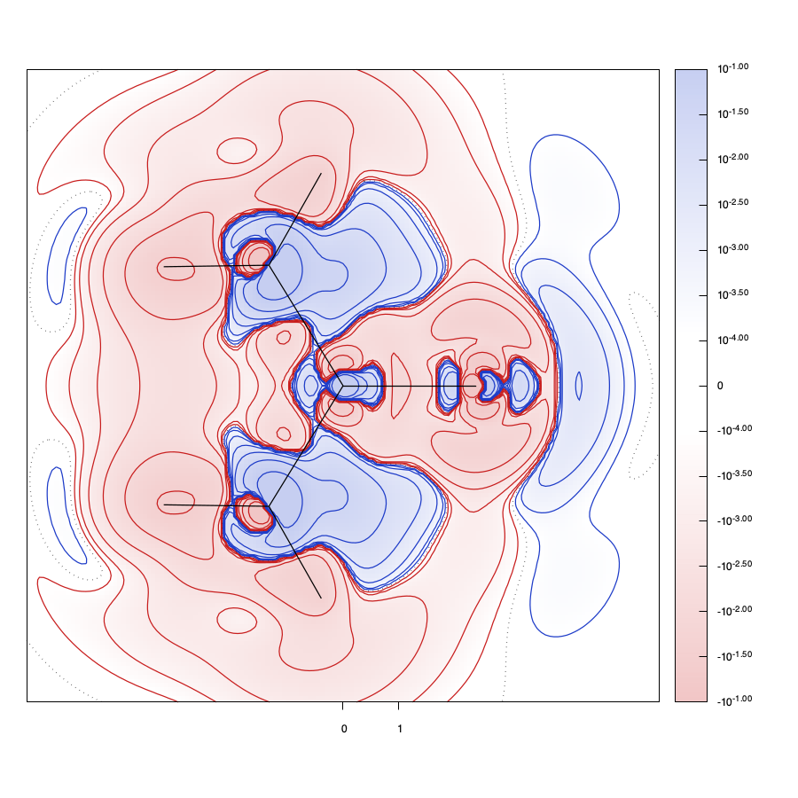

# The X-ray constrained SCF: why it wanders, how stiff the data make it, and how to choose lambda

## 1. Summary

1. **The blow-up is a linear instability of the plain SCF step.** The constraint term makes
   the Fock matrix respond very strongly to a change in the density. Above a certain lambda an
   undamped step overshoots by more than it corrects, and each iteration is worse than the
   last by a fixed factor.
2. **That factor can be calculated before running anything**, from the orbitals, the orbital
   energies, and the reflections with their sigmas (section 3). For the ammonia restart job at
   lambda = 0.012 it predicts that a step mixing in more than 23.0% of the new density diverges.
   Measured: 23% converges, 24% diverges.
3. **No single reflection is to blame** in ammonia (section 7.2). The stiffness is spread over the
   strong low-angle reflections, all of which have F/sigma above 100.
4. **The same matrix gives the effective number of fitted parameters, the AIC, BIC and
   generalised cross-validation criteria for lambda, and a leave-one-out cross-validation from
   one converged run** (section 4). Checked against two real held-out refits: 7 to 8% low.
   Its diagonal is the leverage of crystallographic least squares (section 5).
5. **The cure is the Newton step with the constraint curvature included** (section 6). It
   needs no damping, converges in about ten iterations at every lambda from 0.012 to 4 on
   ammonia, and leaves the converged wavefunction unchanged: it alters only the path.
6. **With the cure the lambda scan runs out to where the criteria turn.** On ammonia the
   leave-one-out sum has its minimum at lambda 2.0 and generalised cross-validation at 3.2,
   where 34 to 36 of the 88 reflections' worth of parameters are in use; AIC with the sigmas
   trusted puts it at 0.08 and BIC at 0.024.
7. **On urea in def2-SVP only the leave-one-out sum turns** (section 8): at lambda 2.4, with 76
   of 817 reflections' worth of parameters in use and GoF 1.40. GCV and the sigma-free AIC are
   still falling, because they average over the reflections, while the leave-one-out sum is
   dominated by the few with the largest leverage. In def2-TZVP not even the leave-one-out
   sum turns up to lambda 6; only BIC turns, at 4.0, and its sigma-free form at 2.3.
8. **Every one of these minima costs far more energy than the crystal can account for**
   (sections 8.6 to 8.9). The energy of the fitted wavefunction rises by 0.56 to 1.06 hartree, 14 to 27
   times urea's lattice energy of 39 m$`E_\mathrm{h}`$. The molecule's own deformation energy
   in the crystal, which is what that rise should be if the fit found the wavefunction of the
   molecule in the crystal, is 14 to 18 m$`E_\mathrm{h}`$ by a cluster-charge calculation, and
   the fit reaches it at lambda 0.005 to 0.008.

## 2. The instability

The job is `tests/long/nh3_x-ray-constrained-rhf-cluster-charge_cc-pVTZ_restart`: ammonia,
RHF/cc-pVTZ, 88 reflections, lambda = 0.012 then 0.016, started from a converged density. With
`output= YES` the first lambda shows:

```
 Iter  Lambda     GoF    Energy   <MO|M0>
    0  0.0120    2.53  -56.2167    1.0000   *Damping on
    1  0.0120    9.56  -55.9161    0.9575
    2  0.0120   35.99  -52.9207    0.6053
    3  0.0120   54.76  -27.0562    0.0049   *Damping was off
    4  0.0120   27.61  -50.8326    0.2870   *DIIS starts saving now
   ...
   10  0.0120   49.16  -14.6622    0.0001
   ...
   31  0.0120    0.84  -56.2039    0.9985
```

The GoF grows by a factor of about 3.8 per iteration from the first step. DIIS, which starts at
iteration 4, eventually recovers. The final answer is right.

The table says damping is on, but no density damping was applied: the routine that makes the
density only damped when an old density already existed, and only kept one when damping was
already on. Damping now mixes with the density it is given on entry, and every SCF with the
default settings takes a different path to the same answer.

The other three constrained test jobs show no such excursion: their GoF and energy move
smoothly to convergence at every lambda. They use much smaller multipliers, at most 0.0003
for `nh3_x-ray-constrained-rhf_cc-pVTZ` and its `_extinction` twin and 0.001 for the urea UHF
job, and at those values the overshoot of section 3 is far too small to matter.

## 3. Theory: the gain matrix

All symbols are defined here. Matrices and vectors are bold; their elements are not.

- $`\boldsymbol{D}`$ is the density matrix and $`E(\boldsymbol{D})`$ the Hartree-Fock energy.
- $`F_k`$ is the calculated structure factor of reflection $`k`$, $`F_k^{\mathrm{obs}}`$ the
  observed magnitude and $`\sigma_k`$ its standard uncertainty.
- $`\alpha`$ is the scale factor, refitted at every iteration.
- $`N_{\mathrm{refl}}`$ is the number of reflections and $`p`$ the number of fitted parameters.
- $`\lambda`$ is the multiplier.

**Everything in units of sigma.** Each reflection has its own units and its own uncertainty,
and both drop out if the residual of reflection $`k`$ is written in units of its sigma,

```math
r_k = \frac{\alpha |F_k| - F_k^{\mathrm{obs}}}{\sigma_k}, \qquad
\mathrm{GoF}^2 = \frac{1}{N_{\mathrm{refl}}-p}\sum_k r_k^2
\qquad (1)
```

The vector $`\boldsymbol{r}`$ of these standardised residuals is the only form in which the data
enter from here on; a change in it, from any cause, is written $`\boldsymbol{e}`$, dimensionless,
one number per reflection. The constrained SCF makes stationary
$`E(\boldsymbol{D}) + \lambda\,\mathrm{GoF}^2(\boldsymbol{D})`$, so the matrix that is diagonalised is the Fock
matrix plus $`\lambda\boldsymbol{C}`$, with, by the chain rule through equation (1),

```math
\boldsymbol{C} = \frac{\partial\,\mathrm{GoF}^2}{\partial\boldsymbol{D}}
  = \frac{2}{N_{\mathrm{refl}}-p}\sum_k \frac{\alpha}{\sigma_k}\, r_k\, \boldsymbol{A}_k ,
\qquad \boldsymbol{A}_k = \frac{\partial |F_k|}{\partial\boldsymbol{D}}
\qquad (2)
```

One $`\alpha`$ sits inside $`r_k`$ and one comes from differentiating $`\alpha|F_k|`$.
$`\boldsymbol{A}_k`$ is the Fourier transform of a pair
of basis functions at the scattering vector of reflection $`k`$, projected on the phase of
$`F_k`$, so that $`\mathrm{tr}\,(\boldsymbol{A}_k\,\delta\boldsymbol{D})`$ is the change of $`|F_k|`$ for a
change $`\delta\boldsymbol{D}`$ of the density. Note that $`\boldsymbol{C}`$ is linear in $`\boldsymbol{r}`$: a
change $`\boldsymbol{e}`$ of the residuals changes it by the same formula with $`\boldsymbol{e}`$ in place
of $`\boldsymbol{r}`$.

**One SCF step, linearised, in four steps.** Suppose the input density is off the converged one
by $`\delta\boldsymbol{D}`$. First, the residuals are off, in units of sigma, by

```math
e_k^{\mathrm{in}} = \frac{\alpha}{\sigma_k}\,\mathrm{tr}\,(\boldsymbol{A}_k\,\delta\boldsymbol{D}),
\qquad\text{and so the operator is off by}\qquad
\boldsymbol{V} = \lambda\,\delta\boldsymbol{C}
 = \lambda\,\frac{2}{N_{\mathrm{refl}}-p}\sum_k \frac{\alpha}{\sigma_k}\, e_k^{\mathrm{in}}\,\boldsymbol{A}_k
\qquad (3)
```

Second, diagonalising the Fock matrix with this extra piece $`\boldsymbol{V}`$ gives, to first order in
$`\boldsymbol{V}`$ and leaving out the change of the two-electron part of the Fock matrix, the
orbitals of ordinary perturbation theory: occupied orbital $`i`$ acquires a part of each virtual
orbital $`a`$,

```math
\boldsymbol{c}_i \to \boldsymbol{c}_i - \sum_a \boldsymbol{c}_a\,\frac{V_{ai}}{\varepsilon_a-\varepsilon_i},
\qquad V_{ai} = \boldsymbol{c}_a^{T}\,\boldsymbol{V}\,\boldsymbol{c}_i
\qquad (4)
```

where $`\varepsilon`$ are the orbital energies. Third, the closed-shell density
$`\boldsymbol{D} = 2\sum_i \boldsymbol{c}_i\boldsymbol{c}_i^{T}`$ therefore changes by
$`\delta\boldsymbol{D}^{\mathrm{out}} = -2\sum_{ia}\frac{V_{ia}}{\varepsilon_a-\varepsilon_i}
\left(\boldsymbol{c}_a\boldsymbol{c}_i^{T} + \boldsymbol{c}_i\boldsymbol{c}_a^{T}\right)`$, and reflection $`l`$ by
$`\mathrm{tr}\,(\boldsymbol{A}_l\,\delta\boldsymbol{D}^{\mathrm{out}}) = -4\sum_{ia} (\boldsymbol{A}_l)_{ia}\,V_{ia}/(\varepsilon_a-\varepsilon_i)`$,
with $`(\boldsymbol{A}_l)_{ia} = \boldsymbol{c}_i^{T}\boldsymbol{A}_l\boldsymbol{c}_a`$ and the 4 from the 2 electrons
and the 2 terms of the transpose. Fourth, put $`V_{ia}`$ from equation (3) into that, and
write the result in units of sigma, $`e_l^{\mathrm{out}} = (\alpha/\sigma_l)\,
\mathrm{tr}\,(\boldsymbol{A}_l\,\delta\boldsymbol{D}^{\mathrm{out}})`$:

```math
\boldsymbol{e}^{\mathrm{out}} = -\lambda\,\boldsymbol{G}\,\boldsymbol{e}^{\mathrm{in}}, \qquad
\boldsymbol{G} = \frac{2}{N_{\mathrm{refl}}-p}\,\boldsymbol{B}\boldsymbol{B}^{T}, \qquad
B_{k,ia} = \frac{2\alpha\,(\boldsymbol{A}_k)_{ia}}{\sigma_k\sqrt{\varepsilon_a-\varepsilon_i}}
\qquad (5)
```

The factor 4 and the one energy denominator have been split between the two factors of
$`\boldsymbol{B}`$, which is why each row of $`\boldsymbol{B}`$ carries a 2 and a square root. So
$`\boldsymbol{G}`$ is an $`N_{\mathrm{refl}} \times N_{\mathrm{refl}}`$ symmetric matrix with no negative eigenvalues,
built only from the sigmas, the structure factor derivatives and the orbital energy gaps, and it
says how an error in the residuals comes back after one plain step. Call it the gain matrix,
and its largest eigenvalue $`\gamma`$. The minus sign is the overshoot: an error comes back
reversed and $`\lambda\gamma`$ times larger. With extinction on, the $`\alpha`$ in the operator
of equation (3) is the derivative of the predicted magnitude rather than the scale, and the
code puts the geometric mean of the two into each row of $`\boldsymbol{B}`$.

**The refitted scale.** Because $`\alpha`$ is refitted each step, an error in the structure
factors that is proportional to the structure factors themselves costs nothing. That error is
the vector $`\boldsymbol{u}`$ in the space of reflections whose $`k`$-th component is $`\alpha|F_k|/\sigma_k`$,
normalised to unit length; it is projected out of $`\boldsymbol{B}`$, row by row, before $`\boldsymbol{G}`$ is formed.
This lowers $`\gamma`$ for ammonia from 1071 to 642.

**The condition for convergence.** A step that mixes a fraction $`x`$ of the new density with
$`1-x`$ of the old multiplies the error along the stiffest direction by
$`1 - x\,(1+\lambda\gamma)`$. It shrinks only if

```math
x < \frac{2}{1+\lambda\gamma}
\qquad (6)
```

With no damping, $`x = 1`$, the step fails once $`\lambda > 1/\gamma`$.

**Antecedents.** The gain matrix is the Jacobian of the SCF fixed-point map, restricted to
the space of reflections, and each half of that is old. That the convergence of an SCF is
decided by the largest eigenvalue of its linearised step, built from the orbital Hessian, is
Stanton's analysis, *J. Chem. Phys.* **75**, 3426 (1981), and the level shift of Saunders and
Hillier, *Int. J. Quantum Chem.* **7**, 699 (1973), is the remedy derived from it. In the
density-mixing SCF of solids the same matrix is the dielectric response, the overshoot is
called charge sloshing, and the cure is a preconditioner on the response: Kerker, *Phys. Rev.
B* **23**, 3082 (1981); Dederichs and Zeller, *Phys. Rev. B* **28**, 5462 (1983); Kresse and
Furthmüller, *Phys. Rev. B* **54**, 11169 (1996), section IV. Here $`\boldsymbol{1}+\lambda\boldsymbol{G}`$
is that dielectric matrix with the fit term in the role of the Coulomb interaction. The other
half, the penalised fit whose hat matrix counts the parameters the data determine, is ridge
regression, Hoerl and Kennard, *Technometrics* **12**, 55 (1970), with the influence matrix of
Golub, Heath and Wahba (1979) in section 4. What is new is only the combination: because the
fit term involves $`N_{\mathrm{refl}}`$ quantities linear in the density, the Jacobian is of low
rank, and the stiffness, the hat matrix and the correction of section 6 all live in the space
of reflections.

**It does not depend on the scale of the sigmas.** If every sigma is multiplied by $`s`$, the
lambda that gives the same wavefunction is multiplied by $`s^2`$ and $`\gamma`$ is divided by
$`s^2`$. The product $`\lambda\gamma`$ measures how many times stiffer the data term is than the
wavefunction's own resistance to change. It is a property of how hard the fit is pushed.

## 4. The effective number of parameters, and the choice of lambda

**The definition.** In a restrained least-squares fit the effective number of parameters is
the trace of the hat matrix $`\boldsymbol{H}`$, the matrix that maps the observations to the fitted values.
Its diagonal element $`H_{kk}`$ says how far the prediction for reflection $`k`$ follows its own
observation: all the way for a freely fitted point, not at all for a point the model cannot
reach. It is the quantity that reduces to the ordinary parameter count for an unrestrained fit,
and to zero at lambda = 0, as Davidson *et al.* (2022) require.

**The hat matrix of the XCW.** Section 3 gave what one SCF step does to an error
$`\boldsymbol{e}`$ in the residuals. The same linearisation gives what a change in the observations
does to the converged predictions. Move the observations by $`\delta o_k`$, in units of their
sigmas, $`\delta o_k = \delta F_k^{\mathrm{obs}}/\sigma_k`$, with the scale direction removed as
before, and let the wavefunction reconverge. Call the change of the predictions, in the same
units, $`e_k = (\alpha/\sigma_k)\,\delta|F_k|`$: it is the quantity to be found. The residuals of
equation (1) are predictions minus observations, so they change by $`\boldsymbol{e} - \delta\boldsymbol{o}`$,
and by equation (2) the operator changes as in equation (3) with $`\boldsymbol{e} - \delta\boldsymbol{o}`$ in
place of $`\boldsymbol{e}^{\mathrm{in}}`$. By equation (5) the predictions respond to that change of
the operator by $`-\lambda\boldsymbol{G}\,(\boldsymbol{e} - \delta\boldsymbol{o})`$. But $`\boldsymbol{e}`$ is that
response: at the reconverged wavefunction the change of the predictions must be the one the
changed operator produces. That is why $`\boldsymbol{e}`$ stands on both sides of

```math
\boldsymbol{e} = -\lambda\,\boldsymbol{G}\,(\boldsymbol{e} - \delta\boldsymbol{o})
\qquad\Longrightarrow\qquad
\boldsymbol{e} = \boldsymbol{H}\,\delta\boldsymbol{o}, \qquad \boldsymbol{H} = \lambda \boldsymbol{G}\,(\boldsymbol{1}+\lambda \boldsymbol{G})^{-1}
\qquad (7)
```

The left-hand form is a fixed-point condition: the predictions move, which moves the residuals,
which moves the operator, which moves the predictions, until the two agree. Collecting
$`\boldsymbol{e}`$ on the left gives $`(\boldsymbol{1}+\lambda\boldsymbol{G})\,\boldsymbol{e} = \lambda\boldsymbol{G}\,\delta\boldsymbol{o}`$,
which is the right-hand form.

$`\boldsymbol{H}`$ has the eigenvectors of $`\boldsymbol{G}`$ and eigenvalues $`\lambda\gamma_j/(1+\lambda\gamma_j)`$. The
effective number of parameters is its trace, plus the $`p`$ parameters of the scale and
extinction model, which were projected out of $`\boldsymbol{G}`$:

```math
p_{\mathrm{eff}}(\lambda) = p + \sum_j \frac{\lambda\gamma_j}{1+\lambda\gamma_j}
\qquad (8)
```

Each direction in reflection space contributes between 0 and 1, and is half fitted when
$`\lambda\gamma_j = 1`$. So $`p_{\mathrm{eff}}`$ is $`p`$ at lambda = 0 and climbs as lambda
switches directions on, stiffest first. The undamped SCF begins to fail at
$`\lambda\gamma_{\max} = 1`$ (equation 6), which is where the first direction passes one half:
the instability and the first fitted parameter are the same event.

This is the trace formula (A5) of the appendix, with the
Hessian of the energy replaced by its uncoupled form, the orbital energy differences. That
costs about 1% on the largest eigenvalue for ammonia (section 7.1), and it neglects a term
proportional to the residuals, which matters only where the fit is poor.

**The criteria.** Write $`r_k = (\alpha|F_k| - F_k^{\mathrm{obs}})/\sigma_k`$ for the
standardised residuals, $`\chi^2 = \sum_k r_k^2`$, and $`N_{\mathrm{refl}}`$ for the number of reflections.
Each criterion is a penalised misfit, to be minimised over lambda: $`\chi^2`$ falls as lambda
rises and $`p_{\mathrm{eff}}`$ rises.

```math
\mathrm{AIC} = \chi^2 + 2\,p_{\mathrm{eff}}, \qquad
\mathrm{BIC} = \chi^2 + p_{\mathrm{eff}}\ln N_{\mathrm{refl}}
\qquad (9)
```

Both assume the sigmas are correct: if every sigma is too small by a factor $`s`$,
$`\chi^2`$ is too large by $`s^2`$ while the penalty is not, and both pick too large a lambda.
With GoF values of 3 to 7 that is a real risk. Two forms do not depend on the overall scale of
the sigmas, because the variance scale is treated as a fitted quantity:

```math
\mathrm{AIC}_{\sigma} = N_{\mathrm{refl}}\ln\frac{\chi^2}{N_{\mathrm{refl}}} + 2\,p_{\mathrm{eff}}, \qquad
\mathrm{GCV} = \frac{N_{\mathrm{refl}}\chi^2}{(N_{\mathrm{refl}}-p_{\mathrm{eff}})^2}
\qquad (10)
```

GCV is generalised cross-validation, Golub, Heath and Wahba (1979), *Technometrics* **21**,
215. These two are the ones to use: the sigmas of a diffraction experiment are unreliable in
scale but useful in their relative values, and both criteria use only the relative values.
The same treatment of BIC gives
$`\mathrm{BIC}_{\sigma} = N_{\mathrm{refl}}\ln(\chi^2/N_{\mathrm{refl}}) + p_{\mathrm{eff}}\ln N_{\mathrm{refl}}`$,
which penalises harder than AIC$`_\sigma`$ and so stops at a smaller lambda; Tonto does not
print it, but it follows from the printed $`\chi^2`$ and $`p_{\mathrm{eff}}`$.
The leave-one-out sum of equation (12) is the default: it is complete cross-validation in
Brünger's sense, and its minimum, like that of GCV, does not move with a common error in the
sigmas. The keyword `lambda_criterion=` switches to GCV or the sigma-free AIC; AIC and BIC
are kept for comparison. BIC penalises harder
than AIC and picks a smaller lambda.

**Leave-one-out without refitting.** A fit is called a linear smoother when its predictions are
a fixed linear map of the observations, $`\hat{\boldsymbol{o}} = \boldsymbol{H} \boldsymbol{o}`$, with $`\boldsymbol{H}`$ not depending on $`\boldsymbol{o}`$;
ordinary and ridge least squares are, and so is the linearised XCW by equation (7). For such a
fit the residual of reflection $`k`$ when it is left out is

```math
r_k^{(-k)} = \frac{r_k}{1 - H_{kk}}
\qquad (11)
```

This is the leaving-out-one lemma of Craven and Wahba, in the form given by Golub, Heath and
Wahba, *Technometrics* **21**, 215 (1979), their equation (2.3). The derivation is short.
Refit with reflection $`k`$ removed, and call its prediction $`\hat o_k^{(-k)}`$. If the
observation $`o_k`$ is now replaced by $`\hat o_k^{(-k)}`$ and the fit redone with all $`N_{\mathrm{refl}}`$
reflections, nothing changes: the extra point sits exactly on the fit and contributes no
residual, so the minimiser is the same. The prediction for $`k`$ is therefore the same too.
Linearity then gives $`\hat o_k^{(-k)} = \hat o_k + H_{kk}(\hat o_k^{(-k)} - o_k)`$, and
rearranging, $`o_k - \hat o_k^{(-k)} = (o_k - \hat o_k)/(1-H_{kk})`$, which is equation (11)
in units of sigma. It is exact for the linearised model, so a full leave-one-out
cross-validation at each lambda comes from one converged run:

```math
\mathrm{LOO} = \sum_k \left(\frac{r_k}{1-H_{kk}}\right)^2
\qquad (12)
```

This is the free R value of Brünger, *Nature* **355**, 472 (1992), taken to its limit: every
reflection is its own test set, which is the complete cross-validation he recommends when the
test set is small (*Methods in Enzymology* **277**, 366 (1997)), and it needs no partition
of the data. It should still be checked once against a real held-out refit. A reflection with a large
$`H_{kk}`$ and a large residual at once is the one worth a second look: it can move the
wavefunction a long way and is asking to.

## 5. Leverage, and the halting methods of Davidson, Grabowsky and Jayatilaka

**Leverage.** In crystallographic least squares the leverage of an observation is the diagonal
element of the projection matrix $`\boldsymbol{P} = \boldsymbol{A}(\boldsymbol{A}^{T}\boldsymbol{W}\boldsymbol{A})^{-1}\boldsymbol{A}^{T}\boldsymbol{W}`$, with $`\boldsymbol{A}`$ the design matrix
and $`\boldsymbol{W}`$ the weights: it says how far the calculated value of that observation follows its
observed value, lies between 0 and 1, and sums to the number of parameters (Parsons, Wagner,
Presly, Wood and Cooper, *J. Appl. Cryst.* **45**, 417 (2012), after Prince). Restraints enter
as extra rows of $`\boldsymbol{A}`$ and get leverages of their own.

The hat matrix of equation (7) is the same object for the XCW. Writing $`\mu = (N_{\mathrm{refl}}-p)/2\lambda`$,

```math
\boldsymbol{H} = \lambda \boldsymbol{G}\,(\boldsymbol{1}+\lambda \boldsymbol{G})^{-1} = \boldsymbol{B}\,(\boldsymbol{B}^{T}\boldsymbol{B} + \mu\,\boldsymbol{1})^{-1}\boldsymbol{B}^{T}
\qquad (13)
```

which is the projection matrix of a least-squares fit with design matrix $`\boldsymbol{B}`$, whose rows are
the reflections in units of their sigmas and whose columns are the occupied-virtual orbital
rotations scaled by the inverse root of their orbital energy gap, restrained by a ridge of
strength $`\mu`$. The energy is the restraint: its uncoupled Hessian, the orbital energy
differences, becomes the identity after the scaling, so the XCW is ridge regression in the
sense of Hoerl and Kennard, and the ridge parameter is $`(N_{\mathrm{refl}}-p)/2\lambda`$. So:

- $`H_{kk}`$ is the leverage of reflection $`k`$, and its trace is the number of parameters the
  data determine. The normalised leverage of Parsons *et al.* is $`H_{kk}`$ divided by
  $`(p_{\mathrm{eff}}-p)/N_{\mathrm{refl}}`$.
- The reflections of high leverage in ammonia are the strong low-angle ones with small absolute
  sigma (section 7.2), where for the alanine refinement of Parsons *et al.* they are the
  moderately weak reflections. The difference is in what is being fitted: the XCW adjusts the
  valence density, which moves the low-angle structure factors most.
- Leverages are also a guide to measurement: the influence of each reflection on any chosen
  density property follows from the same rows of $`\boldsymbol{B}`$, which says which
  reflections to measure longer or again to determine that property best, as Parsons *et al.*
  did for the Flack parameter; see the appendix.
- The parameter-wise sensitivities $`T_{ij}`$ of Parsons *et al.*, the influence of observation
  $`i`$ on parameter $`j`$, are here row $`i`$ of $`\boldsymbol{B}`$ times column $`j`$ of
  $`(\boldsymbol{B}^{T}\boldsymbol{B}+\mu)^{-1}`$, with the orbital rotations as parameters. They are not printed: a
  single rotation is not a quantity anyone asks about. The sensitivity of a density feature, a
  bond charge or an atomic charge, would be the useful form, and is one further contraction.
- Cook's distance, which Merli and co-workers use to find outliers in refinement, is the
  $`D_k`$ of section 7.2, printed for every reflection, listed for the ten largest, and binned.

**The halting methods of Davidson, Grabowsky and Jayatilaka**, *Acta Cryst.* **B78**, 397
(2022), section 2, take the GoF against lambda curve as their only input, and halt the scan at
a lambda read off it. Three are given:

1. A power function, $`\mathrm{GoF}^2 = \boldsymbol{A}\lambda^{\boldsymbol{B}}`$, fitted to the scan, halted at
   $`\lambda = 1`$, where $`\mathrm{GoF}^2 = \boldsymbol{A}`$. The argument for 1 is that there the
   effective forces of the energy and of the fit are equal; the authors call it not very strong.
2. The asymptotic form of Tozer, Ingamells and Handy, equation (14) below, fitted to the
   last three (TIH3) or six (TIH6) converged points, with $`D`$ read as the error term and
   the halting value $`\lambda_{\mathrm{TIH}}`$ the lambda where the two correction terms are
   equal.
3. The smallest halting lambda over several data sets of the same crystal.

```math
\mathrm{GoF}^2 = D + E\lambda^{-2} + F\lambda^{-4}, \qquad
\lambda_{\mathrm{TIH}} = |F/D|^{1/4}
\qquad (14)
```

In every case the scan ends where convergence fails, and that point, $`\lambda_{\max}`$, is used
both as the upper limit of the fit and, in the third method, as a halting value in its own
right. Three comments follow from the present work.

- **The convergence failure is a property of the solver, not of the data.** It sets in where
  $`\lambda\gamma_{\max}`$ passes the value the solver can hold (1 for an undamped step,
  about 100 for damping plus DIIS, equation 6), and $`\gamma_{\max}`$ scales as one over sigma
  squared. That is exactly the behaviour of Table 2 of the paper, where scaling two sigmas by
  $`\eta`$ moves $`\lambda_{\max}`$: the two reflections are the stiffest ones. With the cure
  of section 6 there is no $`\lambda_{\max}`$, and the third method, and the choice of fitting
  range in the other two, lose their anchor.
- **The three-point formula is a local extrapolation, and its answer moves with the points it
  is given.** For ammonia the three points at lambda 0.032, 0.036 and 0.040 give
  $`D = 0.31`$ and $`\lambda_{\mathrm{TIH3}} = 0.019`$; the points at 0.32, 0.36 and 0.40
  give $`D = 0.14`$ and 0.20; the points at 3.2, 3.6 and 4.0 give $`D = 0.09`$ and 1.6. The
  extrapolated error term keeps falling because the curve is not in its asymptotic region at
  any of these, and $`F`$ is poorly determined by three close points, as the authors note for
  their TIH3 fits. The leave-one-out minimum is at 2.0 and the AIC minimum at 0.08 (section
  9). The formula is printed beside the other statistics so the two can be compared on every
  job.
- **The criteria of section 4 answer a different question.** The halting methods ask where the
  fit stops improving on its own curve. AIC, GCV and the leave-one-out sum ask where it stops
  improving *prediction* of reflections it has not seen, with the number of parameters counted.
  Only the second kind can say that a lambda is too large.

## 6. The cure: the Newton step with the constraint curvature

**The plain step.** Every iteration of the constrained SCF diagonalises the effective Fock
matrix

```math
\boldsymbol{F}_{\mathrm{eff}}(\boldsymbol{D}) = \boldsymbol{F}(\boldsymbol{D}) + \lambda\,\boldsymbol{C}(\boldsymbol{r}), \qquad
\boldsymbol{C}(\boldsymbol{r}) = \frac{2}{N_{\mathrm{refl}}-p}\sum_k \frac{\alpha_k}{\sigma_k}\, r_k\, \boldsymbol{A}_k
\qquad (15)
```

where $`\boldsymbol{F}(\boldsymbol{D})`$ is the ordinary Fock matrix, $`r_k = (\alpha|F_k| - F_k^{\mathrm{obs}})/\sigma_k`$
are the standardised residuals of the density $`D`$, and $`\boldsymbol{C}(\boldsymbol{r})`$ is equation (2) written in
terms of them: a linear function of the vector $`\boldsymbol{r}`$. Write $`\boldsymbol{g}`$ for the occupied-virtual
block of $`\boldsymbol{F}_{\mathrm{eff}}(\boldsymbol{D})`$ in the current orbitals, the orbital gradient, and
$`\Delta_{ia} = \varepsilon_a - \varepsilon_i`$ for the orbital energy differences. A change of the
occupied orbitals is a rotation, new orbital coefficients $`\boldsymbol{c}\,e^{\boldsymbol{\boldsymbol{\kappa}}}`$ from the old $`c`$,
with $`\boldsymbol{\kappa}`$ antisymmetric,
whose independent elements $`\kappa_{ia}`$ mix occupied orbital $`i`$ with virtual orbital
$`a`$. By first-order perturbation theory the diagonalisation rotates by

```math
\kappa_{ia} = -\frac{g_{ia}}{\Delta_{ia}}
\qquad (16)
```

and moves each residual, to the same order, by

```math
\delta r_k = \sum_{ia}\frac{\partial r_k}{\partial\kappa_{ia}}\,\kappa_{ia}
           = -\sum_{ia} 4\,\frac{\alpha_k}{\sigma_k}\,(\boldsymbol{A}_k)_{ia}\,\frac{g_{ia}}{\Delta_{ia}}
           = -2\,(\boldsymbol{B}\tilde{\boldsymbol{g}})_k,
\qquad \tilde g_{ia} = \frac{g_{ia}}{\sqrt{\Delta_{ia}}}
\qquad (17)
```

with the $`\boldsymbol{B}`$ of equation (5), since $`\partial|F_k|/\partial\kappa_{ia} = 4(\boldsymbol{A}_k)_{ia}`$ for a
closed shell. Equation (17) is the move the plain step makes in the space of reflections, and
it is the overshoot of section 3 seen from the other side.

**The Newton step.** Expand $`L = E + \lambda\,\mathrm{GoF}^2`$ to second order in the
rotations. For a closed shell the energy's gradient is $`4g_{ia}`$ and its Hessian, in the
uncoupled approximation that keeps only the orbital energy differences, is $`4\Delta_{ia}`$ on
the diagonal. The fit term's Hessian follows from $`\mathrm{GoF}^2 = \frac{1}{N_{\mathrm{refl}}-p}\sum_k r_k^2`$
by differentiating twice and keeping only the products of first derivatives, the Gauss-Newton
form, since the term with the second derivative of $`r_k`$ is weighted by the residual and
vanishes at a perfect fit:

```math
\frac{\partial^2 L}{\partial\kappa_{ia}\,\partial\kappa_{jb}}
 = 4\Delta_{ia}\,\delta_{ia,jb}
 + \lambda\,\frac{2}{N_{\mathrm{refl}}-p}\sum_k \frac{\partial r_k}{\partial\kappa_{ia}}\frac{\partial r_k}{\partial\kappa_{jb}}
 = 4\sqrt{\Delta_{ia}}\left(\boldsymbol{1} + \mu \boldsymbol{B}^{T}\boldsymbol{B}\right)_{ia,jb}\sqrt{\Delta_{jb}}
\qquad (18)
```

with $`\mu = 2\lambda/(N_{\mathrm{refl}}-p)`$, using $`\partial r_k/\partial\kappa_{ia} = 4(\alpha_k/\sigma_k)(\boldsymbol{A}_k)_{ia}
= 2\sqrt{\Delta_{ia}}\,B_{k,ia}`$ from the definition of $`\boldsymbol{B}`$ in equation (5). The Newton step
$`\boldsymbol{\kappa} = -(\partial^2 L)^{-1}\,\partial L`$ is then, in the scaled variables
$`x_{ia} = \sqrt{\Delta_{ia}}\,\kappa_{ia}`$,

```math
\boldsymbol{x} = -\left(\boldsymbol{1} + \mu \boldsymbol{B}^{T}\boldsymbol{B}\right)^{-1}\tilde{\boldsymbol{g}}
\qquad (19)
```

The matrix to invert has the size of the number of orbital rotations, but its second part has
rank $`N_{\mathrm{refl}}`$, the number of reflections, so the Woodbury identity (Henderson and Searle, *SIAM
Review* **23**, 53 (1981)),

```math
\left(\boldsymbol{1} + \mu \boldsymbol{B}^{T}\boldsymbol{B}\right)^{-1} = \boldsymbol{1} - \mu \boldsymbol{B}^{T}\left(\boldsymbol{1} + \mu \boldsymbol{B}\boldsymbol{B}^{T}\right)^{-1}\boldsymbol{B}
\qquad (20)
```

moves the inverse into the space of reflections. Its special case
$`(\boldsymbol{1} + \mu \boldsymbol{B}^{T}\boldsymbol{B})^{-1}\boldsymbol{B}^{T} = \boldsymbol{B}^{T}(\boldsymbol{1} + \mu \boldsymbol{B}\boldsymbol{B}^{T})^{-1}`$ is the push-through identity used
for equation (13). Since $`\mu \boldsymbol{B}\boldsymbol{B}^{T} = \lambda \boldsymbol{G}`$,

```math
\boldsymbol{x} = -\tilde{\boldsymbol{g}} + \mu\,\boldsymbol{B}^{T}(\boldsymbol{1}+\lambda \boldsymbol{G})^{-1}\boldsymbol{B}\tilde{\boldsymbol{g}}
\qquad (21)
```

the plain step with its reflection-visible part reduced.

**The matrix that is diagonalised.** Equation (21) is not applied as a rotation. Instead,
consider diagonalising the effective Fock matrix with a second constraint term added,

```math
\boldsymbol{F}_{\mathrm{eff}}(\boldsymbol{D}) + \lambda\,\boldsymbol{C}(\boldsymbol{y}) = \boldsymbol{F}(\boldsymbol{D}) + \lambda\,\boldsymbol{C}(\boldsymbol{r} + \boldsymbol{y})
\qquad (22)
```

where $`\boldsymbol{y}`$ is a vector in the space of reflections and $`\boldsymbol{C}(\boldsymbol{y})`$ is equation (15) built from
$`\boldsymbol{y}`$ in place of $`\boldsymbol{r}`$, which is allowed because $`C`$ is linear in its argument. Its orbital
gradient is $`\boldsymbol{g} + \lambda\,\boldsymbol{C}(\boldsymbol{y})_{ia}`$, and in scaled form the added part is

```math
\frac{\lambda\,\boldsymbol{C}(\boldsymbol{y})_{ia}}{\sqrt{\Delta_{ia}}}
 = \frac{2\lambda}{N_{\mathrm{refl}}-p}\sum_k \frac{\alpha_k}{\sigma_k}\,\frac{(\boldsymbol{A}_k)_{ia}}{\sqrt{\Delta_{ia}}}\,y_k
 = \frac{\mu}{2}\,(\boldsymbol{B}^{T}\boldsymbol{y})_{ia}
\qquad (23)
```

so by equation (16) the plain step of the matrix (22) is $`\boldsymbol{x} = -\tilde{\boldsymbol{g}} - \frac{\mu}{2}\boldsymbol{B}^{T}\boldsymbol{y}`$.
This is the Newton step (21) when

```math
\boldsymbol{y} = -2\,(\boldsymbol{1}+\lambda \boldsymbol{G})^{-1}\boldsymbol{B}\tilde{\boldsymbol{g}} = (\boldsymbol{1}+\lambda \boldsymbol{G})^{-1}\,\delta\boldsymbol{r}
\qquad (24)
```

with $`\delta\boldsymbol{r}`$ the plain-step move of equation (17). So $`\boldsymbol{y}`$ is that move with each stiff
direction reduced by its own factor $`1/(\boldsymbol{1}+\lambda\gamma_j)`$, the fraction that cancels its
overshoot, and the cure is: at every iteration, after the constraint matrix is added, compute
$`\boldsymbol{y}`$ from the gradient and add $`\lambda \boldsymbol{C}(\boldsymbol{y})`$ to the Fock matrix before it is diagonalised.
Nothing else in the SCF changes, and DIIS takes care of what the reflections cannot see. At
the converged wavefunction $`\boldsymbol{g} = 0`$, so $`\boldsymbol{y} = 0`$ and the fixed point is the ordinary one.

A probe step, that is a trial diagonalisation whose result is used to infer the fixed point,
does not work: far from convergence at large lambda the plain step is so far outside the linear
regime that its result carries no information, and the iteration settles on a wrong fixed point.
Equation (24) uses the gradient, which is linear by construction.

**What the method is, in plain terms.** The plain SCF step is a Newton step on the energy
alone: it knows the curvature of the energy, through the orbital energy gaps, and nothing of
the curvature of the fit term. At large lambda the fit term's curvature is the larger, so the
plain step overshoots in every direction the data see. The corrected step is the Newton step
with both curvatures. Because the fit term involves only $`N_{\mathrm{refl}}`$ reflections, its curvature has
rank $`N_{\mathrm{refl}}`$, and the Woodbury identity turns the Newton step into the plain step plus a
correction that lives entirely in the $`N_{\mathrm{refl}}`$-dimensional space of reflections. That is equation
(20). Nothing about the orbitals or the integrals changes; the correction enters as a second
constraint matrix built from the vector $`\boldsymbol{y}`$.

**The converged wavefunction is unchanged.** The constraint matrix is exactly linear in the
residual vector it is built from, so the fixed points of the corrected iteration are the
orbitals in which $`\tilde{\boldsymbol{g}} - \mu \boldsymbol{B}^{T}(\boldsymbol{1}+\lambda \boldsymbol{G})^{-1}\boldsymbol{B}\tilde{\boldsymbol{g}} = 0`$, and
by equation (20) that is $`(\boldsymbol{1} + \mu \boldsymbol{B}^{T}\boldsymbol{B})^{-1}\tilde{\boldsymbol{g}} = 0`$, which holds
only when $`\tilde{\boldsymbol{g}} = 0`$: the ordinary XCW stationarity condition. The approximations in
$`\boldsymbol{G}`$, the uncoupled response and the neglected residual term, change the preconditioner and
so the path, never the fixed point. Measured: the same energies and GoF as the plain SCF at
every lambda where the plain SCF converges.

**Orthonormality.** The orbitals are still produced by diagonalising a symmetric matrix in the
orthonormalised basis, as in every iteration of every SCF in the code: the correction only
adds the symmetric matrix $`\lambda \boldsymbol{C}(\boldsymbol{y})`$ to the Fock matrix before the diagonalisation. So
the orbitals are orthonormal exactly, not to first order. The Newton step of equation (19)
is a description of what that diagonalisation does to first order, not a rotation that is
applied.

**Is it a change of the sigmas?** Not of individual reflections. In the eigenbasis of $`\boldsymbol{G}`$
the move of the residuals is reduced direction by direction, by $`1/(\boldsymbol{1}+\lambda\gamma_j)`$:
a stiff direction is usually a combination of several strong low-angle reflections. If
$`\boldsymbol{G}`$ were diagonal in the reflections the step would be the one obtained with every sigma
enlarged by the factor $`(\boldsymbol{1}+\lambda\gamma_k)^{1/2}`$, for the update only. Either way the quantity being
made stationary, and the sigmas in it, are untouched.

**Not only for the XCW.** The structure is a penalty term that is a sum of squares over a
small number of quantities linear in the density: a few hundred or thousand reflections against
tens of thousands of orbital rotations. Any such term has a low-rank curvature and the same
cure, with its own $`\boldsymbol{B}`$: a wavefunction fitted to magnetic structure factors or to Compton
profiles, a density fitted to a reference density on a grid, an SCF with several density
constraints. The ordinary two-electron part of the SCF Hessian is not low rank, which is why
it is handled by DIIS and level shifts and not by this.

**Cost, as implemented.** Each iteration remakes the structure factor derivatives over the
occupied-virtual rotations from the current orbitals, which is one pass over the shell pairs,
the same work as a constraint build, plus a transformation costing reflections times the
square of the basis size times the number of virtuals; forms the gain matrix, reflections
squared times occupied-virtual pairs; diagonalises it, reflections cubed; and builds one more
constraint matrix. For ammonia, 88 reflections and 80 basis functions, the whole job with the
correction and no damping takes less CPU time than the plain SCF with damping and DIIS,
because it needs half the iterations. For a molecule with hundreds of basis functions and
thousands of reflections the derivative array and the eigenproblem would dominate an
iteration, and neither is needed. The correction only ever uses $`\boldsymbol{G}`$ in the solve
$`(\boldsymbol{1}+\lambda\boldsymbol{G})\boldsymbol{y} = \delta\boldsymbol{r}`$ of equation (24), and
$`\boldsymbol{G} = \mu\boldsymbol{B}\boldsymbol{B}^{T}`$ acts on a vector through two products the code already
has: $`\boldsymbol{B}\boldsymbol{v}`$ is the set of structure factors of the transition density made
from an occupied-virtual vector $`\boldsymbol{v}`$, scaled by $`2\alpha_k/\sigma_k`$, and $`\boldsymbol{B}^{T}\boldsymbol{w}`$
is the occupied-virtual block of the constraint matrix built from a reflection vector
$`\boldsymbol{w}`$. Conjugate gradients on equation (24) then needs one of each per iteration and
converges in a few tens of iterations, and in a few once the stiff directions are deflated, as
described below. A power series in $`\lambda\boldsymbol{G}`$ would not do, since it diverges exactly
where the cure is needed, $`\lambda\gamma_{\max} > 1`$. The effective number of parameters is
the trace of $`\boldsymbol{H}`$, which the same solves give by Hutchinson's estimator, the average of
$`\boldsymbol{z}^{T}\boldsymbol{H}\boldsymbol{z}`$ over random sign vectors $`\boldsymbol{z}`$, or by the Lanczos
quadrature of Golub and Meurant, which gives $`\sum_j f(\gamma_j)`$ for any $`f`$ from the
same matrix-vector products; the leverages $`H_{kk}`$ come the same way, a diagonal estimator in
place of the trace. The eigenvalue problem is only needed for the full stiffness report, and
only for a few thousand reflections, where it is cheap.

**The matrix-free form, as implemented** (`use_matrix_free_stiffness= TRUE`): the two products
are a structure factor evaluation of a symmetrised transition density and a constraint build
from a reflection vector; the solve is conjugate gradients, stopped at a relative residual of
$`10^{-4}`$ and deflated as described next; $`p_{\mathrm{eff}}`$ and the leverages come from
random sign vectors, as described after that; without deflation the largest gain comes from
power iteration. Section 7.6 compares it with the explicit route.

**Deflation.** What fits this matrix is to take its few stiff directions out of the solve.
Conjugate gradients on $`(\boldsymbol{1}+\lambda\boldsymbol{G})\boldsymbol{y} = \delta\boldsymbol{r}`$ converges in about as
many iterations as the matrix has distinct eigenvalues well above one, and those are the
$`\lambda\gamma_j`$ of the stiff directions, a few tens at most, with the rest clustered near one.
Suppose the $`m`$ largest eigenpairs are known, $`\boldsymbol{G}\boldsymbol{w}_j \approx \theta_j\boldsymbol{w}_j`$, the
$`\boldsymbol{w}_j`$ orthonormal as the columns of $`\boldsymbol{W}`$ and the $`\theta_j`$ on the diagonal of
$`\Theta`$. Then

```math
\boldsymbol{M}^{-1} = \boldsymbol{1} + \boldsymbol{W}\left[(\boldsymbol{1}+\lambda\Theta)^{-1} - \boldsymbol{1}\right]\boldsymbol{W}^{T}
\qquad (25)
```

is the inverse of $`\boldsymbol{1}+\lambda\boldsymbol{G}`$ on the span of $`\boldsymbol{W}`$ and the identity on its
complement, so $`\boldsymbol{M}^{-1}(\boldsymbol{1}+\lambda\boldsymbol{G})`$ has eigenvalue 1 along every $`\boldsymbol{w}_j`$ and
the original eigenvalues $`1+\lambda\gamma_j \le 1+\lambda\gamma_{m+1}`$ on the rest: the $`m`$
stiff eigenvalues are replaced by 1, the spectrum is compressed from $`[1, 1+\lambda\gamma_{\max}]`$
to $`[1, 1+\lambda\gamma_{m+1}]`$, and $`\boldsymbol{M}^{-1}`$ is symmetric positive definite, so
preconditioned conjugate gradients applies as it stands. Each application costs two products
with $`\boldsymbol{W}`$, $`2mN_{\mathrm{refl}}`$ operations, nothing compared with the operator. If the
eigenpairs are only approximate the preconditioner is only less effective, never wrong.

The eigenpairs come from Lanczos on $`\boldsymbol{G}`$ through the same products: starting from the
first right-hand side $`\delta\boldsymbol{r}`$, which is rich in the stiff directions, $`k = 2m+2`$ steps
build an orthonormal basis $`\boldsymbol{v}_1, \ldots, \boldsymbol{v}_k`$ of the Krylov space in which
$`\boldsymbol{G}`$ is tridiagonal,

```math
\boldsymbol{G}\boldsymbol{v}_j = \beta_{j-1}\boldsymbol{v}_{j-1} + \alpha_j\boldsymbol{v}_j + \beta_j\boldsymbol{v}_{j+1},
\qquad \boldsymbol{T} = \mathrm{tridiag}(\beta, \alpha, \beta)
\qquad (26)
```

and the eigenpairs of the small matrix $`\boldsymbol{T}`$, $`\boldsymbol{T}\boldsymbol{s}_j = \theta_j\boldsymbol{s}_j`$,
give the Ritz pairs $`\theta_j`$ and $`\boldsymbol{w}_j = \sum_i s_{ij}\boldsymbol{v}_i`$, of which the $`m`$
largest are kept. Lanczos finds the extreme eigenvalues first and most accurately, which is
exactly what deflation needs. Each step is one application of $`\boldsymbol{G}`$, and every new vector
is orthogonalised against all the previous ones twice, since in finite precision the
three-term recurrence loses orthogonality. The run is repeated at each new lambda, since the
orbitals and with them $`\boldsymbol{G}`$ have changed. The largest Ritz value is the largest gain of
section 3, so with deflation on, the power iteration is not needed. Section 7.6 gives the
conjugate gradient counts on ammonia.

**The statistics in the matrix-free form.** The same Ritz pairs give the stiff part of
$`p_{\mathrm{eff}}`$ and of the leverages directly, $`\sum_j h(\theta_j)`$ and
$`\sum_j h(\theta_j) W_{kj}^2`$ with $`h(\theta) = \lambda\theta/(1+\lambda\theta)`$, and the
rest is estimated by sign vectors applied to $`\boldsymbol{H}`$ minus that part, a control variate
that is unbiased however well the Ritz vectors have converged. Projecting the sign vectors off
the Ritz vectors instead is biased unless they span an invariant subspace: on ammonia it
settled at a leave-one-out sum of 51.5 against 60.9. The leave-one-out sum magnifies the noise
of any leverage near 1 through $`1/(1-h_k)^2`$, so every reflection whose estimate exceeds
one half, up to twenty, gets its leverage from its own solve,
$`h_k = 1 - [(\boldsymbol{1}+\lambda\boldsymbol{G})^{-1}]_{kk}`$. Sixteen sign vectors are the default;
section 7.6 shows why.

**A limit.** The step is a linearisation about the current orbitals, so a jump in lambda that
is too large can still fail, and a scan should step lambda up from one converged point to the
next (sections 7.5 and 8).

The level shift enters the gaps $`\Delta_{ia}`$ while it is applied, since it is added to the
virtual orbital energies before the diagonalisation: the correction uses the shifted gaps,
because that is the operator it corrects, and the statistics at convergence use the physical
ones.

## 7. Results: ammonia

Every ammonia result is for the restart job of section 2: RHF/cc-pVTZ, 80 basis functions,
88 reflections.

### 7.1 The check against measurement

The stiffness report (section 10) computes $`\boldsymbol{G}`$ from equation (5) and prints its largest eigenvalues, the limit of equation (6),
and the reflections with the largest diagonal elements. RHF only. For the ammonia job, from the
orbitals converged at lambda = 0.012:

| | |
|---|---|
| Largest gain per unit lambda, $`\gamma`$ | 642.5 |
| Sum of all gains per unit lambda | 2524 |
| Lambda where an undamped step fails, $`1/\gamma`$ | 0.00156 |
| Gain at lambda = 0.012 | 7.71 |
| Largest stable fraction of new density at 0.012 | 0.230 |

Measured with density damping only, DIIS switched off, and lambda = 0.012 throughout:

| Fraction of new density | Result |
|---|---|
| 0.50 | diverges, energy to -36 |
| 0.30 | diverges |
| 0.26 | diverges |
| 0.24 | diverges |
| 0.23 | converges, error falls by 1.3% per iteration |
| 0.22 | converges in about 90 iterations |
| 0.20 | converges |
| 0.15, 0.10, 0.05 | converge, more slowly |

At 0.23 the measured decay of 0.987 per iteration gives $`\lambda\gamma = 7.64`$ from
$`1 - x(1+\lambda\gamma)`$; the calculation gives 7.71. So leaving out the two-electron response
costs about 1% here.

The three quiet test jobs have lambda at most 0.0003, a gain of 0.2, far inside the limit.

### 7.2 Which reflections make it stiff

The diagonal element $`G_{kk}`$ is the gain reflection $`k`$ would give alone. The top of the
list for ammonia, per unit lambda:

| h k l | sin(theta)/lambda | F_exp | sigma | F/sigma | (F_pred - F_exp)/sigma | own gain | share of stiffest direction |
|---|---|---|---|---|---|---|---|
| 0 4 0 | 0.206 | 9.40 | 0.061 | 154 | -1.24 | 182 | 0.14 |
| 3 0 -2 | 0.186 | 6.12 | 0.056 | 109 | -1.94 | 169 | 0.01 |
| 0 -3 2 | 0.186 | 6.49 | 0.052 | 125 | 0.45 | 169 | 0.08 |
| -1 2 -1 | 0.126 | 8.40 | 0.057 | 147 | -1.26 | 144 | 0.04 |
| 0 3 1 | 0.163 | 7.89 | 0.057 | 138 | 2.58 | 126 | 0.00 |
| -2 0 -4 | 0.231 | 6.42 | 0.051 | 126 | -1.05 | 105 | 0.12 |
| -1 -3 3 | 0.225 | 8.11 | 0.055 | 147 | 0.16 | 87 | 0.09 |
| 1 0 2 | 0.115 | 20.94 | 0.119 | 176 | -1.03 | 87 | 0.04 |
| 1 2 0 | 0.115 | 2.86 | 0.084 | 34 | 1.59 | 77 | 0.01 |

- **No one reflection dominates.** The largest own gain is 182 against a total of 2524, and no
  reflection has more than 14% of the stiffest direction.
- **The stiff ones are the low-angle reflections with small absolute sigma**, about 0.05 to 0.06,
  whatever their size. The own gain goes as $`1/\sigma_k^2`$ times how easily the valence density
  moves that structure factor.
- **A reflection worth a second look has a large leverage and a large residual at once**: it
  can move the wavefunction a long way and is asking to. The measure of that is Cook's
  distance, $`D_k = r_k^2 H_{kk}/\big(p_{\mathrm{eff}}(1-H_{kk})^2\big)`$, with $`H_{kk}`$ the
  leverage of section 4 and $`r_k`$ the standardised residual: how far the whole fit moves
  when reflection $`k`$ is left out, in units of its own uncertainty. The usual threshold is
  $`4/N_{\mathrm{refl}}`$. For ammonia at lambda 0.012, 10 of the 88 reflections are above it, led by (0 3 1)
  at 0.68 and (3 0 -2) at 0.51 against a threshold of 0.045; 61 are below an eighth of it.
  The report prints the ten largest and a histogram in multiples of $`4/N_{\mathrm{refl}}`$.
- Since the result does not depend on the overall scale of the sigmas (section 3), this
  diagnostic can find a reflection whose sigma is too small *relative to the others*, not a set
  of sigmas that are all too small.

### 7.3 Damping and DIIS

Measured on the two-lambda job:

| Setting | Iterations at 0.012, 0.016 | Worst energy on the way |
|---|---|---|
| in test: mix 50% for 3 iterations, DIIS from 4 | 30, 20 | -29.6 |
| mix 15% for 3 iterations, DIIS saving from 1 | 18, 19 | -56.2013 |
| mix 15% for 6 iterations, DIIS from 6 | 19, 20 | -56.2013 |
| no damping, DIIS saving from 1 | 21, 21 | -56.03 |
| mix 15% throughout, with DIIS | 61, 54 | -56.2013 |

All reach GoF 0.78 and -56.2023. So strong damping for the first few steps, then DIIS, removes
the excursion. Damping kept on under DIIS only slows it.

The cure of section 6 needs no damping at all; section 7.5.

### 7.4 The lambda scan with the plain SCF

**A lambda scan on ammonia.** The restart job, damping at 15% for three iterations, DIIS from
the first, three scans joined (step 0.0005 to 0.004, then 0.004 to 0.04, then 0.02 to 0.2). $`N_{\mathrm{refl}} = 88`$, $`p = 1`$. GoF is $`\sqrt{\chi^2/(N_{\mathrm{refl}}-1)}`$.

| lambda | $`\lambda\gamma_{\max}`$ | $`p_{\mathrm{eff}}`$ | $`\chi^2`$ | GoF | AIC | BIC | AIC$`_\sigma`$ | GCV | LOO | iterations |
|---|---|---|---|---|---|---|---|---|---|---|
| 0 | 0 | 1.0 | 851.9 | 3.13 | 853.9 | 856.4 | 201.8 | 9.90 | 851.9 | |
| 0.001 | 0.64 | 2.9 | 407.1 | 2.16 | 413.0 | 420.3 | 140.7 | 4.95 | 483.7 | |
| 0.002 | 1.28 | 4.3 | 256.5 | 1.72 | 265.0 | 275.5 | 102.7 | 3.22 | 338.4 | |
| 0.004 | 2.57 | 6.1 | 145.1 | 1.29 | 157.2 | 172.2 | 56.1 | 1.90 | 215.4 | |
| 0.008 | 5.14 | 8.4 | 82.1 | 0.97 | 98.9 | 119.6 | 10.6 | 1.14 | 134.7 | |
| 0.012 | 7.71 | 9.9 | 61.9 | 0.84 | 81.7 | 106.3 | -11.1 | 0.893 | 106.3 | |
| 0.016 | 10.3 | 11.1 | 52.3 | 0.78 | 74.4 | 101.9 | -23.7 | 0.777 | 92.6 | |
| 0.020 | 12.8 | 12.0 | 46.6 | 0.73 | 70.7 | 100.5 | -31.9 | 0.711 | 84.9 | |
| 0.024 | 15.4 | 12.8 | 42.8 | 0.70 | 68.5 | **100.3** | -37.7 | 0.667 | 80.1 | |
| 0.028 | 18.0 | 13.5 | 40.1 | 0.68 | 67.1 | 100.6 | -42.2 | 0.636 | 76.9 | |
| 0.040 | 25.7 | 15.2 | 34.9 | 0.63 | 65.2 | 102.7 | -51.1 | 0.578 | 71.7 | 49 |
| 0.060 | 38.4 | 17.1 | 30.2 | 0.59 | 64.3 | 106.6 | -60.0 | 0.528 | 68.5 | 58 |
| 0.080 | 51.2 | 18.4 | 27.4 | 0.56 | **64.25** | 109.9 | -65.9 | 0.498 | 67.2 | 77 |
| 0.100 | 63.9 | 19.5 | 25.4 | 0.54 | 64.4 | 112.7 | -70.4 | 0.476 | 66.5 | 91 |
| 0.120 | 76.6 | 20.4 | 23.9 | 0.52 | 64.6 | 115.1 | -74.1 | 0.459 | 66.0 | 128 |
| 0.140 | 89.3 | 21.1 | 22.6 | 0.51 | 64.8 | 117.1 | -77.3 | 0.445 | **65.65** | 251 |
| 0.160 | 101.9 | 21.8 | 21.8 | 0.50 | 65.3 | 119.2 | -79.4 | 0.436 | 65.66 | not converged in 300 |

At 0.18 the SCF is still not converged after 300 iterations and at 0.2 it has blown up, so
the row for 0.16 is the last one to trust and even it is not fully converged.

What the scan says:

- **Where the criteria put the minimum.** BIC at 0.024, AIC at 0.08, leave-one-out at about
  0.15, GCV and AIC$`_\sigma`$ beyond 0.16. The two that trust the sigmas disagree with each
  other by a factor of three, and with the sigma-free ones by more. This is the expected
  behaviour of a penalty that is fixed against a misfit whose scale is uncertain, not a defect
  in any of them. The leave-one-out sum is the one with a clear, if shallow, minimum.
- **The sigmas of this data set look too large, not too small**: GoF falls below 1 at lambda
  0.008, with only 8 effective parameters out of 88. That is the opposite of the GoF 3 to 7
  worry in section 4, and it is why AIC and BIC come out so differently here.
- **The fit keeps paying for its parameters a long way out.** Each extra effective parameter
  is bought for less and less $`\chi^2`$, but $`\chi^2`$ per parameter stays above 1 until about
  lambda 0.1. The effective parameter count climbs slowly: 22 of 88 at lambda 0.16, with
  $`\lambda\gamma_{\max} = 102`$. The stiff directions saturate early and the rest are switched
  on one by one.
- **The plain SCF with damping and DIIS cannot reach the region the sigma-free criteria point
  at.** Iterations rise from 49 at lambda 0.04 to 251 at 0.14 and the SCF fails above that,
  with the stable fraction of equation (6) down to 2%. The cure of section 6 removes this limit.
- **The leave-one-out sum from one converged run at each lambda** replaces a k-fold
  cross-validation, to the accuracy checked next.

**The leave-one-out formula checked against a real held-out refit.** Ammonia restart job,
lambda = 0.012. One reflection at a time was held out by giving it a sigma of
1.0 (weight 300 times smaller than its neighbours, so it still gets a predicted structure
factor), the job was run again, and the prediction was compared with the observation using the
original sigma.

| Held out | residual in full fit | $`H_{kk}`$ | equation (11) | refit |
|---|---|---|---|---|
| (0 3 1) | 2.58 | 0.383 | 4.18 | 4.55 |
| (3 0 -2) | -1.94 | 0.434 | -3.43 | -3.67 |

The formula gives the right size and sign and is 7 to 8% low on both. Both errors have the
same sign, which points at the uncoupled orbital response underestimating $`H_{kk}`$ rather
than at noise; the full coupled response, or the residual term left out, would be the next
refinement if the 8% matters. For choosing lambda it does not.

### 7.5 The cure

The ammonia restart job, no damping, no DIIS, the correction alone, against the
plain SCF with its best damping and DIIS settings (section 7.3):

| lambda | lambda times largest gain | iterations with the correction | plain SCF with damping and DIIS |
|---|---|---|---|
| 0.012 | 7.7 | 9 | 17 |
| 0.14 | 89 | 11 | 251 |
| 0.20 | 127 | 11 | not converged in 300 |
| 0.40 | 253 | 10 | diverges |

The converged energies and GoF agree with the plain SCF wherever that converges. The first
corrected step already lands close: at lambda 0.14 the GoF goes from 2.53 to 0.54 in one
iteration, where the plain step took it to 52.8 and the overlap with the starting orbitals to
0.0035. Adding damping at 15% for three iterations and DIIS on top gives 15 to 17 iterations:
the damping only slows it. The iteration count no longer depends on lambda.

With the correction the lambda scan of section 7.4 continues past the old failure point:

| lambda | $`\lambda\gamma_{\max}`$ | $`p_{\mathrm{eff}}`$ | $`\chi^2`$ | GoF | AIC | BIC | AIC$`_\sigma`$ | GCV | LOO | iterations |
|---|---|---|---|---|---|---|---|---|---|---|
| 0.04 | 25.7 | 15.2 | 34.9 | 0.63 | 65.2 | 102.7 | -51.1 | 0.578 | 71.7 | 10 |
| 0.08 | 51.2 | 18.4 | 27.4 | 0.56 | **64.25** | 109.9 | -65.9 | 0.498 | 67.2 | 10 |
| 0.12 | 76.6 | 20.4 | 23.9 | 0.52 | 64.6 | 115.1 | -74.1 | 0.459 | 66.0 | 10 |
| 0.16 | 102 | 21.8 | 21.6 | 0.50 | 65.1 | 119.0 | -80.1 | 0.433 | 65.3 | 10 |
| 0.20 | 127 | 22.8 | 20.0 | 0.48 | 65.6 | 122.1 | -84.9 | 0.413 | 64.6 | 10 |
| 0.40 | 253 | 26.1 | 15.6 | 0.42 | 67.8 | 132.5 | -100.2 | 0.358 | 60.9 | 10 |
| 0.80 | 504 | 29.4 | 12.4 | 0.38 | 71.2 | 144.0 | -113.8 | 0.317 | 54.8 | |
| 1.2 | 752 | 31.3 | 11.1 | 0.36 | 73.6 | 151.1 | -119.8 | 0.303 | 51.3 | |
| 1.6 | 998 | 32.6 | 10.4 | 0.35 | 75.5 | 156.2 | -123.0 | 0.297 | 49.7 | |
| 2.0 | 1243 | 33.6 | 9.9 | 0.34 | 77.1 | 160.3 | -125.0 | 0.2945 | **49.10** | |
| 2.4 | 1486 | 34.4 | 9.6 | 0.33 | 78.4 | 163.6 | -126.4 | 0.2932 | 49.12 | |
| 2.8 | 1729 | 35.1 | 9.3 | 0.33 | 79.5 | 166.4 | -127.5 | 0.2927 | 49.5 | |
| 3.2 | 1972 | 35.7 | 9.1 | 0.32 | 80.4 | 168.8 | -128.3 | **0.2926** | 50.1 | |
| 3.6 | 2216 | 36.2 | 8.9 | 0.32 | 81.3 | 171.0 | -129.0 | 0.2927 | 50.9 | |
| 4.0 | 2462 | 36.7 | 8.8 | 0.32 | 82.1 | 172.9 | -129.5 | 0.2930 | 51.8 | |

Every point converged. Where the criteria put the minimum on ammonia: BIC at 0.024, AIC at
0.08, the leave-one-out sum at 2.0, generalised cross-validation at 3.2, and the sigma-free
AIC still falling at 4. The two that trust the sigmas stop two orders of magnitude earlier
than the two that do not, which is what section 4 predicts for a data set whose sigmas are
too large: GoF is below 1 from lambda 0.008 on. At the leave-one-out minimum 34 of the 88
reflections' worth of parameters are in use and the GoF is 0.34. The criterion that chooses
lambda is the leave-one-out sum, with GCV as the alternative: neither depends on the overall
scale of the sigmas, only on their relative sizes, so neither is misled by ammonia's sigmas.

**A limit.** The step is a linearisation about the current orbitals. From the converged
lambda 0.012 density the correction takes a jump to lambda 0.4, where $`\lambda\gamma_{\max}`$
is 253, in ten iterations; a jump straight to lambda 4, where it is 2500, diverges. Stepping
lambda up from 0.4 to 4 in steps of 0.4 converges at every point in about ten iterations.

### 7.6 The matrix-free form

The matrix-free route of section 6 against the explicit route, without deflation:

| | explicit | matrix-free |
|---|---|---|
| iterations at lambda 0.012, 0.4 | 9, 10 | 9, 10 |
| energy and GoF | same | same |
| largest gain per unit lambda at 0.4 | 633.631 | 633.630 |
| $`p_{\mathrm{eff}}`$ at 0.4 | 26.13 | 26.05 |
| GCV at 0.4 | 0.3576 | 0.3568 |
| conjugate gradient iterations per SCF iteration at 0.012, 0.4 | | 10, 28 |
| CPU time of the job at 0.4 | 4 s | 86 s |

The correction, $`p_{\mathrm{eff}}`$, GCV and the sigma-free AIC come out the same. The
leave-one-out sum needs the better leverages of the last table below. On a molecule this small the explicit
route is twenty times cheaper, since one pass over the shell pairs makes every derivative at
once while each conjugate gradient iteration costs a structure factor evaluation and a
constraint build; the matrix-free form is for the case where the derivatives cannot be stored.
Its cost per SCF iteration is the conjugate gradient count times those two, and the count
grows with $`\lambda\gamma_{\max}`$. A diagonal preconditioner does not bring it down: with the
exact diagonal of $`\boldsymbol{G}`$ the count on ammonia goes from 10 to 12 at lambda 0.012 and
from 28 to 52 at 0.4, because the stiff directions of $`\boldsymbol{G}`$ are combinations of many
strong reflections and the matrix is nowhere near diagonal.

With deflation by the leading Ritz vectors:

| deflation vectors | conjugate gradient iterations at 0.012, 0.4 | CPU at 0.012, 0.4 |
|---|---|---|
| none | 10, 28 | 34 s, 86 s |
| 10 | 5, 19 | 21 s, 63 s |
| 20 | 3, 10 | 18 s, 38 s |

The job time includes the Lanczos run, and the Lanczos eigenvalues give the largest gain to
six figures.

The statistics, with the control variate and exact large leverages, at lambda 0.4:

| sign vectors | $`p_{\mathrm{eff}}`$ | leave-one-out sum | CPU |
|---|---|---|---|
| explicit route | 26.13 | 60.94 | 4 s |
| 4 | 26.79 | 57.44 | 34 s |
| 16 | 26.39 | 60.60 | 47 s |
| 64 | 25.91 | 60.31 | 98 s |

The two largest leverages come out at the explicit values exactly. Sixteen is the default.

## 8. Results: urea

The crystal and data are those of the test job
`tests/long/urea_x-ray-constrained-uhf_STO-3G_plus_ELF_plot`: 817 reflections and the
two-centre Stewart partition, `partition_model= tc-stewart`, unless stated. Every result is
RHF with the correction on, no damping, DIIS and the default level shift for the first three
iterations, and each lambda starts from the orbitals converged at the one before. The GoF is
$`\sqrt{\chi^2/(N_{\mathrm{refl}}-1)}`$.

### 8.1 STO-3G

The minimal basis is a harder case than ammonia: 817 reflections, a minimal basis, and a GoF of 9.9 before fitting, so the
residuals are eight sigma and the fit term is far from its minimum. Its largest gain per unit
lambda is 1246, so an undamped plain step fails from lambda 0.0008. With the correction, no
damping, DIIS, and the default level shift for the first three iterations, a scan in steps of
0.005 converges in 8 to 11 iterations at every lambda up to 0.030, where $`\lambda\gamma_{\max}`$
is 45 and the GoF has fallen to 7.7. Beyond that the problem changes character rather than the
solver failing. At lambda 0.035 the iteration reaches a solution with GoF 7.61 and energy
-220.691 within five iterations and then drifts away from it over the next fifty, slowly, into
a state with GoF 26 and a higher value of $`E + \lambda\,\mathrm{GoF}^2`$; the level shift kept
on, or made three or ten times larger, only slows the drift; the plain SCF with damping and
DIIS diverges from the first step. With the correction and a constant damping of 50% the
iteration instead moves, slowly, towards a state with GoF 7.19 and energy -220.553, whose
$`E + \lambda\,\mathrm{GoF}^2`$ is lower than that of the GoF 7.61 solution. So at that lambda
the functional has more than one stationary point and the one first reached is not its
minimum. No scheme tried converged to the SCF tolerance there within 150 iterations.

Over the converged range the leave-one-out sum has its minimum at the first step, lambda
0.005, where the GoF is 8.64 and $`p_{\mathrm{eff}}`$ is 7 of 817; the other criteria are still
falling at 0.03, where $`p_{\mathrm{eff}}`$ is 12. A minimal basis cannot fit urea's data to
within their sigmas, so the sigmas are small relative to the model error, and the question of
where to stop does not arise before the question of the basis. The job is a convergence test,
not a fitting test.

### 8.2 def2-SVP

def2-SVP is a basis that can fit the data: 80 basis
functions, GoF 4.43 before fitting, largest gain per unit lambda 1730. With the correction and
nothing else, the scan converges at every lambda from 0 to 0.5, in 5 to 9 iterations for the
first points and 6 or 7 thereafter, with none of the drift of the minimal basis; at lambda
0.5 the product $`\lambda\gamma_{\max}`$ is 994 and the GoF is 1.63:

| lambda | $`\lambda\gamma_{\max}`$ | $`p_{\mathrm{eff}}`$ | GoF | AIC | BIC | AIC$`_\sigma`$ | GCV | LOO | iterations |
|---|---|---|---|---|---|---|---|---|---|
| 0 | 0 | 1 | 4.43 | 16010 | 16015 | 2433 | 19.64 | 16008 | 9 |
| 0.01 | 18 | 21.7 | 2.51 | 5165 | 5267 | 1543 | 6.62 | 7160 | 7 |
| 0.03 | 56 | 31.7 | 2.10 | 3649 | 3799 | 1272 | 4.75 | 5428 | 6 |
| 0.06 | 114 | 38.3 | 1.93 | 3105 | 3285 | 1147 | 4.08 | 4935 | 5 |
| 0.1 | 191 | 43.1 | 1.84 | 2841 | 3043 | 1079 | 3.76 | 4790 | 6 |
| 0.2 | 385 | 49.7 | 1.74 | 2580 | 2814 | 1007 | 3.44 | 4708 | 7 |
| 0.3 | 583 | 53.5 | 1.70 | 2451 | 2703 | 968 | 3.29 | 4665 | 7 |
| 0.4 | 784 | 56.3 | 1.66 | 2359 | 2624 | 939 | 3.17 | 4617 | 7 |
| 0.5 | 994 | 58.5 | 1.63 | 2284 | 2559 | 914 | 3.08 | 4557 | 7 |

Continued from 0.5 in steps of 0.05, the scan converges at 0.55 to 0.85 in 8 to 36
iterations, the count rising with lambda; at 0.9, where $`\lambda\gamma_{\max}`$ is 1900, the
iteration spends its 60 allowed iterations near a state with GoF 18.9 and does not converge;
at 0.95 and 1.0, started from that state, it converges again, in 55 and then 9 iterations,
to GoF 1.525 and 1.517, $`p_{\mathrm{eff}}`$ 66, GCV 2.72, the leave-one-out sum 4191. Steps of
0.1 fail at 0.9 for good, and a jump from the promolecule straight to 0.8 fails where a jump to
0.5 does not. Every criterion is still falling at lambda 1, and the GoF is still well above
1, so in this basis the data have more to say than the fit has yet taken.

So the corrected iteration is reliable on urea in def2-SVP up to $`\lambda\gamma_{\max}`$ of
about 1700, and beyond that it can wander into a higher stationary point of the functional
and sit there, as the minimal basis does from $`\lambda\gamma_{\max}`$ of 45. The difference
between the two is the size of the residuals: eight sigma in the minimal basis, under two
here, and the terms the model Hessian leaves out grow with them. What would stop the
wandering is a line search on $`E + \lambda\,\mathrm{GoF}^2`$ along the corrected step, which
no step of the present iteration checks.

Continued from lambda 1 in steps of 0.1, every point converges, in 9 to 14 iterations, and
the leave-one-out sum turns:

| lambda | $`\lambda\gamma_{\max}`$ | $`p_{\mathrm{eff}}`$ | GoF | AIC | BIC | AIC$`_\sigma`$ | GCV | LOO | iterations |
|---|---|---|---|---|---|---|---|---|---|
| 1.0 | 2090 | 66.2 | 1.517 | 2011 | 2323 | 813 | 2.723 | 4191.0 | |
| 1.5 | 3259 | 71.0 | 1.461 | 1883 | 2217 | 760 | 2.556 | 4012.8 | 9 |
| 2.0 | 4559 | 74.3 | 1.423 | 1802 | 2151 | 724 | 2.448 | 3940.2 | 9 |
| 2.2 | 5116 | 75.3 | 1.412 | 1778 | 2132 | 713 | 2.416 | 3930.7 | 9 |
| 2.3 | 5403 | 75.9 | 1.407 | 1767 | 2124 | 708 | 2.402 | 3928.6 | 10 |
| 2.4 | 5697 | 76.3 | 1.402 | 1757 | 2116 | 704 | 2.389 | **3927.7** | 10 |
| 2.5 | 5998 | 76.8 | 1.397 | 1747 | 2108 | 699 | 2.376 | 3927.9 | 13 |
| 2.6 | 6308 | 77.3 | 1.393 | 1738 | 2101 | 695 | 2.364 | 3928.8 | 13 |
| 2.8 | 6952 | 78.2 | 1.384 | 1720 | 2088 | 687 | 2.341 | 3931.9 | 14 |

- **The leave-one-out minimum is at lambda 2.4**, where 76 of 817 reflections' worth of
  parameters are in use and the GoF is 1.40. The minimum is shallow: the sum changes by less
  than 0.1% between 2.2 and 2.6.
- **GCV and the sigma-free AIC are still falling at 2.9**, and AIC and BIC with the sigmas
  trusted have no minimum either, since the GoF is above 1 throughout. On ammonia, whose GoF
  goes below 1, they stopped first; here they do not stop at all.
- **The leave-one-out sum turns because a few reflections dominate it.** At lambda 2.9, 48
  reflections have a leverage above 0.5 and 7 above 0.9; those 48 give 58% of the
  leave-one-out sum and 8% of $`\chi^2`$, and ten of them give half the sum. GCV is the
  leave-one-out sum with every leverage replaced by the mean, $`p_{\mathrm{eff}}/N_{\mathrm{refl}}
  = 0.095`$, so it cannot see them.

Where each criterion has its minimum, over the range scanned. The first four do not depend
on the overall scale of the sigmas; BIC, in the last column, trusts them:

| system | leave-one-out sum | GCV | AIC$`_\sigma`$ | BIC$`_\sigma`$ | BIC |
|---|---|---|---|---|---|
| ammonia | 2.0 | 3.2 | none up to 4 | 1.2 to 1.6 | 0.024 |
| urea, STO-3G | 0.005 | none up to 0.03 | none up to 0.03 | none up to 0.03 | none up to 0.03 |
| urea, def2-SVP | 2.4 | none up to 2.9 | none up to 2.9 | none up to 2.9 | none up to 2.9 |
| urea, def2-TZVP | none up to 6 | none up to 6 | none up to 6 | 2.3 | 4.0 |

No criterion has a minimum on every data set. The leave-one-out sum turns on three of the
four: it stops where the fit begins to chase the reflections that can each move the
wavefunction most, while GCV and AIC$`_\sigma`$ measure the average reflection and go on
rewarding the fit. In def2-TZVP only the BIC forms, with their heavier penalty, turn. Section 8.6 compares
the energy each of these minima costs with the energy that holds the crystal together.
- **The energy has risen by 1.06 hartree** at the def2-SVP leave-one-out minimum, from
  -223.825 to -222.763: the fit buys a GoF of 1.40 from 4.43 with a wavefunction far from the
  variational one.
- **No wandering** beyond the visit near 0.9: at $`\lambda\gamma_{\max}`$ up to 7300 the
  iteration count rises slowly with lambda and every point converges.

### 8.3 def2-TZVP

def2-TZVP, 168 basis functions, GoF 4.11 before fitting. Steps of 0.05 from lambda 0 fail at
the first step; steps of 0.005 converge at every point to 0.06, in 5 to 10 iterations. From
there, continued in steps of 0.05, every point converges in 6 iterations, with the overlap
with the starting orbitals above 0.99:

| lambda | $`\lambda\gamma_{\max}`$ | $`p_{\mathrm{eff}}`$ | GoF | AIC | BIC | AIC$`_\sigma`$ | GCV | LOO |
|---|---|---|---|---|---|---|---|---|
| 0 | 0 | 1.0 | 4.114 | 13813 | 13818 | 2312 | 16.946 | 13811.2 |
| 0.06 | 155 | 53.9 | 1.535 | 2031 | 2284 | 807 | 2.698 | 3787.5 |
| 0.5 | 1080 | 85.2 | 1.291 | 1530 | 1931 | 586 | 2.074 | 3458.6 |
| 0.8 | 1602 | 92.3 | 1.246 | 1451 | 1885 | 542 | 1.969 | 3328.4 |
| 1.1 | 2168 | 97.1 | 1.216 | 1401 | 1858 | 513 | 1.903 | 3197.2 |
| 1.3 | 2561 | 99.7 | 1.202 | 1377 | 1846 | 498 | 1.871 | 3111.3 |
| 2.0 | 3957 | 106.4 | 1.166 | 1322 | 1823 | 463 | 1.795 | 2843.6 |
| 3.0 | 6017 | 113.0 | 1.135 | 1278 | 1810 | 432 | 1.734 | 2573.1 |
| 4.0 | 8400 | 118.1 | 1.115 | 1250 | **1805** | 412 | 1.695 | 2399.1 |
| 5.0 | 10487 | 123.2 | 1.097 | 1229 | 1809 | 397 | 1.668 | 2311.7 |
| 6.0 | 12960 | 127.5 | 1.083 | 1213 | 1812 | 385 | 1.646 | 2235.7 |

From 2 to 6, in steps of 0.1, every point converges in 9 to 23 iterations except 4.1, which
takes 60 and lands on a slightly different solution: the overlap with the starting orbitals
drops by 0.007 there against 0.001 per step elsewhere, and its leave-one-out sum is 4% off
the curve. From 4.2 on the curve is smooth again.

- **At every lambda the larger basis fits better than def2-SVP with more effective
  parameters**: at lambda 1, GoF 1.22 against 1.52, and 96 parameters against 66.
- **The leave-one-out sum has no minimum up to 6.** It is 2236 there, with GoF 1.083, and
  falling by 7 per step of 0.1. The fall shrinks by about 0.13 per step, which puts a
  minimum near lambda 11 or 12, at a GoF of about 1.05 and an energy about 2 hartree above
  lambda 0. GCV and AIC$`_\sigma`$ are falling too.
- **BIC with the sigmas trusted has its minimum at 4.0**, GoF 1.115, the first time it turns
  on urea; it is flat to within 2 from 3.5 to 4.8, so the position is loosely fixed.
  BIC$`_\sigma`$ has its minimum at 2.3, flatter still.
- **The energy rises by 16.8 m$`E_\mathrm{h}`$ per step of 0.1 throughout**, with no sign of
  slowing: 0.50 hartree at lambda 2, 0.84 at 4, 1.17 at 6.

### 8.4 The Hirshfeld partitions

The correction on the Hirshfeld-atom partitions, def2-SVP, lambda 0 to 0.01 in steps of
0.005, against the two-centre partition with the matrix-free correction:

| partition model | iterations at 0, 0.005, 0.01 | GoF at 0, 0.005, 0.01 | energy at 0.01 | CPU |
|---|---|---|---|---|
| `tc-stewart`, matrix-free | 9, 8, 7 | 4.43, 2.82, 2.51 | -223.799 | 323 s |
| `oc-hirshfeld` | 9, 8, 7 | 4.27, 2.76, 2.48 | -223.802 | 2008 s |
| `oc-ri` | 9, 8, 7 | 4.28, 2.75, 2.47 | -223.802 | 1858 s |

The three partitions converge in the same number of iterations, and the two Hirshfeld routes
agree with each other to 0.01 in the GoF. Continued on `oc-ri` to lambda 0.06, every point
converges in 6 or 7 iterations, to GoF 1.95, in 1283 s for the thirteen lambdas. Each
Hirshfeld iteration costs several grid passes, so these routes are six times slower than the
two-centre route at this size.

### 8.5 Deformation densities as lambda grows

The deformation density is the density of the fitted wavefunction minus the promolecule of
spherical atoms, in the molecular plane, 6 Å square, centred on the carbon atom with the C=O
bond pointing right. Blue contours are positive and red negative, on a logarithmic scale from
$`10^{-3}`$ to 1 $`e\,a_0^{-3}`$ in steps of a factor $`\sqrt{10}`$; the dotted line is zero.
Under each map are lambda, the GoF squared, $`\chi^2/(N_{\mathrm{refl}}-1)`$, and the rise
$`\Delta E`$ of the energy above the unconstrained energy at lambda 0. The last row of each
grid is a criterion's minimum, the leave-one-out minimum in def2-SVP and the BIC minimum in
def2-TZVP, where the leave-one-out sum has none: its deformation density, and the change made
by fitting, the density there minus the density at lambda 0, on a scale ten times finer.

**def2-SVP**

| | | |
|---|---|---|
|  |  |  |
| $`\lambda = 0`$, $`\mathrm{GoF}^2 = 19.62`$, $`\Delta E = 0`$ m$`E_\mathrm{h}`$ | $`\lambda = 0.01`$, $`\mathrm{GoF}^2 = 6.28`$, $`\Delta E = 26`$ m$`E_\mathrm{h}`$ | $`\lambda = 0.02`$, $`\mathrm{GoF}^2 = 4.97`$, $`\Delta E = 44`$ m$`E_\mathrm{h}`$ |
|  |  |  |
| $`\lambda = 0.03`$, $`\mathrm{GoF}^2 = 4.40`$, $`\Delta E = 58`$ m$`E_\mathrm{h}`$ | $`\lambda = 0.04`$, $`\mathrm{GoF}^2 = 4.07`$, $`\Delta E = 70`$ m$`E_\mathrm{h}`$ | $`\lambda = 0.05`$, $`\mathrm{GoF}^2 = 3.86`$, $`\Delta E = 79`$ m$`E_\mathrm{h}`$ |
|  |  | |
| $`\lambda = 2.4`$, the leave-one-out minimum, $`\mathrm{GoF}^2 = 1.97`$, $`\Delta E = 1062`$ m$`E_\mathrm{h}`$ | the density at $`\lambda = 2.4`$ minus the density at $`\lambda = 0`$; contours from $`10^{-4}`$ to $`10^{-1}`$ $`e\,a_0^{-3}`$ | |

**def2-TZVP**

| | | |
|---|---|---|
|  |  |  |
| $`\lambda = 0`$, $`\mathrm{GoF}^2 = 16.93`$, $`\Delta E = 0`$ m$`E_\mathrm{h}`$ | $`\lambda = 0.01`$, $`\mathrm{GoF}^2 = 3.72`$, $`\Delta E = 21`$ m$`E_\mathrm{h}`$ | $`\lambda = 0.02`$, $`\mathrm{GoF}^2 = 3.02`$, $`\Delta E = 31`$ m$`E_\mathrm{h}`$ |
|  |  |  |
| $`\lambda = 0.03`$, $`\mathrm{GoF}^2 = 2.73`$, $`\Delta E = 38`$ m$`E_\mathrm{h}`$ | $`\lambda = 0.04`$, $`\mathrm{GoF}^2 = 2.56`$, $`\Delta E = 44`$ m$`E_\mathrm{h}`$ | $`\lambda = 0.05`$, $`\mathrm{GoF}^2 = 2.44`$, $`\Delta E = 49`$ m$`E_\mathrm{h}`$ |
|  |  | |
| $`\lambda = 4.0`$, the BIC minimum, $`\mathrm{GoF}^2 = 1.24`$, $`\Delta E = 838`$ m$`E_\mathrm{h}`$ | the density at $`\lambda = 4.0`$ minus the density at $`\lambda = 0`$; contours from $`10^{-4}`$ to $`10^{-1}`$ $`e\,a_0^{-3}`$ | |

- **In both bases the fit moves density from the hydrogen atoms into the N–H bonds**, and
  spreads the density between the three heavy atoms. By lambda 0.05 the two bases give
  similar maps.
- **Most of the fit comes first and cheaply.** Lambda 0.05 takes $`\mathrm{GoF}^2`$ from
  19.6 to 3.9 in def2-SVP for 79 m$`E_\mathrm{h}`$, and from 16.9 to 2.4 in def2-TZVP for
  49 m$`E_\mathrm{h}`$.
- **The rest is expensive.** At the def2-SVP leave-one-out minimum, lambda 2.4,
  $`\mathrm{GoF}^2`$ is 1.97 and $`\Delta E`$ is 1062 m$`E_\mathrm{h}`$. The fit has taken
  density from the hydrogen atoms and the outer region of the molecule and put it on and
  between the heavy atoms, with the largest changes, up to $`10^{-1}`$ $`e\,a_0^{-3}`$, at the
  nuclei.
- **def2-TZVP at its BIC minimum shows the same pattern**, lambda 4.0, $`\mathrm{GoF}^2`$
  1.24, $`\Delta E`$ 838 m$`E_\mathrm{h}`$: density leaves the hydrogen atoms and the outer
  region and gathers around the nitrogen atoms and in a band beyond the oxygen atom, with
  alternating shells at the carbon and oxygen nuclei.

### 8.6 The energy against the crystal's binding energy

$`\Delta E`$ is the energy of the fitted wavefunction, evaluated with the Hamiltonian of the
free molecule, above that Hamiltonian's minimum. A natural scale for it is the energy that
holds the crystal together. The sublimation enthalpy of urea at 298 K is 93.8 kJ/mol, the
average of the measurements; with the vibrational contributions removed, the lattice energy
is 102.5 kJ/mol, or 39.0 m$`E_\mathrm{h}`$ per molecule (Reilly and Tkatchenko,
*J. Chem. Phys.* **139**, 024705 (2013), Table IV; Otero-de-la-Roza and Johnson,
*J. Chem. Phys.* **137**, 054103 (2012), give 99.4 kJ/mol). For ammonia the lattice energy is
37.2 kJ/mol, 14.2 m$`E_\mathrm{h}`$. The criteria's minima cost many times the urea figure:

| basis, criterion | lambda | $`\mathrm{GoF}^2`$ | $`\Delta E`$ (m$`E_\mathrm{h}`$) | $`\Delta E`$ / lattice energy |
|---|---|---|---|---|
| def2-SVP, leave-one-out | 2.4 | 1.97 | 1062 | 27 |
| def2-TZVP, BIC$`_\sigma`$ | 2.3 | 1.33 | 557 | 14 |
| def2-TZVP, BIC | 4.0 | 1.24 | 838 | 21 |
| def2-TZVP, end of scan | 6.0 | 1.17 | 1173 | 30 |
| def2-TZVP, leave-one-out, extrapolated | 11 to 12 | about 1.10 | about 2000 to 2200 | about 55 |

### 8.7 What the energy rise should be: deformation and polarisation

Write the Hamiltonian of a molecule in the crystal as
$`H_0 + V`$, where $`H_0`$ is the Hamiltonian of the free molecule and $`V`$ the potential of
its neighbours. Let $`\Psi_0`$ be the ground state of $`H_0`$, with energy $`E_0`$, and $`\Psi`$
the ground state of $`H_0 + V`$. The deformation energy is the free-molecule energy of the
molecule as it is in the crystal:

```math
\Delta E_{\mathrm{def}} = \langle\Psi|H_0|\Psi\rangle - E_0 \;\ge\; 0
\qquad (27)
```

It cannot be negative, because $`E_0`$ is the minimum of $`H_0`$. The polarisation energy is
the energy gained by letting the molecule respond to $`V`$:

```math
E_{\mathrm{pol}} = \langle\Psi|H_0+V|\Psi\rangle - \langle\Psi_0|H_0+V|\Psi_0\rangle
 = \Delta E_{\mathrm{def}} + \langle\Psi|V|\Psi\rangle - \langle\Psi_0|V|\Psi_0\rangle \;\le\; 0
\qquad (28)
```

It cannot be positive, because $`\Psi`$ is the minimum of $`H_0+V`$. So the deformation
energy is a rise, the polarisation energy a fall, and the rise is bounded by what the
interaction gains, $`0 \le \Delta E_{\mathrm{def}} \le \langle\Psi_0|V|\Psi_0\rangle -
\langle\Psi|V|\Psi\rangle`$. To second order in $`V`$ the two are tied exactly. With
$`\psi_n`$ and $`E_n`$ the excited states of $`H_0`$ and $`V_{n0} = \langle\psi_n|V|\Psi_0\rangle`$,
the first-order wavefunction is $`\Psi = \Psi_0 - \sum_n \psi_n V_{n0}/(E_n - E_0)`$, and

```math
\Delta E_{\mathrm{def}} = \sum_{n} \frac{|V_{n0}|^2}{E_n - E_0} = -E_{\mathrm{pol}}
\qquad (29)
```

while the interaction changes by twice the polarisation energy. For a uniform field $`F`$ and
polarisability $`\alpha`$ this is the familiar $`+\tfrac12\alpha F^2`$ spent on distortion,
$`-\alpha F^2`$ gained in interaction, $`-\tfrac12\alpha F^2`$ net. It is standard in the
theory of induction: Stone, *The Theory of Intermolecular Forces*, 2nd ed. (2013), section 2.3,
equation (2.3.22), where the factor $`\tfrac12`$ in the energy of an arbitrary perturbing
potential arises because the distortion of the charge density costs energy, which partly
cancels the gain in interaction. So if the fit recovered
the wavefunction of the molecule in the crystal, its $`\Delta E`$ would be the deformation
energy, close to $`-E_{\mathrm{pol}}`$: a target for $`\Delta E`$ that owes nothing to the
statistics of the data. Two effects outside a point-charge $`V`$ add to it: the compression
of the density by the exchange repulsion of the neighbours, and electron correlation, since
the data come from a correlated density and the Hartree-Fock energy of a correlated density
lies above $`E_0`$.

### 8.8 Hylleraas's variational principle

The identity of equation (29) was stated, in effect, by Hylleraas in 1930, as part of a
variational principle for the second-order energy (E. A. Hylleraas, *Z. Phys.* **65**, 209
(1930)). For a trial function $`\phi`$ orthogonal to $`\Psi_0`$, his functional is

```math
J[\phi] = \langle\phi|H_0 - E_0|\phi\rangle + 2\,\mathrm{Re}\,\langle\phi|V - E^{(1)}|\Psi_0\rangle
\qquad (30)
```

where $`E^{(1)} = \langle\Psi_0|V|\Psi_0\rangle`$ is the first-order energy. For a ground state
$`H_0 - E_0`$ has no negative eigenvalues, so $`J`$ is bounded below. Its minimum is at the
first-order wavefunction $`\Psi^{(1)}`$, the solution of
$`(H_0 - E_0)\Psi^{(1)} = -(V - E^{(1)})\Psi_0`$, and the value there is the second-order energy
$`E^{(2)}`$. Every other trial function gives a value above it. Putting that equation into the
second term shows that, at the minimum, the second term is minus twice the first:

```math
E^{(2)} = J[\Psi^{(1)}] = -\langle\Psi^{(1)}|H_0 - E_0|\Psi^{(1)}\rangle
 = \mathrm{Re}\,\langle\Psi^{(1)}|V|\Psi_0\rangle
\qquad (31)
```

The two terms of the functional are the two parts of section 8.7. The first is the deformation
energy: with $`\Psi = \Psi_0 + \Psi^{(1)}`$ and $`\Psi^{(1)}`$ orthogonal to $`\Psi_0`$,
$`\langle\Psi|H_0|\Psi\rangle - E_0 = \langle\Psi^{(1)}|H_0 - E_0|\Psi^{(1)}\rangle`$ to second order.
The second is the change in the interaction with $`V`$. So the polarisation energy is the minimum
of the deformation energy plus the interaction gain, and at that minimum the gain is twice the
deformation energy. The result in this form is Epstein, *The Variation Method in Quantum
Chemistry* (1974), section 30, equation (14); the functional and its minimum property are in
Helgaker, Jørgensen and Olsen, *Molecular Electronic-Structure Theory* (2000), section 14.1.3.

The XCW has the same shape: it minimises the energy, the cost of deforming the wavefunction,
plus $`\lambda\,\mathrm{GoF}^2`$, the gain from the data. The one-to-two ratio does not carry over
to those two terms, because $`\mathrm{GoF}^2`$ is strongly curved in the density rather than
linear like $`V`$. In def2-TZVP at lambda 0.005, $`\Delta E`$ is 13 m$`E_\mathrm{h}`$ while
$`\lambda\,\Delta\mathrm{GoF}^2`$ is $`-61`$ m$`E_\mathrm{h}`$, a ratio of about 0.2 rather than 0.5.
What carries over is the target. If the fitted wavefunction is the molecule's wavefunction in
the crystal, its $`\Delta E`$ is the deformation energy that Hylleraas's principle ties to the
polarisation energy.

### 8.9 The deformation energy computed

Tonto's self-consistent cluster charges place the
Hirshfeld charges and dipoles of every neighbour within 8 Å around the molecule and
iterate them with its density; $`\langle\Psi|H_0|\Psi\rangle`$ is the total energy minus the
printed charge attraction energy $`V_{cN}`$. The charges need a Hirshfeld partition model,
`partition_model= oc-hirshfeld`; under `tc-stewart` they are all zero. Hartree-Fock, the
urea crystal of section 8:

| basis | $`E_0`$ | energy in the field | $`V_{cN}`$ | $`\Delta E_{\mathrm{def}}`$ (m$`E_\mathrm{h}`$) | lambda at which the fit's $`\Delta E`$ equals it | $`\mathrm{GoF}^2`$ there | $`p_{\mathrm{eff}}`$ there |
|---|---|---|---|---|---|---|---|
| def2-SVP | -223.825356 | -224.470684 | -0.659557 | 14.2 | 0.005 | 7.9 | 16 |
| def2-TZVP | -224.082702 | -224.757236 | -0.692443 | 17.9 | about 0.008 | about 4.1 | about 27 |

The deformation energy is 37 to 47 kJ/mol, a third to a half of the lattice energy; point
charges at hydrogen-bond distances, without damping, may overstate it. The total-energy
difference is not $`E_{\mathrm{pol}}`$ here, because the charges follow the density and so
$`V`$ is not fixed.

- **A fit whose $`\Delta E`$ matches the deformation energy stops very early**, at lambda
  0.005 to 0.008, with $`\mathrm{GoF}^2`$ still 4 to 8.
- **Every statistical minimum costs 14 to 30 times as much.** By this measure most of what
  those criteria fit is not the polarisation of the molecule by the crystal, but other
  things the model lacks: errors in the thermal motion model and in the data, and the limits
  of the basis and of Hartree-Fock.
- **A stopping rule follows**: stop where $`\Delta E`$ reaches the deformation energy,
  estimated from the cluster-charge calculation above or from atomic polarisabilities in the
  field of the neighbours, plus the correlation term. It uses no sigmas, and since
  $`\Delta E`$ rises steadily with lambda it picks one lambda.

### 8.10 Cost

**Cost of the explicit route, measured.** On one core of the Mac, one SCF iteration with the
correction costs 0.4 s for ammonia, 80 basis functions and 88 reflections, and 5 s for urea in
def2-SVP, 80 basis functions and 817 reflections; a lambda takes 5 to 12 iterations, so the
urea scan from 0 to 0.06 in 13 steps took 340 s and the chained scan from 0.5 to 1 with its
231 iterations 1214 s. The parts that grow with the problem, per iteration: the pass over the
shell pairs that makes the derivatives, which costs what a structure factor evaluation costs;
the transformation of the derivatives to the occupied-virtual block, reflections times basis
size squared times virtuals; the gain matrix, reflections squared times occupied-virtual
pairs; its eigenproblem, reflections cubed; one extra constraint build; and the ordinary Fock
build, basis size to the fourth. In def2-TZVP, 168 functions, an iteration on urea takes
12 s, and the scan from 0 to 0.06 in 13 steps with its 102 iterations took 21 minutes: the
grow-with-size parts are still small beside the fixed cost of the structure factors. A molecule of thirty atoms in def2-TZVP, some
600 functions and 5000 reflections, is a few hundred seconds per iteration on one core by the
same scaling, and the structure factor loops are parallel over shell pairs.

**Beyond that, the structure factors are the wall, not the correction.** The explicit route
stops where the derivatives no longer fit: reflections times basis size squared, 800 GB at
$`10^5`$ reflections and 1000 functions. The matrix-free route never forms them, and its only
large operations are the two products, a structure factor evaluation of a transition density
and a constraint build, which the plain XCW does once each per iteration anyway. With the
two-centre partition models each costs shell pairs times unique scattering vectors, hours per
product at that size on one core, so the plain XCW is already out of reach there whatever the
solver. The Hirshfeld-atom partition puts the density on a grid once per iteration and makes
atom-centred transforms with no pair sum, which is how HAR handles $`10^5`$ reflections, and
the two products exist on that route. With the fitted Hirshfeld atoms, `partition_model=
oc-ri`, where every structure factor is a sum over auxiliary functions of analytic
transforms, the reflection count drops out of the grid term altogether: a product is one
grid pass plus reflections times auxiliary functions. The matrix-free correction with
deflation on that route is therefore the form for large systems. It is implemented
(section 8.4), and has not yet been run at that size.

## 9. Where it is implemented

Each piece, and the Tonto procedure that does it.

| piece | procedure |
|---|---|
| the constraint matrix, eq. (2); from a given residual vector | `MOLECULE.SCF:make_r_constraint`, `make_H_r_constraint` |
| the Hirshfeld-atom constraint from the transpose of the fit (`oc-ri`) | `FOURIER_SUMS:fitted_exp_ikr_transpose`, `SPACEGROUP:make_unique_sf_coefficients` |
| $`\boldsymbol{B}`$ and the gain matrix $`\boldsymbol{G}`$, eq. (5), explicit | `MOLECULE.SCF:make_constraint_stiffness` |
| the scale direction removed, the orbital gaps without the level shift | `MOLECULE.SCF:make_constraint_stiffness`, `orbital_gap` |
| the hat matrix, $`p_{\mathrm{eff}}`$, AIC, BIC, GCV, leave-one-out, eqs. (7) to (12) | `MOLECULE.SCF:make_constraint_stiffness` |
| the stiffness report: gains, leverages, Cook's distance, histogram | `MOLECULE.SCF:put_constraint_stiffness` |
| the statistics with the SCF results | `SCF_DATA:put_stiffness_statistics` |
| the chosen criterion and its running minimum; the TIH three-point fit, eq. (14) | `SCF_DATA:criterion_value`, `record_lambda_point` |
| the correction, eqs. (15) to (24) | `MOLECULE.SCF:correct_constraint_overshoot` |
| $`\boldsymbol{B}\boldsymbol{v}`$ and $`\boldsymbol{B}^{T}\boldsymbol{w}`$ without $`\boldsymbol{B}`$ | `MOLECULE.SCF:make_B_times`, `make_BT_times`, `make_Hirshfeld_FFs_of` |
| $`(\boldsymbol{1}+\lambda\boldsymbol{G})\boldsymbol{x}`$, the conjugate gradient solve, its preconditioners | `MOLECULE.SCF:apply_stiffness_operator`, `solve_stiffness_system`, `make_stiffness_preconditioner` |
| deflation, eqs. (25) and (26) | `MOLECULE.SCF:make_stiffness_deflation`, `apply_stiffness_deflation` |
| matrix-free $`p_{\mathrm{eff}}`$, leverages and largest gain | `MOLECULE.SCF:make_constraint_stiffness_estimates` |
| which form is used | `MOLECULE.SCF:stiffness_is_matrix_free` |
| density damping in the SCF loops | `MOLECULE.BASE:make_SCF_density_mx` |

## 10. Keywords

All in the `scfdata=` block. None is on by default: an XCW without them runs as before.

| keyword | default | meaning |
|---|---|---|
| `use_stiffness_correction=` | `FALSE` | `TRUE` switches on the correction of section 6; no damping is needed with it |
| `put_constraint_stiffness=` | `FALSE` | `TRUE` prints a summary at every converged lambda (gains, stable damping fraction, $`p_{\mathrm{eff}}`$, the criteria of equations (9) and (10), leave-one-out, the three-point extrapolation of section 5), adds the main numbers to the SCF results, and at the end of the run prints the table of every reflection: leverage, residual left out, Cook's distance, own gain |
| `lambda_criterion=` | `loo` | the criterion whose value and running minimum over the scan are printed: `loo`, `gcv`, `aic_sigma`, `aic` or `bic`; the lambda with the smallest value so far is the optimum |
| `use_matrix_free_stiffness=` | `FALSE` | `TRUE` uses the matrix-free form of section 6; always used for the Hirshfeld-atom partitions |
| `stiffness_deflation=` | 20 | leading eigenvectors of $`\boldsymbol{G}`$ from Lanczos, matrix-free form: they deflate the conjugate gradients and give the stiff part of $`p_{\mathrm{eff}}`$ and the leverages exactly; 0 turns it off |
| `stiffness_samples=` | 16 | sign vectors in the trace estimator for what the deflation vectors miss, matrix-free form |
| `stiffness_cg_tolerance=` | $`10^{-4}`$ | relative residual at which the conjugate gradient solve stops |
| `stiffness_preconditioner=` | `none` | `diagonal` uses the exact diagonal of $`\boldsymbol{G}`$, made in batches once per lambda; slower on ammonia |

In the matrix-free form the own gains, the share of the stiffest mode and the full list of
eigenvalues are not made, and the leverages below one half are estimates. All of this is for
restricted wavefunctions.

An X-ray constrained Hartree-Fock scan with the correction and the statistics, lambda in steps
of 0.005 from 0 to 0.06. Lambda has to be stepped, not jumped: each lambda starts from the
converged wavefunction of the one before.

```
   scfdata= {
      kind=            xray_rhf
      initial_density= promolecule
      initial_lambda=  0.000
      lambda_step=     0.005
      lambda_max=      0.060
      use_damping=     NO
      use_stiffness_correction= TRUE
      put_constraint_stiffness= TRUE
      lambda_criterion= loo
      convergence= 0.00001
      diis= { convergence_tolerance= 0.00001 }
      max_iterations= 60
      output= YES
      output_results= YES
   }
   scf
```

To continue a scan from a stored lambda, copy that lambda's files `<name>.MOs,lambda=...,r`
and `<name>.MO_energies,lambda=...,r` to `<name>.MOs,r` and `<name>.MO_energies,r`, and start
with `initial_mos= r` and `initial_lambda=` set to that lambda. Not `initial_density= r`:
that rebuilds the orbitals from the Fock matrix without the constraint and undoes most of the
fit.

The test job `tests/long/nh3_x-ray-constrained-rhf_stiffness_correction` is a complete input:
the ammonia restart job at lambda 0.012 and 0.016 with the correction and the statistics.

## Appendix. Choosing lambda: cross-validation, information criteria and the sigmas

This appendix collects the background to section 4: why a single free set cannot locate
lambda, what complete cross-validation is, how the Akaike criterion is set up for a fit with
an effective number of parameters, two independent ways of computing that number, and how
each method responds to sigmas that are wrong.

**A single free set is too noisy.** If the model is right, the free-set statistic on $`m`$
reflections is a sum of $`m`$ squared standardised residuals, distributed as $`\chi^2`$ on about
$`m`$ degrees of freedom, with mean $`m`$ and variance $`2m`$. Its relative standard error is

```math
\frac{\sqrt{2m}}{m} = \sqrt{\frac{2}{m}}
\qquad (A1)
```

For urea, five percent of 817 reflections is 41, giving 22%; telling apart two values of
lambda whose free residual differs by 2% would need about five thousand free reflections. A
uniform random draw of the free set adds two further faults: its size varies from draw to
draw by about $`\sqrt{m}`$, and its balance across resolution and intensity is left to chance,
so whether a few strong low-angle reflections land in it changes the statistic substantially.
Because the same free set is used at every lambda, the curve against lambda is smooth even
when imprecise; what moves from split to split is where its minimum lies.

**Complete cross-validation.** Partition the reflections into $`t`$ disjoint test sets of
equal size, refit with each omitted in turn, and add the held-out residuals. Every reflection
is then predicted once by a model that did not see it, and the relative standard error falls
from $`\sqrt{2/m}`$ to about $`\sqrt{2/N_{\mathrm{refl}}}`$, from 22% to 5% for urea. This is Brünger's
complete cross-validation, *Methods in Enzymology* **277**, 366 (1997), equations (13) and
(14), which he says must be applied when the test set is small. The leave-one-out sum of
equation (12) is its limit $`t = N_{\mathrm{refl}}`$, obtained from one converged run.

**Why it works for proteins.** Brünger gives the standard deviation of the free R value as
about $`R_{\mathrm{free}}/\sqrt{n}`$ for a test set of $`n`$ reflections, the same inverse square
root as equation (A1). With a five percent test set:

| case | reflections | test set | relative s.e. of $`\chi^2`$ | of $`R_{\mathrm{free}}`$ |
|---|---|---|---|---|
| urea | 817 | 41 | 22% | 16% |
| small-molecule charge density | 6000 | 300 | 8% | 6% |
| protein at 2.0 Å | 25000 | 1250 | 4.0% | 2.8% |
| protein at 1.5 Å | 60000 | 3000 | 2.6% | 1.8% |

A factor of five or six in precision, not a difference in kind. There is also a difference in
signal: a protein refinement has few observations per parameter, so overfitting is large and
easy to see, while an ordinary small-molecule refinement has little to detect. The XCW lies
between, since its wavefunction has many parameters.

**What $`p_{\mathrm{eff}}`$ measures.** Nudge one observation and see how far its own
prediction follows: all the way for a reflection the model fits freely, not at all for one it
cannot reach. Summed over reflections, that is the effective number of parameters. In symbols,
with predictions and observations in units of sigma, $`\hat{\boldsymbol{o}}`$ and $`\boldsymbol{o}`$,

```math
p_{\mathrm{eff}} = \sum_k \frac{\partial \hat o_k}{\partial o_k}
 = \mathrm{tr}\,\boldsymbol{H}
 = \sum_k \frac{\mathrm{cov}(\hat o_k, o_k)}{\mathrm{var}(o_k)}
\qquad (A2)
```

The middle form holds when the predictions are linear in the observations,
$`\hat{\boldsymbol{o}} = \boldsymbol{H}\boldsymbol{o}`$. The last holds for any fitting rule, and it
follows in one line from the linear case: $`\mathrm{cov}(\hat{\boldsymbol{o}}, \boldsymbol{o}) =
\boldsymbol{H}\,\mathrm{cov}(\boldsymbol{o}) = \boldsymbol{H}`$ when the observations have unit variance in
these units, so the trace of the cross-covariance of predictions with observations is the trace
of $`\boldsymbol{H}`$. Note that it is the covariance of predictions *with* observations, not the
covariance matrix of the parameters. For ordinary least squares with design matrix
$`\boldsymbol{X}`$ and weights $`\boldsymbol{W}`$, $`\boldsymbol{H} = \boldsymbol{X}(\boldsymbol{X}^{T}\boldsymbol{W}\boldsymbol{X})^{-1}\boldsymbol{X}^{T}\boldsymbol{W}`$
and $`\mathrm{tr}\,\boldsymbol{H} = \mathrm{tr}[(\boldsymbol{X}^{T}\boldsymbol{W}\boldsymbol{X})^{-1}\boldsymbol{X}^{T}\boldsymbol{W}\boldsymbol{X}] = p`$: the
parameter covariance times the normal matrix, whose trace counts the parameters exactly.
With a restraint the normal matrix gains a term the data do not supply, and the trace falls
below the parameter count, which is the XCW case. See Efron, *J. Am. Stat. Assoc.* **99**, 619
(2004), and Hastie, Tibshirani and Friedman, *The Elements of Statistical Learning*, 2nd ed.
(2009), sections 7.4 to 7.6.

**Why it decides overfitting.** The same covariance measures how optimistic the fit is about
itself. The expected residual of the fitted data is smaller than the expected error of
predicting fresh data from the same experiment by exactly

```math
\mathrm{E}\!\left[\sum_k (o_k^{\mathrm{new}} - \hat o_k)^2\right]
 - \mathrm{E}\!\left[\sum_k (o_k - \hat o_k)^2\right]
 = 2\sum_k \mathrm{cov}(\hat o_k, o_k) = 2\,p_{\mathrm{eff}}
\qquad (A3)
```

(Efron 2004, equation 2.8). So a lower residual is evidence of a better model only when it
falls by more than twice the parameters it costs, which is the AIC penalty below, and a fit
that keeps lowering its residual while $`p_{\mathrm{eff}}`$ climbs faster than half that fall is
fitting the noise.

**Leverages point to the measurements that matter.** The diagonal $`H_{kk}`$ says how much
reflection $`k`$ alone determines the fit, and the same machinery says how much it determines
any chosen quantity: contracting a row of $`\boldsymbol{B}`$ with the derivative of a density
property, an atomic charge, a bond critical point density or a Laplacian, gives each
reflection's influence on that property. That is the basis for deciding which reflections to
measure longer or again in order to pin down the quantity wanted, as Parsons *et al.* (2012) did
for the Flack parameter, and it is open here.

**The Akaike criterion.** With measured sigmas the errors are Gaussian with known variances,
and $`-2\ln L = \chi^2 + \mathrm{constant}`$, so

```math
\mathrm{AIC} = \chi^2 + 2\,p_{\mathrm{eff}} + \mathrm{constant}
\qquad (A4)
```

which is equation (9) of section 4. The penalty cannot be a count of wavefunction
parameters: there are more of those than reflections, and at lambda zero the data influence
none of them. It is the effective number, the summed sensitivity of each prediction to its
own observation, which is zero at lambda zero as Davidson *et al.* (2022) require. If
$`p_{\mathrm{eff}}`$ becomes an appreciable fraction of $`N_{\mathrm{refl}}`$, the corrected form
$`\mathrm{AIC}_c = \mathrm{AIC} + 2p_{\mathrm{eff}}(p_{\mathrm{eff}}+1)/(N_{\mathrm{refl}}-p_{\mathrm{eff}}-1)`$ applies.

**The analytic route to $`p_{\mathrm{eff}}`$.** Differentiate the stationarity condition of
$`E + \lambda\,\mathrm{GoF}^2`$ with respect to one observation. The response of the orbitals is
the inverse of the full orbital Hessian, energy plus fit term, applied to the derivative of the
fit gradient, and summing the self-sensitivities over reflections gives

```math
p_{\mathrm{eff}} = \mathrm{tr}\left[(\boldsymbol{A} + \lambda\boldsymbol{K})^{-1}\lambda\boldsymbol{K}\right]
\qquad (A5)
```

with $`\boldsymbol{A}`$ the Hessian of the energy and $`\boldsymbol{K}`$ that of the fit term. Solving
with the full Hessian is a coupled-perturbed Hartree-Fock calculation for each reflection.
Section 4 takes $`\boldsymbol{A}`$ in its uncoupled form, the orbital energy differences, after
which the trace moves into the space of reflections and becomes equation (8). The check of
section 7.4 against two held-out refits measures the cost of that approximation: 7 to 8% on the
leave-one-out residuals.

**The Monte Carlo route, which needs no Hessian.** By Stein's lemma the effective number of
parameters equals the summed covariance of each prediction with its observation,
$`p_{\mathrm{eff}} = \sum_k \mathrm{cov}(F_k^{\mathrm{pred}},F_k^{\mathrm{obs}})/\sigma_k^2`$, for any fitting rule
that is deterministic and differentiable. So perturb the data by
$`F_k^{\mathrm{obs}} \to F_k^{\mathrm{obs}} + \epsilon\,\sigma_k z_k`$ with $`z_k`$ independent standard
normal numbers, rerun the XCW at the same lambda from the converged wavefunction, and form

```math
\hat p = \frac{1}{\epsilon}\sum_k z_k\,\frac{F_k^{\mathrm{pred}}(\epsilon) - F_k^{\mathrm{pred}}(0)}{\sigma_k}
\qquad (A6)
```

whose expectation is the trace of the sensitivity matrix, since the expectation of
$`z_k z_l`$ is one when $`k = l`$ and zero otherwise. Twenty to fifty draws give a usable figure.
The step trades bias, which grows with $`\epsilon`$, against numerical noise, which grows as
$`1/\epsilon`$; a perturbation of about one sigma, checked by halving and doubling, is the usual
start, and every perturbed run must start from the unperturbed wavefunction with the same
tolerance so that the common error cancels. This treats the whole XCW as a black box,
two-electron response included, and is therefore an independent check of equation (8).
The keyword `F_sigma_noise=` adds noise to `F_exp` in units of `F_sigma`; whether it also
perturbs `F_sigma`, which this estimator must not do, needs checking before use.

**Wrong sigmas.** The estimate of $`p_{\mathrm{eff}}`$ is immune to them: in equation (A6) the
perturbation and the normalisation use the same sigma, so only the diagonal survives with a
sigma ratio of exactly one, and scaling every sigma changes the variance of the estimate, not
its mean. AIC as a whole is not immune. If the true errors are $`s`$ times the stated ones,
$`\chi^2`$ is inflated by $`s^2`$ while the penalty is not, so minimising AIC is minimising the
true residual with the penalty divided by $`s^2`$. With a GoF of 7 the penalty would be fifty
times too weak and AIC would choose the largest lambda offered without warning.

**The repair, and why it still discriminates.** Treat the error scale as unknown. With errors
distributed as $`N(0, s^2\sigma_k^2)`$,

```math
-2\ln L = N_{\mathrm{refl}}\ln(2\pi s^2) + 2\sum_k \ln\sigma_k + \frac{\chi^2}{s^2}
\qquad (A7)
```

minimised at $`s^2 = \chi^2/N_{\mathrm{refl}}`$, and substituting back,

```math
\mathrm{AIC}_\sigma = N_{\mathrm{refl}}\ln\chi^2 + 2\,(p_{\mathrm{eff}} + 1) + \mathrm{constant}
\qquad (A8)
```

which is equation (10) of section 4 up to a constant and the one extra parameter, the
estimated scale. After rescaling, the $`\chi^2`$ of every model is $`N_{\mathrm{refl}}`$ by
construction, so the comparison is not of fits but of *how small an error level each model
needs to explain the data*: the fit term is the logarithm of the residual. Two checks: if the
residual falls by a fraction $`f`$, the gain is $`N_{\mathrm{refl}}\ln\frac{1}{1-f} \approx N_{\mathrm{refl}}f`$
against $`f\chi^2`$ in equation (A4), so the two agree when the sigmas are right,
$`\chi^2 \approx N_{\mathrm{refl}}`$, and differ by the factor $`\chi^2/N_{\mathrm{refl}}`$, the GoF
squared, otherwise; and with the scale estimated one can no longer say a model fits well, only
that it fits better than another, which is honest when the noise level is unknown. This form
is immune to a common error in the sigmas, not to errors that vary with resolution or
intensity.

**Cross-validation is invariant without repair.** Multiplying every sigma by a constant moves
the held-out residual curve bodily and leaves its turning point where it was, and the free R
value, Brünger's equation (15), uses no sigmas at all. Its weakness here is that held-out
reflections are not independent of the rest: in the XCW one wavefunction ties every
reflection to every other, so a reflection set aside is partly predictable from those kept and
the held-out residual is optimistic. For choosing lambda that bias largely cancels, since it
varies slowly with lambda, but the free residual should not be quoted as an honest estimate of
prediction error.
