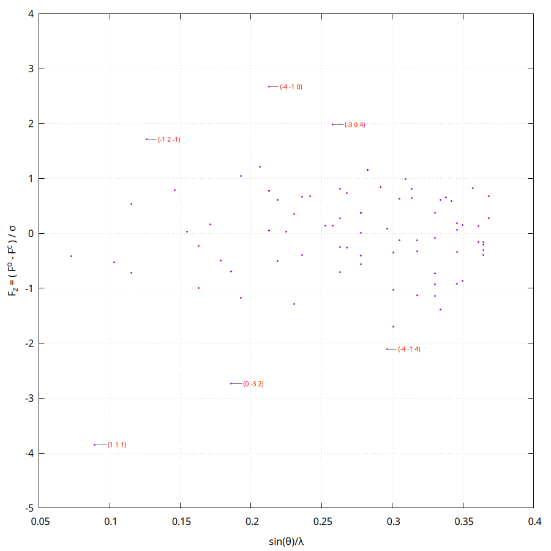
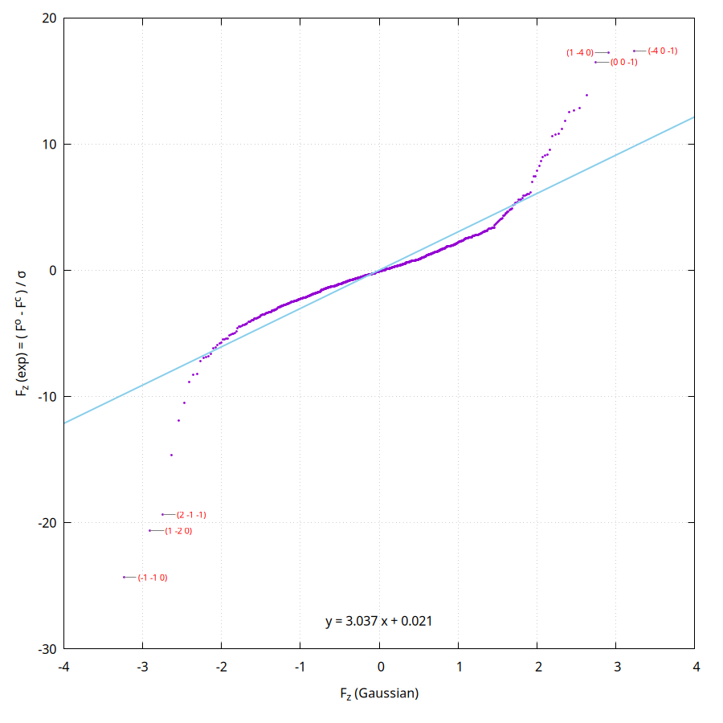
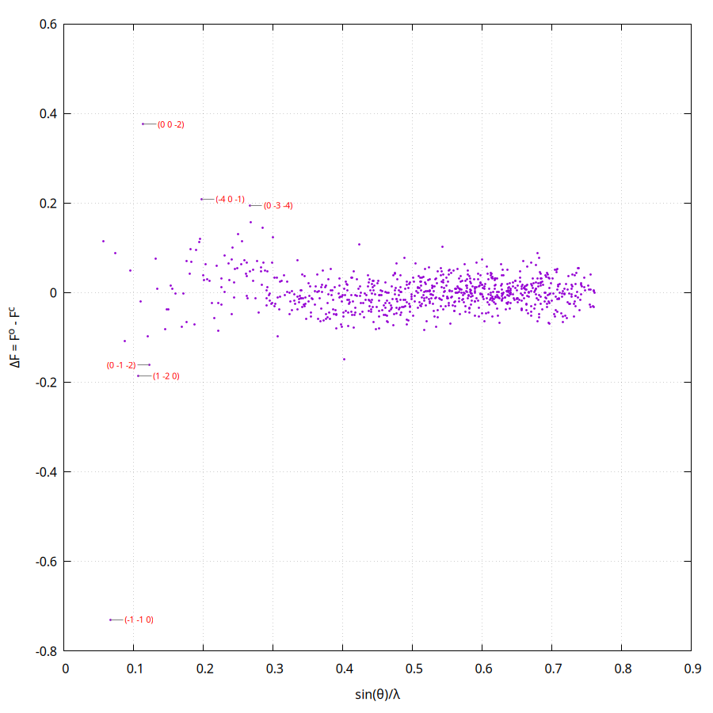

# Tonto workshop

A guided introduction to Hirshfeld atom refinement (HAR) and X-ray constrained
wavefunction (XCW) fitting, driving **Tonto directly** — no GUI. Three worked
exercises, each with a results table for you to fill in from your own run.

Everything you need is in this repository, under `docs/workshop/`. The input
files are printed in full below, so you can read them here and check what you
are running.

| | Exercise | Program | Runs in |
|---|---|---|---|
| 1 | HAR on ammonia | `hart` | ~2 s |
| 2 | HAR on urea, then a Roby–Gould bond index analysis | `tonto` | ~30 s |
| 3 | XCW fitting on exercise 2's refined geometry | `tonto` | *(see below)* |

Together they are one procedure, not three: exercise 2 produces a wavefunction,
exercise 3 constrains that wavefunction against the diffraction data, and the
bond indices in exercise 2 are the first example of a property computed from it.

---

## Why bother

Ordinary refinement, as in SHELXL, minimises

$$M = \sum w\,(|F_o| - |F_c|)^2$$

where $F_o$ and $F_c$ are the observed and calculated structure factors. The
calculated ones come from a sum over atomic form factors $f_j$:

$$F(\vec{h}) = \sum_{j=1}^{N} f_j \, e^{2\pi i \vec{h} \cdot \vec{r}_j}$$

Those $f_j$ describe how an **isolated atom type** scatters, and they are read
from a table — Tables 4.2.6.8 and 6.1.1.4 of *International Tables* Vol. C.

Read that again, because everything follows from it: every atom is modelled as
an isolated, non-interacting sphere sitting at the centre of its electron
cloud, regardless of what it is bonded to or what its oxidation state is.

**Hirshfeld atom refinement** computes the form factors instead of looking them
up — for each atom, not each atom *type* — from a quantum chemical calculation
on the actual molecule. The atomic densities that result are aspherical and
distorted by their surroundings, as real ones are.

### The main reason is the wavefunction

The famous benefit of HAR is that hydrogen atoms come out right. A hydrogen's
electron density peaks *inside* the bond, not at the nucleus, so a spherical
model places it too close to its neighbour — the well-known shortening of X–H
distances in X-ray structures. HAR removes that bias and puts hydrogen where
neutron diffraction puts it. You will see this happen in exercises 1 and 2, and
it is the easiest thing to check.

But it is not the main reason to do HAR. The main reason is this:

> HAR gives you a **wavefunction for the system at that geometry**. That
> wavefunction can be fitted further — that is what XCW does, in exercise 3 —
> and properties can be computed from it: properties consistent with an
> electron density that has been fitted to X-ray diffraction data.

That is the point. An ordinary refinement gives you coordinates and thermal
parameters, and nothing else; the model has no electrons in it that you could
ask a question of. HAR gives you a density, and XCW makes that density answer
to the experiment. Bond indices, electrostatic potentials, energies, ELF — all
become *experimentally constrained* quantities rather than purely theoretical
ones. Exercise 2 computes the first of these.

## How HAR works

Starting from an ordinary refined structure — HAR is a *post-IAM* procedure:

1. **A single-point calculation** gives the molecular electron density.

2. **That density is partitioned** into atoms by Hirshfeld's stockholder
   scheme, each atom taking a share proportional to what a free atom would
   contribute there:

   $$\rho_A(\vec{r}) = w_A(\vec{r}) \cdot \rho_{\text{molecule}}(\vec{r})
   \qquad
   w_A(\vec{r}) = \frac{\rho_A^0(\vec{r} - \vec{r}_A)}{\sum_B \rho_B^0(\vec{r} - \vec{r}_B)}$$

   Each atomic density is then smeared by thermal motion and Fourier
   transformed into a scattering factor.

3. **A least-squares refinement** against the measured reflections, using those
   tailor-made scattering factors.

The geometry has now changed, so the density is out of date — go back to step 1.
Repeat until nothing moves.

## And XCW

HAR fits *positions* to the data, with the wavefunction along for the ride. XCW
fits the **wavefunction itself**. It minimises

$$E[\Psi] + \lambda \left( \chi^2[\Psi] - \Delta \right)$$

— the quantum mechanical energy, plus the disagreement with the diffraction
data weighted by a multiplier $\lambda$. At $\lambda = 0$ you have an ordinary
Hartree–Fock wavefunction that has never seen the experiment. As $\lambda$
rises, the wavefunction is pulled towards the data: $\chi^2$ falls, the energy
rises above its variational minimum, and the orbitals change.

($\chi^2$ here is the goodness of fit squared — the same quantity the refinement
tables call GoF². It is defined in exercise 1.)

How far to push $\lambda$ is a judgement call, and that is exactly what
exercise 3 asks you to look at.

## Three things to know before you start

1. **Reflection files must be merged and pruned of systematic absences.**

2. **The molecule must be chemically complete.** HAR runs a quantum chemical
   calculation on whatever fragment you give it. If the asymmetric unit holds
   a third of a molecule, you must complete it first, or the calculation is
   meaningless. Both molecules here are completed for you.

3. **Tonto eliminates linear dependencies in the least-squares matrix
   automatically**, so it has no restraints or constraints. That can cause
   trouble for spherical ions.

---

## Before you begin

Build Tonto by following [BUILDING_TONTO.md](BUILDING_TONTO.md). The quick
version, on Linux or macOS:

```bash
git clone --recursive https://github.com/dylan-jayatilaka/tonto.git
cd tonto && mkdir build && cd build
cmake .. -DCMAKE_BUILD_TYPE=release
make -j3
```

That gives you two programs, `build/tonto` and `build/hart`.

**Work in the exercise directories where they sit, inside the repository.**
Everything each exercise needs is then a short relative path away — the
executables you have just built, and the basis set library:

```bash
cd <path-to>/tonto/docs/workshop/1-nh3-hart
ln -s ../../../build/hart hart          # exercises 2 and 3: ln -s ../../../build/tonto tonto
```

The three exercise directories all sit three levels below the top of the
repository, so `../../../basis_sets` is the basis set library from any of them.
Exercise 1 passes that on the command line. Exercises 2 and 3 have no such
option, so set the environment variable for them:

```bash
export TONTO_BASIS_SET_DIRECTORY=<path-to>/tonto/basis_sets
```

If you would rather work somewhere of your own, copy a directory
(`cp -r <path-to>/tonto/docs/workshop/1-nh3-hart ~/workshop-1`) and adjust the
two paths to suit.

---

## Exercise 1 — ammonia, with `hart`

`hart` is the standalone Hirshfeld-atom-refinement program. It takes no input
file: **the command line is the input.** That makes it the quickest way to see
a HAR happen.

Two data files are provided:

| | |
|---|---|
| `nh3.cif` | the starting independent-atom structure — *P* 2₁3, *a* = 5.1305 Å |
| `nh3.hkl` | 88 reflections, free format: `h k l F sigma` |

Run it — one line, made to be copied:

```bash
./hart --job nh3 --basis def2-SVP --basis-dir ../../../basis_sets --std-f nh3.hkl nh3.cif
```

About two seconds. `./hart` because the exercise directory is not on your
`PATH`; it is the symlink you made in *Before you begin*. What the options mean:

| Option | |
|---|---|
| `--job nh3` | names every output file |
| `--basis def2-SVP` | the Gaussian basis set. Also the default — spelled out so all three exercises visibly agree |
| `--basis-dir ../../../basis_sets` | where the basis set files live. Only needed because we are running in place without `TONTO_BASIS_SET_DIRECTORY` set |
| `--std-f nh3.hkl` | free-format `h k l F sigma`. Use `--std-f2` for *F*², or `--shelx-f`/`--shelx-f2` for the fixed-format SHELX layout |

`hart --help` lists the rest — including `--dtol` and `--grid-accuracy`, whose
defaults (0.01 and `low`) are what this exercise wants anyway, so they are not
written out. Note that `hart` has **no option for the SCF energy convergence** —
exercises 2 and 3 set `convergence= 0.001` explicitly, and exercise 1 simply
cannot, so it runs at hart's internal default.

### What you should get

Results are in `nh3.out`; look for `Structure refinement results`. The refined
structure, with esds, is in `nh3.archive.cif`.

**A word on the names, because two of them are the same thing.** The
**goodness of fit**, GoF, is the root-mean-square misfit measured in units of
the experimental error:

$$\mathrm{GoF}^2 = \chi^2 = \frac{1}{N_r - N_p}\sum_k
\left(\frac{|F_{\mathrm{calc},k}| - |F_{\mathrm{exp},k}|}{\sigma_k}\right)^2$$

So **GoF² and χ² are one quantity under two names** — older Tonto output and
much of the literature call it χ², while the tables below and Tonto's current
output call it GoF². It appears again in exercise 3, where it is the thing the
constraint is buying. A value near **1** means the model reproduces the data to
within its stated errors; much above 1 means it does not; much below 1 usually
means the σ values are overestimated.

| NH₃ | SHELX IAM | HAR (mine) | HAR (yours) |
|:---|:---:|:---:|:---:|
| R(F) | 0.0071 | 0.0101 | ? |
| Rw(F) | — | 0.0096 | ? |
| GoF² (goodness of fit, squared) | — | 1.0737 | ? |
| ρ<sub>max</sub> / e Å⁻³ | 0.014 | 0.0373 | ? |
| ρ<sub>min</sub> / e Å⁻³ | −0.013 | −0.0571 | ? |
| reflections | 98 | 84 | ? |
| parameters | 8 | 13 | ? |
| **N–H distance / Å** | **0.842(7)** | **0.988(7)** | ? |

The last row is the one to look at. The independent-atom model puts the
hydrogen 0.842 Å from the nitrogen; HAR moves it out to 0.988 Å. Neutron
diffraction gives about 1.01 Å.

The SHELX IAM column is quoted from Malaspina's lab notes and uses a slightly
different reflection selection, so the R factors are not exactly comparable —
the hydrogen distance is.

### The fit plots

At the end of a refinement Tonto draws four diagnostic plots itself, using
gnuplot. They are the fastest way to see whether anything is wrong with the fit.


**Normal QQ plot.** If the errors are normally distributed the points lie on a
straight line through the origin with slope 1. The fitted line and its equation
are drawn for you; the six worst outliers are labelled with their (*h k l*).



**F_z against sin θ/λ.** Systematic structure here means a resolution-dependent
error — an extinction, thermal-motion or scattering-factor problem. You want a
featureless band.


**F_z against F_exp.** A trend here points at the weighting scheme, or at
extinction on the strong reflections.


**ΔF against sin θ/λ.** The unnormalised residual — shows you which reflections
dominate in absolute terms rather than in units of σ.

For ammonia the QQ plot is close to a straight line of slope 0.932, with (1 1 1)
sitting well below it — one reflection fitting worse than a normal distribution
would allow. With only 88 reflections that is not alarming.

### Things to try

- Raise `--grid-accuracy` to `high` and see whether anything moves. If it does,
  the `low` grid was not adequate.
- Add `--cluster-radius 8` to surround the molecule with Hirshfeld charges out
  to 8 Å, simulating the crystal environment. Does the N–H distance change?
- Change `--fos` (the *F*/σ cutoff, default 3) to 4 and watch the residual
  density.

---

## Exercise 2 — urea, and a property of the wavefunction

Now the same thing with a job file rather than a command line, on a molecule
with two distinct N–H bonds — and then the part that exercise 1 could not do:
we ask the refined wavefunction a chemical question.

Urea's asymmetric unit contains a quarter of a molecule. HAR needs a complete
one, so `urea_init.cif` has been completed for you; it also carries all 817
reflections, so it is the only data file you need.

Run it:

```bash
cd ../2-urea-har && ./tonto
```

`tonto` reads `stdin` from the working directory and writes `stdout` there — so
unlike `hart` it takes no arguments at all, and there is nowhere to say where
the basis sets are. That is what `TONTO_BASIS_SET_DIRECTORY` is for. It takes
about half a minute.

### The input file

This is `docs/workshop/2-urea-har/stdin`, in full:

```
{

   name= urea

   basis_name= def2-SVP

   charge= 0
   multiplicity= 1

   CIF= { file_name= urea_init.cif }
   process_CIF

   crystal= {

      xray_data= {

         ! 0.3173 Angstrom. Tonto's default length unit is the bohr, so
         ! say "angstrom" or you will silently refine against the wrong
         ! wavelength.
         wavelength= 0.3173 angstrom

         partition_model= oc-hirshfeld

         optimise_extinction= NO
         optimise_scale_factor= YES

         do_residual_cube= NO

         show_refinement_output=  FALSE
         show_refinement_results= TRUE

      }
   }

   ! A first SCF on the starting geometry, to get the Hirshfeld charges
   ! the refinement starts from.
   scfdata= {
      kind=            rhf
      initial_density= promolecule
      convergence= 0.001
      diis= { convergence_tolerance= 0.01 }
   }
   scf

   ! The refinement itself. This loops: SCF -> partition -> least squares
   ! -> new geometry -> SCF ... until nothing moves.
   HAR_refinement

   ! Roby-Gould bond index analysis of the final, refined wavefunction.
   ! output_theta_info= YES is what writes rgbi-dial-table+H.tex, and without
   ! it make-rgbi-dials has nothing to draw. Say YES if you want the pictures.
   robydata= {
      kind= atom_bond_analysis
      output_theta_info= YES
   }
   roby_analysis

   delete_scf_archives

}
```

Points worth pausing on:

- **`wavelength= 0.3173 angstrom`.** Tonto's default length unit is the *bohr*.
  Leave off `angstrom` and you have quietly specified 0.3173 bohr = 0.168 Å.
  (You will meet the same figure written `0.59960` in some of Tonto's test
  jobs — that is the same wavelength in bohr.)
- **`process_CIF`** does the work of reading the CIF. `CIF= { … }` only says
  which file.
- **`HAR_refinement`** is the whole loop of the three steps above — SCF,
  partition, least squares — repeated to convergence. One keyword.
- **`convergence= 0.001`** is on the SCF energy, **`convergence_tolerance= 0.01`**
  is on the DIIS gradient. Both are deliberately loose, to keep the exercise
  short.

### What you should get

| Urea | SHELX IAM | HAR (mine) | HAR (yours) |
|:---|:---:|:---:|:---:|
| R(F) | 0.0253 | 0.0185 | ? |
| Rw(F) | — | 0.0138 | ? |
| GoF² | — | 11.157 | ? |
| reflections | 817 | 817 | ? |
| parameters | 21 | 27 | ? |
| C=O / Å | — | 1.2558(4) | ? |
| C–N / Å | — | 1.3413(3) | ? |
| **N1–H1 / Å** | **0.964(17)** | **1.028(5)** | ? |
| **N1–H3 / Å** | **0.900(12)** | **0.986(6)** | ? |

Both N–H distances lengthen, by 0.06 and 0.09 Å, and their esds shrink by a
factor of three. Neutron values for urea are about 1.00 and 1.01 Å.

Note the goodness of fit: **11.2**, not ≈1. Urea's σ values are very small, and
a GoF² this far above 1 says the model still does not explain the data to
within its stated precision — there is real structure left in the residuals.
Do not read it as a failed refinement; read it as the reason exercise 3 exists.

### The fit plots






Compare the QQ plot with ammonia's. With 817 reflections instead of 88 the
shape is much better defined — and it is visibly *not* a straight line of slope
1. That is the same message the goodness of fit gave.

### The bond indices

The Roby–Gould analysis at the end of the job is the first property computed
from the refined wavefunction — a wavefunction which, because HAR produced it,
is consistent with the diffraction data.

Tonto writes the numbers to `stdout` and, at the same time, LaTeX fragments for
two pictures. Draw them with the scripts in `rgbi-scripts/`:

```bash
export PATH=<path-to>/tonto/rgbi-scripts:$PATH
make-rgbi-dials --do-H     # needs LaTeX with chemfig, plus ghostscript
make-rgbi-pic   --do-H     # additionally needs Open Babel and mol2chemfig
```

The two halves are independent: if the second defeats you, you still get the
dial diagrams. `scripts/rgbi_doctor.sh` tells you what is missing, and
[INSTALLING_RGBI.md](INSTALLING_RGBI.md) how to fix it.


Each bond carries its **bond index** in black and its **percentage covalency**
in blue. The C=O comes out at 1.78 and 74% covalent; the two C–N bonds at 1.46
and 71%; the N–H bonds at 0.95 and about 80%.

Those numbers say something chemical. A textbook urea has a C=O double bond and
two C–N single bonds; what the refined wavefunction says is that the C–N bonds
are **half again as strong as a single bond** (1.46, not 1.0) and the C=O is
noticeably *less* than a double bond (1.78, not 2.0). That is amide resonance,
measured rather than asserted.

The dial diagrams show where each index comes from — covalent index along the
horizontal, ionic index along the vertical, the total being the radius:


Read them as a picture of bond character. The C=O dial (top left, 1.63 covalent
against 0.70 ionic) leans well off the horizontal — a strongly polarised double
bond. The N–H dial (bottom right, 0.90 against 0.30) leans less. The O···H
contact (top right) is nearly *all* ionic, 0.22 against 0.04: that is the
hydrogen bond that holds the urea crystal together, and it appears here as a
weak, almost purely electrostatic interaction rather than a bond.

The full page of 21 dials, including every non-bonded pair, is in
`rgbi-dial-table+H.pdf`, and reproduced
[here](images/workshop/urea.rgbi-dials-all.png).

### Things to try

- Set `output_theta_info= NO` and re-run. The numbers are unchanged and the
  dial diagrams disappear — that flag controls the pictures, nothing else.
- Add `use_SC_cluster_charges= TRUE` and `cluster_radius= 8 angstrom` to the
  `scfdata` block, surrounding the molecule with self-consistent Hirshfeld
  charges. Urea is held together by strong, directional hydrogen bonds, so the
  crystal environment matters a great deal here. Watch the C=O index.
- Change `basis_name=` to `def2-TZVP`. Slower. Do the bond indices move as much
  as the crystal environment moved them?

---

*Exercise 3 is running now.*
