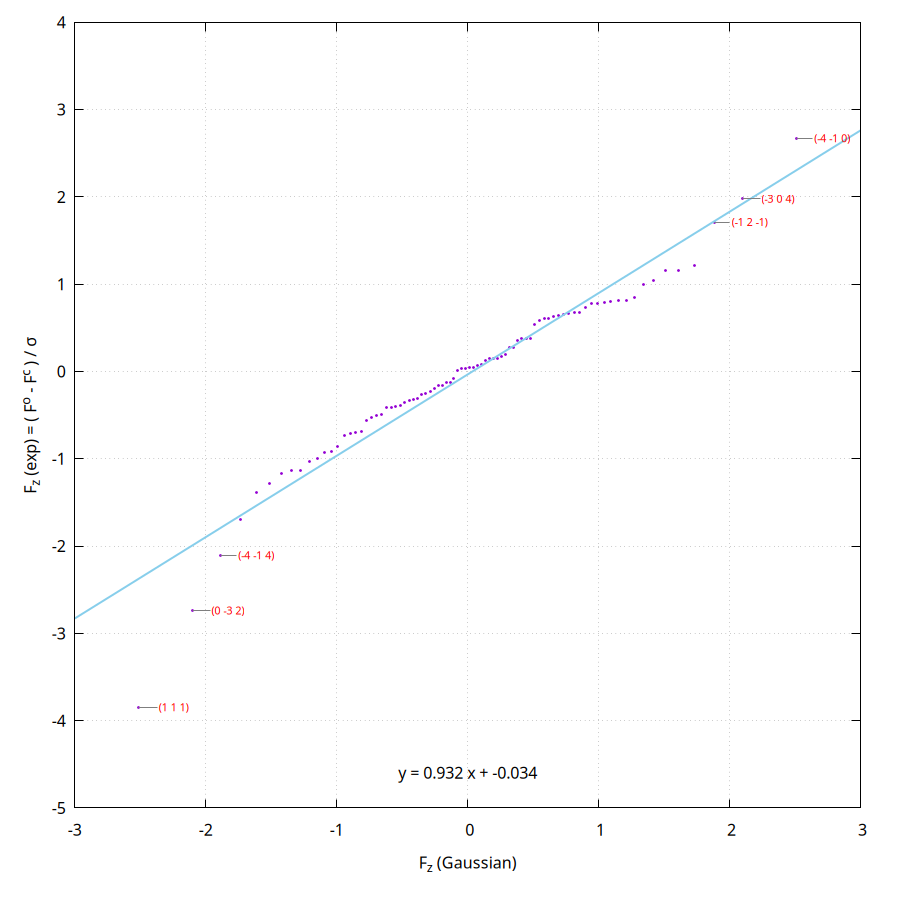
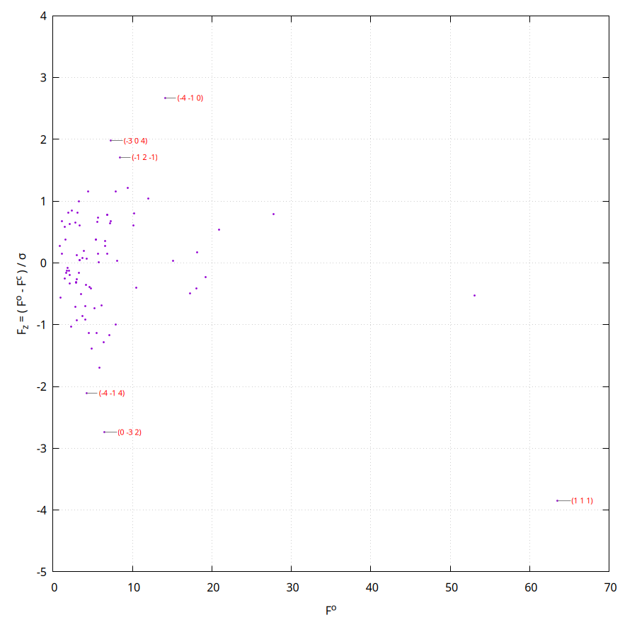
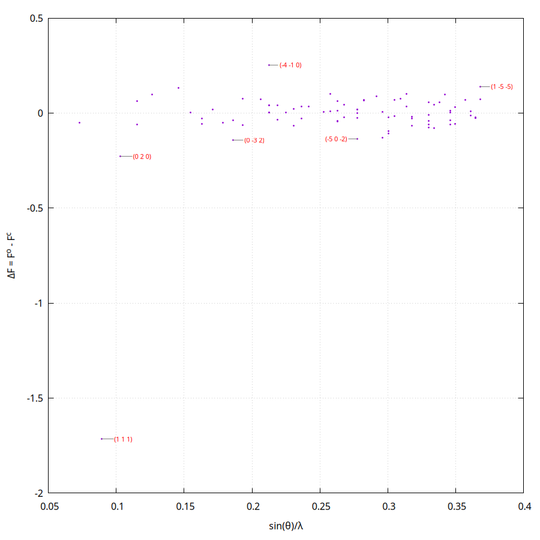
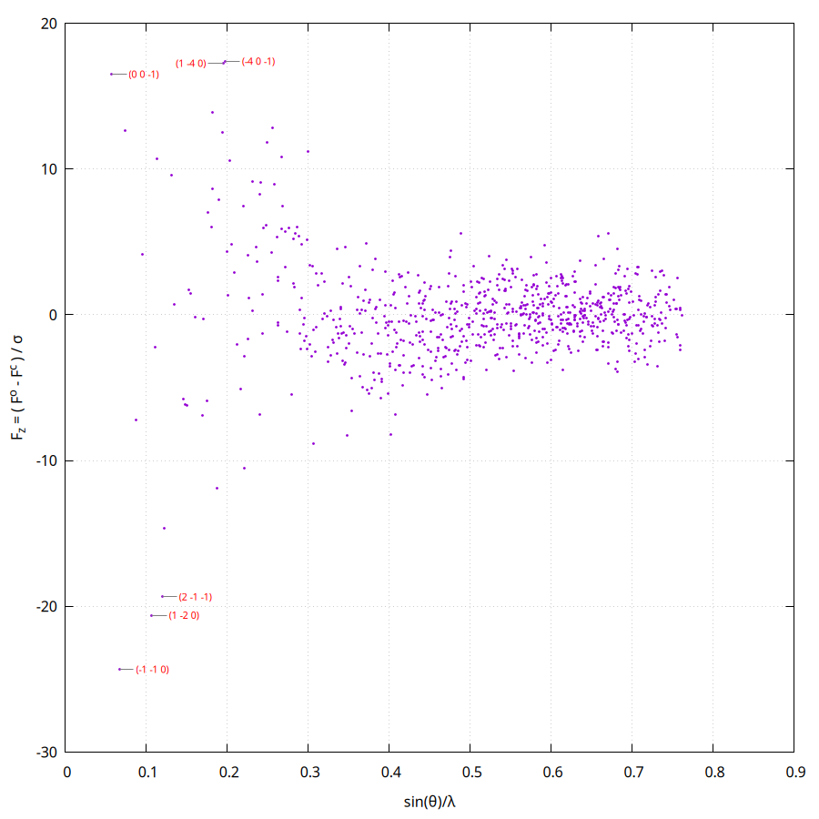
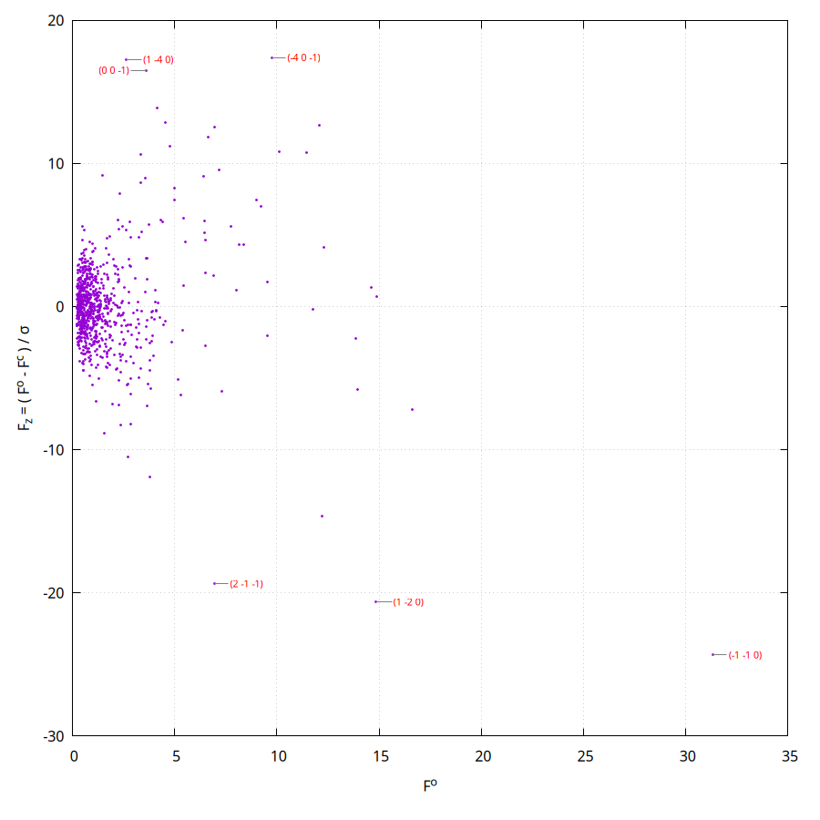
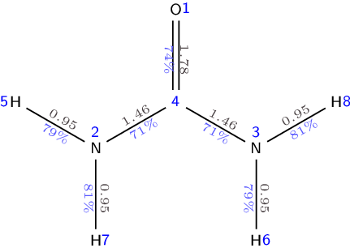
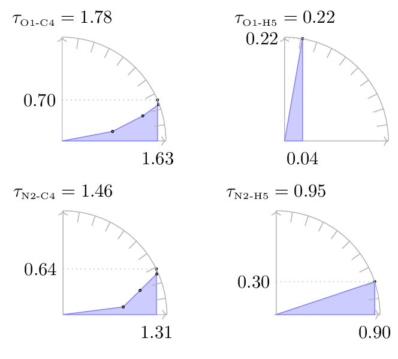

# Tonto workshop

A guided introduction to Hirshfeld atom refinement (HAR) and X-ray constrained
wavefunction (XCW) fitting, driving **Tonto directly** — no GUI. Three worked
exercises, each with a results table for you to fill in from your own run.

Everything you need is in this repository, under `examples/`. The input
files are printed in full below, so you can read them here and check what you
are running.

| | Exercise | Program | Runs in |
|---|---|---|---|
| 1 | HAR on ammonia | `hart` | ~2 s |
| 2 | HAR on urea, then a Roby–Gould bond index analysis | `tonto` | ~30 s |
| 3 | XCW fitting on exercise 2's refined geometry | `tonto` | *(see below)* |

Together they are one procedure, not three: exercise 2 produces a wavefunction,
exercise 3 constrains that wavefunction against the diffraction data, and the
bond indices in exercise 2 are the first example of a property computed from it.

---

## Why refine with a wavefunction at all

Ordinary **Independent Atom Model** (IAM) refinement in chemical
crystallography, as done by SHELXL or Olex2, minimises

<div align="center">

```math
M = \sum_{r=1}^{N_{\mathrm{refl}}} w_r
\left( s |F_r^{\mathrm{calc}}| - |F_r^{\mathrm{obs}}| \right)^2
```

</div>

where $r$ labels the $N_{\mathrm{refl}}$ measured reflections,
$|F_r^{\mathrm{obs}}|$ and $|F_r^{\mathrm{calc}}|$ are the observed and
calculated structure factor magnitudes, $w_r$ is the weight given to
reflection $r$ — usually related to $1/(\sigma_r^{\mathrm{obs}})^2$, the reciprocal of
its estimated standard uncertainty squared — and $s$ is an overall scale
factor, refined along with everything else, because the experimental
magnitudes are not measured on an absolute scale.

The calculated magnitudes are the usual sum over atomic form factors $f_j$,
one per atom, phased by the atomic positions. What matters here is where those
$f_j$ come from: they describe how an **isolated atom type** scatters, and
they are read from a table — Tables 4.2.6.8 and 6.1.1.4 of *International
Tables* Vol. C.

Everything follows from that: every atom is modelled as an isolated,
non-interacting sphere at the centre of its electron cloud, whatever it is
bonded to and whatever its oxidation state.

**Hirshfeld atom refinement** (Jayatilaka et al., 2008) computes the form
factors instead of looking them up — for each atom, not each atom *type* —
from a quantum chemical calculation on the actual molecule. The atomic
densities that result are aspherical and distorted by their surroundings, as
real ones are.

### The main reason is the wavefunction, not the hydrogens

The famous benefit of HAR is that the position of hydrogen atoms come out right,
in agreement with independent neutron diffraction experiments. A hydrogen's
electron density peaks *inside* the bond, not at the nucleus, so a spherical
model places it too close to its neighbour — the well-known shortening of X–H
distances in X-ray structures. HAR removes that bias and puts hydrogen where
neutron diffraction puts it, in a fairly automatic and standard way
(Woińska et al., 2016). You will see this happen in exercises 1 and 2, and it
is the easiest thing to check. In good quality data these small differences
in bond length can be seen, which bodes well for the use of the structure
factors for other purposes.

In fact, the main reason to do HAR is this:

> HAR gives you a **wavefunction for the system at that geometry**. That
> wavefunction can be fitted further — that is what XCW does, in exercise 3 —
> and properties can be computed from it: properties consistent with an
> electron density that has been fitted to X-ray diffraction data.

An ordinary refinement gives coordinates and thermal parameters and nothing
else; its model has no electrons in it to ask a question of. HAR gives you a density, and XCW makes that density answer
to the experiment. Bond indices, electrostatic potentials, energies, ELF — all
become *experimentally constrained* quantities rather than purely theoretical
ones. Exercise 2 computes the first of these. One can predict the results of
other experiments.

## How Hirshfeld atom refinement works

Starting from an ordinary refined structure — HAR is a *post-IAM* procedure:

1. **A single-point calculation** gives the molecular electron density.

2. **That density is partitioned** into atoms by Hirshfeld's stockholder
   scheme (Hirshfeld, 1977), each atom taking a share proportional to what a
   free atom would contribute there:

   ```math
   \rho_A(\boldsymbol{r}) = w_A(\boldsymbol{r}) \cdot \rho_{\text{molecule}}(\boldsymbol{r})
   \qquad
   w_A(\boldsymbol{r}) = \frac{\rho_A^0(\boldsymbol{r} - \boldsymbol{r}_A)}{\sum_B \rho_B^0(\boldsymbol{r} - \boldsymbol{r}_B)}
   ```

   Each atomic density is then smeared by thermal motion and Fourier
   transformed into a scattering factor.

3. **A least-squares refinement** against the measured reflections, using those
   tailor-made scattering factors.

The geometry has now changed, so the density is out of date — go back to step 1.
Repeat until nothing moves.

## And how X-ray constrained wavefunction fitting works

HAR fits *positions* to the data, with the wavefunction along for the ride. XCW
(Grimwood et al., 2001) fits the **wavefunction itself**. It minimises

<div align="center">

```math
E[\Psi] + \lambda \left( \mathrm{GoF}^2[\Psi] - \Delta \right)
```

</div>

— the quantum mechanical energy, plus the disagreement with the diffraction
data weighted by a multiplier $\lambda$. At $\lambda = 0$ you have an ordinary
Hartree–Fock wavefunction that has never seen the experiment. As $\lambda$
rises, the wavefunction is pulled towards the data: GoF² falls, the energy
rises above its variational minimum, and the orbitals change. $\Delta$ is the
value of GoF² you are aiming at, and deciding what it should be is the
*halting problem* of the XCW method.

(GoF², the goodness of fit squared, is defined in exercise 1.)

How far to push $\lambda$ is a judgement call, and that is exactly what
exercise 3 asks you to look at.

## Two requirements on your data and your molecule

1. **Reflection files must be merged and pruned of systematic absences.**

2. **The molecule must be chemically complete.** HAR runs a quantum chemical
   calculation on whatever fragment you give it. If the asymmetric unit holds
   a third of a molecule, you must complete it first, or the calculation is
   meaningless. Both molecules here are completed for you.

   Tonto will do the completing itself, by applying the crystal symmetry to
   grow each fragment into whole molecules: the keyword `defragment` after
   `process_CIF` in a job file, and in `hart` the `--defragment` option, which
   is **on by default**. **Turn it off for a network solid** — diamond,
   silica, a coordination polymer — with `--defragment f`. There is no whole
   molecule to complete in such a structure, so the growth has no stopping
   point and the run will not terminate.

---

## Building Tonto, and where to work

First build Tonto. Jump straight to your platform — each page is
self-contained:

| | |
|---|---|
| **Linux** | [BUILDING_ON_LINUX.md](../docs/BUILDING_ON_LINUX.md) |
| **macOS** | [BUILDING_ON_MACOS.md](../docs/BUILDING_ON_MACOS.md) |
| **Windows** | [BUILDING_ON_WINDOWS.md](../docs/BUILDING_ON_WINDOWS.md) (via WSL) |

The short version, on Linux or macOS, once the prerequisites on those pages are
installed:

```bash
git clone --recursive https://github.com/dylan-jayatilaka/tonto.git
cd tonto && mkdir build && cd build
cmake .. -DCMAKE_BUILD_TYPE=release
make -j3
```

That gives you two programs, `build/tonto` and `build/hart`.

**Work in the exercise directories where they sit, inside the repository.**
Everything each exercise needs is then a short relative path away — the
executables you have just built, and the basis set library:

```bash
cd <path-to>/tonto/examples/1-nh3-hart
ln -s ../../build/hart hart          # exercises 2 and 3: ln -s ../../build/tonto tonto
```

The three exercise directories all sit three levels below the top of the
repository, so `../../basis_sets` is the basis set library from any of them,
and each exercise passes it on the command line. Nothing else to set up: no
environment, no copying, no editing of paths.

If you would rather not type it every time, both programs fall back to the
`TONTO_BASIS_SET_DIRECTORY` environment variable, and then the option can be
dropped:

```bash
export TONTO_BASIS_SET_DIRECTORY=<path-to>/tonto/basis_sets
```

**The two programs spell the same option differently** — `hart --basis-dir`,
`tonto --basis-library`. Not a typo below; `--help` on either will confirm it.

If you would rather work somewhere of your own, copy a directory
(`cp -r <path-to>/tonto/examples/1-nh3-hart ~/workshop-1`) and adjust the
two paths to suit.

---

## Exercise 1 — a HAR on ammonia, with `hart`

`hart` is the standalone Hirshfeld-atom-refinement program. It takes no input
file: **the command line is the input.** That makes it the quickest way to see
a HAR happen.

Two data files are provided:

| | |
|---|---|
| `nh3.cif` | the starting independent-atom structure — *P* 2₁3, *a* = 5.1305 Å |
| `nh3.hkl` | 88 reflections, free format: `h k l F sigma` |

Run it — one line, made to be copied:

```bash
./hart --job nh3 --basis def2-SVP --basis-dir ../../basis_sets --std-f nh3.hkl nh3.cif
```

About two seconds. `./hart` because the exercise directory is not on your
`PATH`; it is the symlink you made in *Before you begin*. What the options mean:

| Option | |
|---|---|
| `--job nh3` | names every output file |
| `--basis def2-SVP` | the Gaussian basis set. Also the default — spelled out so all three exercises visibly agree |
| `--basis-dir ../../basis_sets` | where the basis set files live. Only needed because we are running in place without `TONTO_BASIS_SET_DIRECTORY` set |
| `--std-f nh3.hkl` | free-format `h k l F sigma`. Use `--std-f2` for *F*², or `--shelx-f`/`--shelx-f2` for the fixed-format SHELX layout |

`hart --help` lists the rest — including `--dtol` and `--grid-accuracy`, whose
defaults (0.01 and `low`) are what this exercise wants anyway, so they are not
written out. Note that `hart` has **no option for the SCF energy convergence** —
exercises 2 and 3 set `convergence= 0.001` explicitly, and exercise 1 simply
cannot, so it runs at hart's internal default.

### What you should get

Results are in `nh3.out`; look for `Structure refinement results`. The refined
structure, with esds, is in `nh3.archive.cif`.

**A word on the names.** The **goodness of fit**, GoF, is the root-mean-square
misfit measured in units of the experimental error:

<div align="center">

```math
\mathrm{GoF}^2 = \left(N_{\mathrm{refl}} - N_{\mathrm{param}}\right)^{-1}
\sum_{r=1}^{N_{\mathrm{refl}}}
\left(\frac{s\,|F_r^{\mathrm{calc}}| - |F_r^{\mathrm{obs}}|}
{\sigma_r^{\mathrm{obs}}}\right)^2
```

</div>

with the symbols of the previous section, and $\sigma_r^{\mathrm{obs}}$ the
estimated standard uncertainty of $|F_r^{\mathrm{obs}}|$. The number of
parameters is

<div align="center">

```math
N_{\mathrm{param}} = N_{\mathrm{pADP}} + N_{\mathrm{misc}}
```

</div>

where $N_{\mathrm{pADP}}$ counts the symmetry-unique atomic positions and
displacement parameters, and $N_{\mathrm{misc}}$ is at least one — for $s$ —
plus any further parameters refined for phenomenological corrections such as
extinction. Tonto prints both, as `N_r` and `N_p`.

A value near **1** means the model reproduces the data to within its stated
errors; much above 1 means it does not; much below 1 usually means the σ values
are overestimated.

**GoF² is not χ², although Tonto used to say it was.** Earlier Tonto output and
earlier papers called this quantity χ². The two differ by exactly the factor
that GoF² divides out:

<div align="center">

```math
\chi^2 = \left(N_{\mathrm{refl}} - N_{\mathrm{param}}\right)\,\mathrm{GoF}^2
```

</div>

so for the ammonia run below, with $N_{\mathrm{refl}} - N_{\mathrm{param}} =
84 - 13$, a GoF² of 1.07 is a χ² of about 76. Everything Tonto now prints, and
every table in this document, is GoF².

| NH₃ | SHELX IAM | HAR (mine) | HAR (yours) |
|:---|:---:|:---:|:---:|
| R(F) | 0.0071 | 0.0101 | ? |
| Rw(F) | — | 0.0096 | ? |
| GoF² (goodness of fit, squared) | — | 1.0737 | ? |
| ρ<sub>max</sub> / e Å⁻³ | 0.014 | 0.0373 | ? |
| ρ<sub>min</sub> / e Å⁻³ | −0.013 | −0.0571 | ? |
| reflections | 98 | 84 | ? |
| parameters | 8 | 13 | ? |
| **N–H distance / Å** | **0.842(7)** | **0.988(7)** | ? |

The last row is the one to look at. The independent-atom model puts the
hydrogen 0.842 Å from the nitrogen; HAR moves it out to 0.988 Å. Neutron
diffraction gives about 1.01 Å.

The SHELX IAM column is quoted from Malaspina's lab notes and uses a slightly
different reflection selection, so the R factors are not exactly comparable —
the hydrogen distance is.

### The four diagnostic plots

At the end of a refinement Tonto draws four diagnostic plots itself, using
gnuplot. They are the fastest way to see whether anything is wrong with the fit.



**Normal QQ plot.** If the errors are normally distributed the points lie on a
straight line through the origin with slope 1. The fitted line and its equation
are drawn for you; the six worst outliers are labelled with their (*h k l*).


**F_z against sin θ/λ.** Systematic structure here means a resolution-dependent
error — an extinction, thermal-motion or scattering-factor problem. You want a
featureless band.



**F_z against F_exp.** A trend here points at the weighting scheme, or at
extinction on the strong reflections.



**ΔF against sin θ/λ.** The unnormalised residual — shows you which reflections
dominate in absolute terms rather than in units of σ.

For ammonia the QQ plot is close to a straight line of slope 0.932, with (1 1 1)
sitting well below it — one reflection fitting worse than a normal distribution
would allow. With only 88 reflections that is not alarming.

### Questions: what are all these output files?

A two-second run on 88 reflections has left about thirty files behind. Look at
their names before you look at anything else:

```bash
ls
```

1. Every one is called `nh3.something`. Where did `nh3` come from, and what
   would happen if you ran a second job in this directory?
2. There are **four** files describing the refined structure — `.archive.cif`,
   `.HBB.cif2`, `.cartesian.cif2`, `.fractional.cif1` — and **three** giving
   the calculated structure factors: `.archive.fcf`, `.fcf6`, `.archive.fco`.
   Why would anyone want the same result written out more than once?
3. Which file would you deposit with a journal? Which would you hand to a
   quantum chemistry program?
4. Three files have a `,r` in their names: `nh3.MOs,r`, `nh3.MO_energies,r`,
   `nh3.density_mx,r`. What is the `r`, and what would an open-shell molecule
   write instead? Between them these three are the *reason for doing HAR at
   all* — why?
5. `nh3.residual_density,cell.cube` is a `.cube` file. What would you open it
   with, and what are you looking for when you do?
6. Each plot comes as four files — the data, a `.labels`, a `.gnuplot` and a
   `.png`. Which one would you edit to change the axis range, and would you
   need to rebuild Tonto to do it?
7. One file is not Tonto's at all and was written by another program entirely.
   Which, and by what? (`fit.log`.)
8. `nh3.err` is empty. Is that good or bad?

Answers: [WORKSHOP_ANSWERS.md](WORKSHOP_ANSWERS.md).

### Things to try next

- Raise `--grid-accuracy` to `high` and see whether anything moves. If it does,
  the `low` grid was not adequate.
- Add `--cluster-radius 8` to surround the molecule with Hirshfeld charges out
  to 8 Å, simulating the crystal environment. Does the N–H distance change?
- Change `--fos` (the *F*/σ cutoff, default 3) to 4 and watch the residual
  density.

---

## Exercise 2 — a HAR on urea, then bond indices from the wavefunction

Now the same thing with a job file rather than a command line, on a molecule
with two distinct N–H bonds — and then the part that exercise 1 could not do:
we ask the refined wavefunction a chemical question.

Urea's asymmetric unit contains a quarter of a molecule. HAR needs a complete
one, so `urea_init.cif` has been completed for you; it also carries all 817
reflections, so it is the only data file you need.

Run it:

```bash
cd ../2-urea-har && ./tonto --basis-library ../../basis_sets
```

`tonto` takes no input file argument: it reads `stdin` from the working
directory and writes `stdout` there. About 40 seconds.

### The input file

This is `examples/2-urea-har/stdin`, in full:

```
{

   name= urea

   basis_name= def2-SVP

   charge= 0
   multiplicity= 1

   CIF= { file_name= urea_init.cif }
   process_CIF

   crystal= {

      xray_data= {

         ! 0.3173 Angstrom. Tonto's default length unit is the bohr, so
         ! say "angstrom" or you will silently refine against the wrong
         ! wavelength.
         wavelength= 0.3173 angstrom

         partition_model= oc-hirshfeld

         optimise_extinction= NO
         optimise_scale_factor= YES

         do_residual_cube= NO

         show_refinement_output=  FALSE
         show_refinement_results= TRUE

      }
   }

   ! A first SCF on the starting geometry, to get the Hirshfeld charges
   ! the refinement starts from.
   scfdata= {
      kind=            rhf
      initial_density= promolecule
      convergence= 0.001
      diis= { convergence_tolerance= 0.01 }
   }
   scf

   ! The refinement itself. This loops: SCF -> partition -> least squares
   ! -> new geometry -> SCF ... until nothing moves.
   HAR_refinement

   ! Roby-Gould bond index analysis of the final, refined wavefunction.
   ! output_theta_info= YES is what writes rgbi-dial-table+H.tex, and without
   ! it make-rgbi-dials has nothing to draw. Say YES if you want the pictures.
   robydata= {
      kind= atom_bond_analysis
      output_theta_info= YES
   }
   roby_analysis

   delete_scf_archives

}
```

Points worth pausing on:

- **`wavelength= 0.3173 angstrom`.** Tonto's default length unit is the *bohr*.
  Leave off `angstrom` and you have quietly specified 0.3173 bohr = 0.168 Å.
  (You will meet the same figure written `0.59960` in some of Tonto's test
  jobs — that is the same wavelength in bohr.)
- **`process_CIF`** does the work of reading the CIF. `CIF= { … }` only says
  which file.
- **`HAR_refinement`** is the whole loop of the three steps above — SCF,
  partition, least squares — repeated to convergence. One keyword.
- **`convergence= 0.001`** is on the SCF energy, **`convergence_tolerance= 0.01`**
  is on the DIIS gradient. Both are deliberately loose, to keep the exercise
  short.

### What you should get

| Urea | SHELX IAM | HAR (mine) | HAR (yours) |
|:---|:---:|:---:|:---:|
| R(F) | 0.0253 | 0.0185 | ? |
| Rw(F) | — | 0.0138 | ? |
| GoF² | — | 11.157 | ? |
| reflections | 817 | 817 | ? |
| parameters | 21 | 27 | ? |
| C=O / Å | — | 1.2558(4) | ? |
| C–N / Å | — | 1.3413(3) | ? |
| **N1–H1 / Å** | **0.964(17)** | **1.028(5)** | ? |
| **N1–H3 / Å** | **0.900(12)** | **0.986(6)** | ? |

Both N–H distances lengthen, by 0.06 and 0.09 Å, and their esds shrink by a
factor of three. Neutron values for urea are about 1.00 and 1.01 Å.

Note the goodness of fit: **11.2**, not ≈1. Urea's σ values are very small, and
a GoF² this far above 1 says the model still does not explain the data to
within its stated precision — there is real structure left in the residuals.
Do not read it as a failed refinement; read it as the reason exercise 3 exists.

### The four diagnostic plots







Compare the QQ plot with ammonia's. With 817 reflections instead of 88 the
shape is much better defined — and it is visibly *not* a straight line of slope
1. That is the same message the goodness of fit gave.

### The bond indices

The Roby–Gould analysis (Gould et al., 2008) at the end of the job is the
first property computed from the refined wavefunction — a wavefunction which, because HAR produced it,
is consistent with the diffraction data.

Tonto writes the numbers to `stdout` and, at the same time, LaTeX fragments for
two pictures. Draw them with the scripts in `rgbi-scripts/`:

```bash
export PATH=<path-to>/tonto/rgbi-scripts:$PATH
make-rgbi-dials --do-H     # needs LaTeX with chemfig, plus ghostscript
make-rgbi-pic   --do-H     # additionally needs Open Babel and mol2chemfig
```

The two halves are independent: if the second defeats you, you still get the
dial diagrams. `scripts/rgbi_doctor.sh` tells you what is missing, and
[INSTALLING_RGBI.md](../docs/INSTALLING_RGBI.md) how to fix it.



Each bond carries its **bond index** in black and its **percentage covalency**
in blue. The C=O comes out at 1.78 and 74% covalent; the two C–N bonds at 1.46
and 71%; the N–H bonds at 0.95 and about 80%.

Those numbers say something chemical. A textbook urea has a C=O double bond and
two C–N single bonds; what the refined wavefunction says is that the C–N bonds
are **half again as strong as a single bond** (1.46, not 1.0) and the C=O is
noticeably *less* than a double bond (1.78, not 2.0). That is amide resonance,
measured rather than asserted.

The dial diagrams show where each index comes from — covalent index along the
horizontal, ionic index along the vertical, the total being the radius:



Read them as a picture of bond character. The C=O dial (top left, 1.63 covalent
against 0.70 ionic) leans well off the horizontal — a strongly polarised double
bond. The N–H dial (bottom right, 0.90 against 0.30) leans less. The O···H
contact (top right) is nearly *all* ionic, 0.22 against 0.04: that is the
hydrogen bond that holds the urea crystal together, and it appears here as a
weak, almost purely electrostatic interaction rather than a bond.

The full page of 21 dials, including every non-bonded pair, is in
`rgbi-dial-table+H.pdf`, and reproduced
[here](images/urea.rgbi-dials-all.png).

### Things to try next

- Set `output_theta_info= NO` and re-run. The numbers are unchanged and the
  dial diagrams disappear — that flag controls the pictures, nothing else.
- Add `use_SC_cluster_charges= TRUE` and `cluster_radius= 8 angstrom` to the
  `scfdata` block, surrounding the molecule with self-consistent Hirshfeld
  charges. Urea is held together by strong, directional hydrogen bonds, so the
  crystal environment matters a great deal here. Watch the C=O index.
- Change `basis_name=` to `def2-TZVP`. Slower. Do the bond indices move as much
  as the crystal environment moved them?

---

## Exercise 3 — constraining that wavefunction to the data (XCW)

Exercise 2 refined a geometry *and* left a wavefunction behind. This exercise
takes that wavefunction and fits it to the same 817 reflections.

Doing the two in sequence is **X-ray wavefunction refinement**, XWR
(Woińska et al., 2017) — and it has a precise definition, §2.8 of
Davidson et al. (2022):

> XWR ≡ XWR(HA) = HAR + HA-XCW

The content of that definition is *consistency*. HAR smears the atomic density with a Hirshfeld-atom, one-centre model; an XCW
fitting is free to use a different smearing model, and the earlier XWR
protocols did exactly that — HAR positions and ADPs, but a two-centre
(Tanaka) model in the XCW step. The recommendation is to use the **same**
position-averaging model in both halves. Exercises 2 and 3 both set
`partition_model= oc-hirshfeld`, so what you are running here is XWR(HA) as
defined.

There are no cluster charges here: this is the isolated molecule, constrained
by the data and by nothing else.

Run it:

```bash
cd ../3-urea-xcw && ./tonto --basis-library ../../basis_sets
```

About two and a half minutes.

Two files come from exercise 2 and are already here: `urea.HBB.cif2`, the
refined geometry, and `urea.hkl`, the same 817 reflections unrounded. Take the
`.HBB.cif2` and **not** `urea.archive.cif` — the archive CIF holds the
asymmetric unit, five atoms, half a urea, because that is what you deposit;
the `.cif2` holds the whole eight-atom molecule, which is what a quantum
calculation needs.

### The input file

This is `examples/3-urea-xcw/stdin`, in full:

```
{

   ! Exercise 3 -- X-ray constrained wavefunction (XCW) fitting on the
   ! geometry that exercise 2 refined. Both halves use the same one-centre
   ! Hirshfeld smearing model (partition_model= oc-hirshfeld), which is what
   ! makes the pair an X-ray wavefunction refinement as defined in section
   ! 2.8 of Davidson, Grabowsky & Jayatilaka, Acta Cryst. (2022) B78 312:
   !
   !    XWR = XWR(HA) = HAR + HA-XCW
   !
   ! Run it in this directory, in place:
   !
   !    ln -s ../../build/tonto tonto        # once, if the link is not here
   !    ./tonto --basis-library ../../basis_sets
   !
   ! tonto takes no input file argument: it reads the file called "stdin" in
   ! the working directory -- this one -- and writes "stdout" beside it. (hart
   ! spells the same option --basis-dir; tonto spells it --basis-library. Or
   ! set TONTO_BASIS_SET_DIRECTORY once and drop it.)
   !
   ! The geometry is urea.HBB.cif2, already here -- it is what exercise 2
   ! wrote. Take that file and NOT urea.archive.cif: the archive CIF holds
   ! the asymmetric unit, 5 atoms, half a urea, because that is what you
   ! deposit. The .cif2 holds the whole 8-atom molecule with the refined
   ! coordinates, which is what a quantum calculation needs. Reflections come
   ! from urea.hkl -- the same 817 Birkedal reflections, unrounded.
   !
   ! No cluster charges: this is the isolated molecule constrained by
   ! the data, and nothing else.
   !
   ! THE POINT OF THE THREE SCF BLOCKS AT THE END. Lambda has no natural
   ! size: it multiplies the derivative of GoF^2, so how hard a given
   ! lambda pulls depends entirely on how precise your sigmas are. There
   ! is no value that transfers from one dataset to the next. So you do
   ! not guess -- you scan by decades, 0.0001, 0.001, 0.01, and read off
   ! which decade your data lives in. Then, if you want, refine within it.

   ! NOT "urea": the refinement below writes <name>.HBB.cif2, which with
   ! name= urea is the file this job READS. Running the lab twice would then
   ! start from the previous run's output instead of exercise 2's, and the
   ! numbers would drift a little each time with nothing to show why.
   name= urea_xcw

   basis_name= def2-SVP

   charge= 0
   multiplicity= 1

   CIF= { file_name= urea.HBB.cif2  data_block_name= urea }
   process_CIF

   crystal= {

      xray_data= {

         wavelength= 0.3173 angstrom

         partition_model= oc-hirshfeld

         optimise_extinction= NO
         optimise_scale_factor= YES

         do_residual_cube= NO

         REDIRECT urea.hkl

      }
   }

   ! The unconstrained wavefunction: lambda = 0. Every overlap <MO|M0>
   ! in the tables below is measured against the orbitals from this SCF.
   scfdata= {
      kind=            rhf
      initial_density= promolecule
      convergence= 0.001
      diis= { convergence_tolerance= 0.01 }
   }
   scf

   ! The geometry is already refined, so this converges at once. It is
   ! here to settle the scale factor between F_calc and F_exp: start the
   ! XCW without it and GoF^2 is wrong from the very first step.
   refine_hirshfeld_atoms


   ! ---- decade 1: lambda = 0.0001 --------------------------------------

   scfdata= {
      kind= xray_rhf
      initial_density= restricted
      convergence= 0.001
      diis= { convergence_tolerance= 0.01 }
      max_iterations= 60
      initial_lambda= 0.0001
      lambda_step=    0.0001
      lambda_max=     0.0001
   }
   scf


   ! ---- decade 2: lambda = 0.001, starting from the orbitals above -----

   scfdata= {
      kind= xray_rhf
      initial_density= restricted
      convergence= 0.001
      diis= { convergence_tolerance= 0.01 }
      max_iterations= 60
      initial_lambda= 0.001
      lambda_step=    0.001
      lambda_max=     0.001
   }
   scf


   ! ---- decade 3: lambda = 0.01 ----------------------------------------
   ! Deliberately NOT run. On urea this does not overshoot, it destroys the
   ! wavefunction. Measured, with the block below uncommented:
   !
   !    iter 0:  GoF2     11.3   E -223.82   <MO|M0> 0.9999
   !    iter 2:  GoF2   9398.9   E -196.02   <MO|M0> 0.000000
   !    iter 3:  GoF2  19397.8   E  -99.21   <MO|M0> 0.000000
   !
   ! and it does not recover: after 15 iterations GoF2 is still 302 and the
   ! SCF has not converged. It adds about 3 minutes to a 2.5 minute job to
   ! watch that happen. The two decades above already show which one urea's
   ! data lives in. Uncomment it if you want to see it for yourself.
   !
   ! scfdata= {
   !    kind= xray_rhf
   !    initial_density= restricted
   !    convergence= 0.001
   !    diis= { convergence_tolerance= 0.01 }
   !    max_iterations= 15
   !    initial_lambda= 0.01
   !    lambda_step=    0.01
   !    lambda_max=     0.01
   ! }
   ! scf


   ! Roby-Gould bond indices again -- but now from the CONSTRAINED
   ! wavefunction, the one that has been fitted to the diffraction data.
   ! Exercise 2 ran the same analysis on the unconstrained wavefunction,
   ! so the two sets of numbers are directly comparable, and the
   ! difference between them is the effect of the experiment on the
   ! bonding. That comparison is the whole point of doing HAR and XCW in
   ! sequence.
   robydata= {
      kind= atom_bond_analysis
      output_theta_info= YES
   }
   roby_analysis

   delete_scf_archives

}
```

### Choosing λ: why a decade scan is needed

λ has no natural size. It multiplies the derivative of GoF², so how hard a
given λ pulls depends entirely on how precise your σ values are, and **no value
transfers from one dataset to the next**. Urea's data is about two hundred
times more precise than the ammonia data of exercise 1, and its GoF² surface is
correspondingly steeper.

So you do not guess: you scan by decades and read off which decade your data
lives in. That is why the deck has one `scfdata` block per decade rather than
a `lambda_step=` sweep — `lambda_step` adds, it does not multiply.

### What you should get

| λ | GoF² | *E* / hartree | ⟨MO\|M0⟩ | yours |
|:---|:---:|:---:|:---:|:---:|
| 0 (unconstrained) | 11.14 | −223.823350 | 1.000000 | ? |
| 0.0001 | 10.87 | −223.823338 | 0.999998 | ? |
| 0.001 | 9.43 | −223.822669 | 0.999873 | ? |
| 0.01 | *diverges* — see below | | | |

Read the columns together: the trade is what matters. Going from
λ = 0 to λ = 0.001 buys a drop in GoF² of 1.7 — a real improvement in the fit
to the experiment — and pays 0.7 mhartree of energy for it. The orbitals
themselves barely move: ⟨MO|M0⟩, the overlap with the unconstrained orbitals,
is still 0.99987.

That ratio is not a coincidence. λ is a Lagrange multiplier, so at the
constrained solution λ = −d*E*/d(GoF²), an exchange rate: the energy you pay
per unit of GoF² you buy.

### Reading the SCF trace: it gets worse before it settles

The iteration table for each λ is worth looking at, because it does **not**
descend smoothly. At λ = 0.001:

```
 Iter    Lambda      GoF2       Energy        Delta     - DIIS -      <MO|M0>
    0  0.001000     11.18  -223.823349  -223.812172     0.113942     0.999998
    1  0.001000      9.32  -223.821685    -0.000196     0.118774     0.999768
    2  0.001000     11.01  -223.822700     0.000677     0.163113     0.999919
    3  0.001000     10.13  -223.820083     0.001736     0.241988     0.999543
    4  0.001000      9.42  -223.822644    -0.003266     0.013574     0.999871
    5  0.001000      9.43  -223.822669    -0.000013     0.001706     0.999873
```

GoF² falls to 9.32, climbs back to 11.01, falls again, and settles at 9.43.

**This is worth recording as an observation rather than explaining away.** An
XCW fit commonly gets *worse* over its first few iterations before settling
down, and **the cause is not established**. In this run the swing coincides
with the converger changing gear — damping and level-shifting come off at
iteration 3 and DIIS takes over there — but that is a correlation seen in one
trace, not a demonstrated cause. At λ = 0.0001 the pull is small enough that
nothing wobbles at all (11.14 → 10.85 → 10.87).

The practical consequence: a couple of iterations going the wrong way is
expected and is not a reason to stop the job. A sustained *trend* the wrong
way, as at λ = 0.01 below, is another matter entirely.

### What too large a λ does

The deck has a third block, for λ = 0.01, commented out. Uncomment it and this
is what you get:

```
    0  0.010000     11.33  -223.823280   ...   0.999873
    1  0.010000    177.29  -223.586517   ...   0.968370
    2  0.010000   9398.93  -196.022704   ...   0.000000
    3  0.010000  19397.80   -99.210871   ...   0.000000
```

The wavefunction is destroyed — the overlap with the starting orbitals is zero
by the third iteration and the energy has risen by 120 hartree. It does not
recover: after fifteen iterations GoF² is still 302 and the SCF has not
converged. It costs about three minutes to watch, which is why it is left
commented out rather than removed.

**Too large a λ does not overshoot the right answer, it leaves the variational
region entirely**, and there is no warning in advance — only the decade scan.

### The effect of the experiment on the bonding

The deck ends with the same Roby–Gould analysis exercise 2 ran, but now on the
*constrained* wavefunction. The two are directly comparable, and the difference
between them is the effect of the experiment on the bonding:

| bond | | covalent | ionic | bond index | % covalent |
|:---|:---|:---:|:---:|:---:|:---:|
| C=O | unconstrained | 1.63 | 0.70 | 1.78 | 84.4 |
| | λ = 0.001 | 1.63 | 0.68 | 1.77 | 85.1 |
| C–N | unconstrained | 1.31 | 0.64 | 1.46 | 80.7 |
| | λ = 0.001 | 1.31 | 0.62 | 1.45 | 81.9 |
| N–H | unconstrained | 0.90 | 0.30 | 0.95 | 90.0 |
| | λ = 0.001 | 0.90 | 0.30 | 0.95 | 90.0 |

The changes are small and they are systematic: on the two polar bonds the
ionic index drops by about 3% and the covalency rises by about one point,
while the N–H bonds do not move at all. Carbon gains 0.03 electrons. That is
what fitting to urea's diffraction data does to this wavefunction at the λ its
data supports — a modest, directional correction to the polar bonds, and the
number to quote is the *difference*, not either column alone.

The dial diagrams are written to this folder as `rgbi-dial-table+H.pdf` and
`rgbi-mol-structure+H.pdf`, exactly as in exercise 2. They are not reproduced
here — put them beside exercise 2's and look for yourself.

### Things to try next

- Refine *within* the decade: 0.002, 0.003. GoF² keeps falling and the energy
  keeps rising. Where would you stop, and on what grounds?
- Add `use_SC_cluster_charges= TRUE` and `cluster_radius= 8 angstrom`. Does
  the crystal environment move the bond indices more than the data constraint
  does?
- Compare the residual density cube before and after the constraint.

---

## References

Davidson et al. (2022). *Acta Cryst.* **B78**, 312–332.

Gould et al. (2008). *Theor. Chem. Acc.* **119**, 275–290.

Grimwood et al. (2001). *Acta Cryst.* **A57**, 87–100.

Hirshfeld (1977). *Theor. Chim. Acta* **44**, 129–138.

*International Tables for Crystallography*, Vol. C, Tables 4.2.6.8 and 6.1.1.4.

Jayatilaka et al. (2008). *Acta Cryst.* **A64**, 383–393.

Woińska et al. (2016). *Sci. Adv.* **2**, e1600192.

Woińska et al. (2017). *ChemPhysChem* **18**, 3334–3351.
